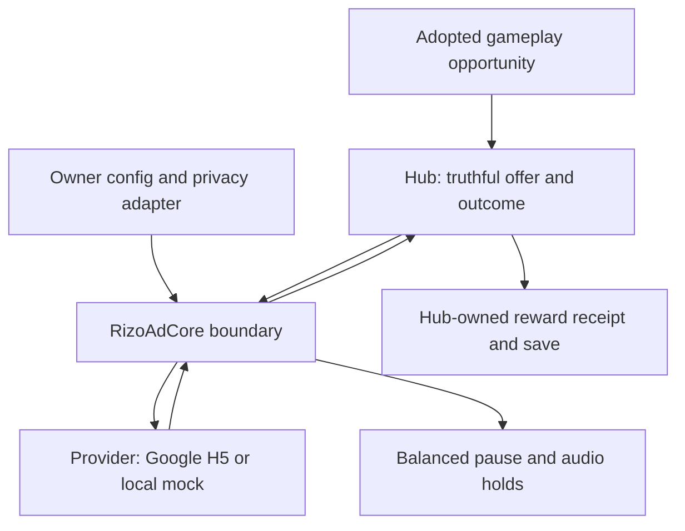

# Rizo World monetization architecture

Date: 2026-10-04. Build: `v92-public-foundation`. **Advertising is disabled, no placements are approved, and no Google SDK or analytics runs by default.** This is an implementation boundary and future integration plan, not approval to serve ads.

Read [PUBLISHER-READINESS.md](PUBLISHER-READINESS.md) for dated primary-source research and the distinction between policy requirements and Rizo's stricter product choices. The game remains valuable and functional when advertising is unavailable.

## Ownership and dependencies

| Layer | File | Responsibility | Must not own |
|---|---|---|---|
| Configuration | `rizo-config.js` | Disabled defaults, approved-placement catalog, verified-account gate, test-mode setting, conservative attempt limits | Actual consent, invented IDs, game reward logic |
| Pure boundary | `core/rizo-ads.js` | Allowlist, consent/context checks, one active request, dedupe, limits, timeout, provider lifecycle and one result | Network, DOM, pet data, wallet, save writes |
| Google adapter | `providers/google-h5.js` | Convert injected `adBreak` / `adConfig` callbacks into provider outcomes | Script loading, player-facing offer text, save rewards |
| Browser bootstrap | `monetization.js` | Privacy-adapter seam and conditional official SDK initialization | A fake CMP, automatic approval, automatic ad requests |
| Host | `game-v79-defense.js` | Safe context, explicit local UI, background/input isolation, simulation and audio holds, future durable reward delivery | Provider-specific gameplay code |

`window.RizoPrivacy.setAdapter(adapter)` accepts a reviewed integration whose `canRequestAds()` returns exactly `true` when the request is allowed. Missing, pending, throwing or revoked permission denies it. This tiny interface is **not a CMP**: it does not collect consent, keep records, identify geography, emit TCF/GPP strings or implement opt-out rights. Those remain a real integration task.

`window.RizoMonetization.connect()` can initialize the Google provider only when all configuration gates and the privacy adapter permit it. Attaching a provider to `window.AdBridge` does not enable advertising. The hub's current context guard rejects hidden pages, active training runs and active modes. Default placements are empty, so there is no automatic request on boot, a click, a timer or a semantic Dungeon event.

## Request contract

A host request specifies an adopted placement ID, a non-personal opportunity ID and `naturalBreak: true`. Rewarded opportunities additionally require `userInitiated: true` and an offer callback. These are semantic host contracts, not a way to detect whether a human exists; application code must call them only from the deliberately reviewed UI flow.

`showRewarded(id, input)` resolves a boolean. `true` means the provider confirmed the earned reward; a shown ad, ad click, dismissed ad, timer or terminal status string alone cannot earn anything. `showInterstitial` reports whether an ad was shown. Refusal or failure resolves `false`, allowing normal gameplay to proceed. A second concurrent request is rejected rather than queued.

For Google rewards, `beforeReward(showAd)` only offers a choice. The provider passes `{show, cancel}` to the host; it never invokes `showAd` merely because inventory exists. The host must show the exact reward, a clear Watch action and a usable No action. Only the player's affirmative choice calls `offer.show()`, which rechecks privacy and context. Confirmation comes from `adViewed`; the result settles at `adBreakDone`. `adDismissed` earns nothing.

The catalog permits rewarded placements and conservative `next`, `pause` or `browse` interstitial contexts. Start/preroll are supported Google concepts, but are deliberately excluded from this product's current boundary. Do not relabel an in-combat interruption as `next` to fit the API.

### Local limits are product policy, not Google eligibility thresholds

The default boundary permits at most three attempts per page session, at least 30 seconds between attempts and at least 180 seconds between shown ads before an interstitial can be requested. Opportunity IDs are deduped for the session. No automatic polling or retry exists. Google can impose additional caps and decide not to show inventory regardless of these local settings. Reloading is not a monetization strategy.

The 45-second watchdog settles a stalled request without granting a reward and quarantines the provider. An ad that already began releases its balanced hold into a state requiring explicit Resume. Late SDK starts still hold input/audio; a late end requires Resume and can never resurrect a timed-out reward. Errors after a start also require Resume. A watchdog cannot forcibly dismiss a third-party overlay; recovery/reload may still be needed if the SDK itself is broken. Do not retry into uncertain overlay state.

The host suspends its AudioContext and music, freezes training jobs and notifies the active mode through its existing lifecycle contract. UI backgrounds become inert. Completion releases only the ad hold; background, manual, save-blocked or update holds remain. Actual game sound settings inform Google's `adConfig({sound})`; this reports the game state rather than promising that every creative is silent. A timeout is never permission to advance combat beneath an unknown overlay.

## Placement decisions

| Context | Current status | Future direction |
|---|---|---|
| Dungeon opening, travel, dialogue, SIT/GO, rest, loss, boss, First Knot and homecoming | Protected; no ad UI and no approved placement | Keep the entire current episode ad-free. Dormant semantic events are not advertising instructions. |
| Den care, recovery, absence, feeding and pet attachment | No approved placement; old display placeholders stay hidden | Do not monetize fear that a companion will suffer. Remove old rewarded-care UI from Journal rather than imply an unavailable promise. |
| Defense combat, tower placement, map reading, context panels | Protected during the active mode | No display units near controls and no interstitial during continuous play. |
| A completed, already-banked Defense result | **Proposal only** | A later explicitly optional, predictable in-game bonus might fit. First design its value, limits, save receipt and exact decline/failure behavior. |
| Arcade | No placement | A genuinely completed run might provide a future break; no interruption during timing, memory, rhythm, movement or retry pressure. |
| Public World / Journal / About | No display integration | Owner may later review clearly labeled content inventory. It must not dominate original content or appear on error/consent/navigation-only surfaces. |
| First-party Rizo Apparel links | Ordinary labeled commercial links | Never treated as third-party ad inventory, a reward or proof of physical ownership. |

“WATCH → REVIVE” is not implemented. A potential revive needs a non-ad normal route, explicit player choice, a safe failure fallback and a mode-specific design review. It is particularly inappropriate to casually attach it to Dungeon's authored loss/homecoming. Core functionality never depends on inventory or consent.

If a later display unit needs a label, use Google's permitted “Advertisements” or “Sponsored Links”, not a fictional shop label, recommendation or game prompt. Existing hidden `SPONSORED` placeholders are never mounted; they are not reusable approved inventory. A first-party Apparel link says Apparel and identifies the separate store instead.

### Reward delivery remains a launch blocker

The provider boundary intentionally does not mutate a save. Before adopting a rewarded placement, capture the original run/pet/opportunity identity and deliver a bounded reward through a hub-owned durable receipt. Confirmed completion must not grant twice after callback duplication, reload, tab conflict or retry. Do not mutate whichever pet happens to be active when an asynchronous promise resolves.

A successful ad with a failed primary save requires recoverable pending delivery and a truthful player message; it must not lose the promised reward or double-grant after backup recovery. Test primary failure, backup failure, newer saves, pet switches, imports and storage blocking. None of that placement-specific reward delivery is claimed as implemented here. The existing mode-receipt system provides a pattern, not automatic adoption of ad rewards.

## Google initialization and privacy

The bootstrap checks `ads.enabled`, provider selection, `publisherVerified`, H5 enablement, a correctly shaped configured client, a nonempty enabled catalog and current permission before requesting the official script. `onReady` establishes readiness after initialization; the existence of a queue function does not. Script failure or no inventory leaves the product usable.

The repository contains an inherited publisher client in config. Its owner/account/domain eligibility has not been verified. It is inert, no longer emitted in static publisher metadata, and not sent by the default build. Confirm it directly in the owner's account before reuse. No fabricated client, slot, analytics identifier or production `ads.txt` has been introduced. Legacy display-slot placeholders remain inert compatibility scaffolding; `mountBanner` always returns false and the hub never mounts them.

Publisher verification should use an account-issued **static** meta tag or the actual approved verification method. It does not require enabling in-game inventory. Copy the exact account data; do not auto-insert an unverified token in JavaScript. `ads.txt.template` contains instructions only and is excluded from production packaging; root `ads.txt` is added only with verified seller records.

For personalized ads in the EEA, UK and Switzerland, the current [Google CMP requirement](https://support.google.com/adsense/answer/13554116?hl=en) calls for a Google-certified TCF CMP. Its current wording also allows some non-certified traffic to be eligible for non-personalized or limited ads where supported. That is not a general consent bypass: the [EU User Consent Policy](https://www.google.com/about/company/user-consent-policy/) still applies, including legally required storage consent. Choose and integrate a real solution, configure provider signals and withdrawal, and test actual permitted regions before opening the request gate.

Applicable US choices, Global Privacy Control, restricted data processing and other regional obligations require an owner-reviewed data-flow plan. The current code does not infer a legal classification from “13+”, a browser locale, an IP guess or the cuteness of Rizo. Account-level treatment and consent strings must actually reach the SDK; returning `true` from a homegrown banner is insufficient.

Consent withdrawal blocks new requests and a pending Watch choice. An already loaded script cannot be made never to have loaded; the CMP/SDK integration must handle its lawful ongoing behavior. Do not confiscate a legitimately earned reward because the player later changes privacy choices.

## Testing and operations

Automated tests inject local provider functions and block external requests. They never fetch live Google ads or generate production impressions. Test no fill, exception, denial, revocation, duplicate press/callback, dismissal, earned completion, frequency caps, foreground/background overlap and late timeout callbacks.

For later manual SDK integration testing use Google's documented [test mode](https://developers.google.com/ad-placement/docs/test), `data-adbreak-test="on"`, with a verified owner configuration. Test mode cycles mock inventory and makes no real ad requests; it does not validate account approval or correct production setup. Do not click live ads to test them. Disable test mode only for a separately reviewed production launch after every gate is complete.

Current SDK callback references: [API overview](https://developers.google.com/ad-placement/apis), [adBreak](https://developers.google.com/ad-placement/apis/adbreak), [adConfig](https://developers.google.com/ad-placement/apis/adconfig), [official tag example](https://developers.google.com/ad-placement/docs/example), [placement types](https://developers.google.com/ad-placement/docs/placement-types). Recheck them when integration actually begins.

Before live serving: monitor actual policy/account status and invalid-traffic signals without shipping raw pet/save data. Retain a simple config kill switch; stopping requests must not stop play. Revenue dashboards, a chosen analytics provider, consent UI, ad-supported rewards and production inventory are future work, not hidden defaults.
