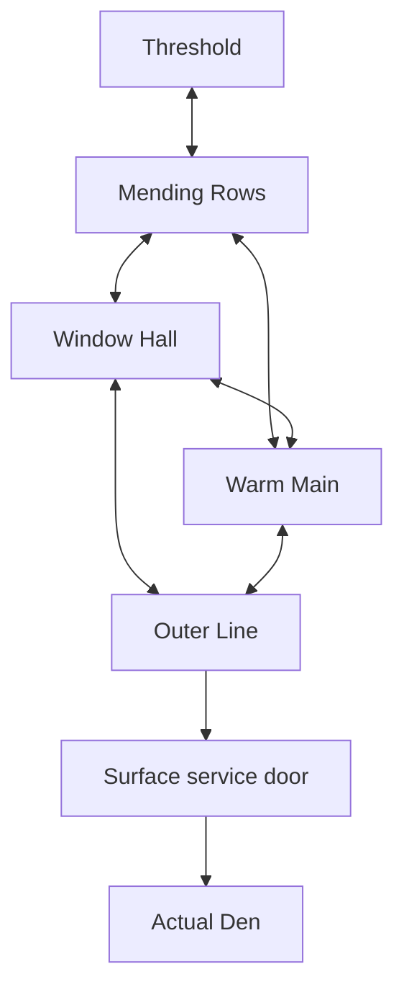

# Rizo Dungeon — narrative development package

**Version:** 0.1 · 3 October 2026  
**Purpose:** an authored campaign proposal for deliberate canon decisions and later implementation. This is not a dialogue script, code change, architecture audit, or instruction to interrupt the current art pass.  
**Reference repository:** `taymarspencer/Rizo-World-`  
**Accepted checkpoint inspected:** `6865e7f8e2caebdc06fa200c1e7f2a90d9e13162`.

## Authority and reading order

The owner's current brief governs this package. The accepted Run 2 source and the original preproduction/implementation documents govern existing facts. Everything newly authored here is **PROPOSED FULL-STORY DEVELOPMENT**, including names, explanations, chapter events, and ending details. A coherent recommendation is supplied so a future writer does not have to choose the plot while coding; coherence does not silently promote a proposal into canon.

Read in this order: constitution → campaign spine → character dossiers → relationship timelines → plant/payoff map → scene cards → ending architecture. The writer-only mystery answers, optional stories, and continuity ledger support those sections. The document ends with ten owner decisions.

### Sources actually read

| Source | Authority used here |
|---|---|
| [Accepted Run 2](https://github.com/taymarspencer/Rizo-World-/commit/6865e7f8e2caebdc06fa200c1e7f2a90d9e13162) | Verified checkout; accepted playable opening and proof episode. |
| `modes/dungeon/dungeon-content.js` | Actual rooms, props, speakers, authored lines, room connections, and stable IDs. |
| `modes/dungeon/dungeon-mode.js` | Actual rescue, sitting, assistance, gift, proof completion, and Den handoff. |
| `ARCHITECTURE.md`, Dungeon section; relevant `AUDIT.md` resolution entries | Proof/full-story distinction, pet identity, durable story events, and ordinary Den continuity. |
| `game-v79-defense.js`, relevant care/lore/wardrobe/story-mark entries | The actual pet, First Knot, shared-hearth behavior, and existing mythology fragments. |
| `Rizo-Dungeon-Preproduction.md`, current available version | Five interconnected districts, small recurring cast, warmth, bounded pet individuality, Return Coat, and the 6–8 / 10–14 hour targets. |
| `Rizo-Dungeon-Opus-Implementation-Brief.md`; `Rizo-Dungeon-Opus-Launch-Prompts.md` | The Threshold's fixed proof content, independent SIT/GO outcomes, and true proof homecoming. |

No claim is made about the unfinished art pass after this checkpoint. Appearance concepts below are narrative briefs for collaboration with its artist, not replacement asset instructions.

## LOCKED CANON

### Existing fiction and playable facts

1. The protagonist is the actual Rizo the player raised: its identity, name, form, age, personality, and chosen clothing matter. A borrowed generic hero cannot substitute for it.
2. YOU enters a late store after the established “Be good.” instruction. Rizo waits outside. The soft look-back boundary expresses waiting rather than a combat wall.
3. Hooded figures approach from a van. The established exchanges include “That him?” / “Obviously.” and the driver's objection to the fire followed by “I said probably.” These establish recognition and incompetence; they do **not** establish a prophecy or prove a particular motive.
4. The loose cooler introduces Tuck without burning Rizo. The van door gives. Rizo hesitates and falls out during rain at night.
5. Rizo walks alone, passes a bowl explicitly not its own, takes shelter in a drain, and falls into BELOW. The opening is played, not replaced with a narrated recap.
6. The six-room route is Slip → Clatter → Hem → Hearth → Queue → Porter, with the existing branches and real Hearth–Queue shortcut. HOME ↑ is scratched with a key. Its author and precise intention are undefined.
7. Latch is a stranded courier in a paper-like coat, trapped by a frozen latch. Rizo warms the mechanism and frees him. His procedural fear and dry humor are established.
8. The Hearth offers SIT / GO without a timer. Both paths retain saving and Latch's later assistance. SIT records a specific shared rest; GO is not a moral failure.
9. Familiar objects occur in emotionally wrong contexts. The Hearth bowl contains cold ash. It is an inspectable reaction, not a resurrection puzzle or penalty.
10. The Night Porter checks tickets, fights through readable sweep/charge patterns, and exposes his coat seam. Latch opens the protective alcove at half health because Rizo helped him. The Porter settles; the proof does not establish his death.
11. Latch gives the First Knot. It is earned once, can be worn by player choice, and is distinct from the proposed full-story Return Coat.
12. The accepted proof genuinely returns to the actual Den. The same pet shakes off; ordinary care resumes. This is not a dream, a false room, or an imitation of home.
13. `proofComplete` and `storyComplete` deliberately mean different things. The accepted content is a self-contained proof campaign, not an already-written six-hour campaign.

### Locked creative constraints from the owner

Rizo is mostly nonverbal. Home is the central desire. Death concerns absence and endings; fire concerns warmth, danger, gathering, and transformation. Kindness can be real even when its giver later causes harm. The campaign has no chosen-one explanation, dream cancellation, compulsory forgiveness, interchangeable biome tour, or purchased emotional resolution. Required outcomes cannot depend on prior training, rare form, high bond, optional completion, or perfect combat.

### Unresolved canon boundary: the proof endpoint

The actual Den return at the end of a ten-minute proof and an uninterrupted six-hour lost journey cannot both occupy the same chronological point. This is an editorial decision, not a mystery to conceal with an in-world twist.

**P-01 — recommended edition boundary, requiring owner adoption:** preserve the accepted proof and its real homecoming exactly. The **full campaign edition** reuses the opening and The Threshold through the First Knot; its onward door leads into the Mending Rows service lobby instead of invoking the proof's Den handoff. The full campaign's final door returns to the actual Den. This deliberately develops the previously unwritten campaign connection and changes the endpoint for that edition only. It does not claim the proof Den was false or overwrite completed proof saves.

A completed proof save must never silently be rewritten as “you were actually still lost.” The eventual entry design must explicitly distinguish starting the full journey with the same owned Rizo from continuing an incomplete full journey. Reusing already-earned First Knot ownership is acceptable; inventing a second protagonist or silently duplicating a campaign is not. The exact migration belongs to a later implementation brief.

**Alternative if the early Den return must be literal main-campaign history:** a short, voluntary later visit to thank Latch could become a second lost journey. That version needs a new, convincing inciting event and makes the game about two trips. It is not the recommended spine below: it risks repeating the loss and weakening the original desire. Do not insert it while coding.

---

## 1. Story constitution

**Status: PROPOSED FULL-STORY DEVELOPMENT.** This section supplies the creative contract after adoption; it adds no runtime behavior now.

### Central emotional question

**When somebody who made you feel safe decides that your needs can wait, can you leave them without deciding that all their love was false?**

Rizo's practical question remains smaller: which door gets it home? The larger question emerges through what people do around those doors. The player must not need to recite the emotional question to understand the ending.

### Player promise

You will recognize your own small creature in a place much larger than it. You will learn routes, make a few attachments, experience a consequential breach of trust, and bring that same Rizo home. The ending will honor both your prior care and the people encountered below. The world will retain physical evidence of your passage.

Home is not an upgrade earned by becoming useful. Rizo deserved to return before it repaired anything. Helping changes the route and relationships; it does not purchase a right to be loved.

### Themes and their physical expression

| Theme | Recurring physical situation | Boundary |
|---|---|---|
| Waiting and trust | A seat kept dry; a person at the promised junction; a door watched from the wrong side. | No real-world waiting, offline appointment, or timer choosing a social response. |
| Care versus possession | Someone adjusting a garment versus someone closing a protective shutter around its wearer. | A sincere obligation explains coercion; it does not erase it. |
| Being small in adult systems | Oversized counters, ticket lanes, boiler instructions, a name replaced with an equipment category. | System maintainers are not all fools or villains. |
| Warmth as shared work | Meals, drying rails, carried lamps, opening vents, moving a shelter. | Rizo is not the miraculous fuel that can save a civilization. |
| Death as a continuing absence | A second place prepared for a dead colleague; an obsolete routine with no returning participant. | No hidden revive quest, ghost reward, or reveal that everyone is dead. |
| Home after change | The original bowl, an ordinary doorway, a familiar habit interrupted and resumed. | No permanent fear simulation, punishment for affection, or required sentimental speech. |

### Mythology boundaries

BELOW is a real, strange underside of the ordinary world. Drains, laundries, delivery bays, service windows, utility routes, and abandoned connections overlap into inhabited districts. Scale and depth occasionally exceed what the surface building ought to contain. The story accepts that impossibility without making every corridor a symbolic hallucination.

The working internal ontology is **living service residents**, not secretly dead humans. Their appearances may be odd; they eat, repair, disagree, leave, and have routines independent of Rizo. Their materials and species remain an art/owner decision. Latch's coat does not mean his entire body must be paper.

Most warmth comes from ordinary sources: useful mains, stored fuel, insulated communal rooms, cooking, and maintenance. Rizo supplies controllable ignition and localized warmth. It cannot heat an entire district by existing. Its flame is useful because it is portable, not cosmically rare.

Hearth recovery remains the accepted Dungeon setback: the borrowed adventure flame gutters and reforms at the registered shelter. It is not evidence that every death can be reversed. It does not change the Hub pet's life flag. The older Phoenix Thread and cartridge lore remain fragments; this campaign does not turn them into universal resurrection technology or solve the Void Den.

Exits lead to actual streets and buildings. They do not read a player's soul or teleport to an emotionally correct house. Finding a way above and finding one's own Den are related but different tasks. No test of worth unlocks either.

### Tone rules

- Humor belongs to conduct, literal procedure, incompatible sizes, or familiar irritations. A funny character has serious work.
- A joke can precede a frightening discovery. It cannot be compulsory punctuation after loss, confinement, or apology.
- Cute behavior does not make the stakes childish. Fright does not require graphic suffering.
- Rizo's body tells us what its mouth cannot. Player movement remains authoritative; hesitation cannot steal a combat input.
- NPCs can be wrong about Rizo. The story does not automatically endorse an adult or a quest label.
- Familiarity earns dread: a drying locker becomes frightening because it was useful and safe before. Do not substitute a sinister laboratory.
- Silence should have an action: placing a bowl, waiting at a hatch, turning away from an offered hand. Avoid empty camera holds.
- Main dialogue explains the immediate practical situation. Meaning comes from accumulated evidence, not a lore lecture.

### What the story must not become

A tour of elemental kingdoms; a rescue of the universe; a pet neglect guilt simulator; a secret royal lineage; a friendship meter with a best-ending threshold; a reveal that kindness was camouflage; compulsory forgiveness; a collection of tragedy tableaux; a game that asks players to buy a garment to complete its meaning.

### Decision discipline

For every major choice, record the familiar first solution, why it fails this creature, and the specific replacement. A choice is useful only if it creates a playable situation, credible obligation, or later payoff. The rejection ledger near the end records the decisions made here.

---

## 2. Full campaign spine

**Status: PROPOSED FULL-STORY DEVELOPMENT; assumes P-01.** Five physical districts, one return chapter through changed districts, and the real Den. Titles are working names, not vocabulary the player must memorize.

### Campaign in one causal chain

An opportunistic theft separates Rizo from YOU. Below, its warmth first frees Latch, then makes it useful to people maintaining a failing local heat circuit. Nell, a mender who sincerely helps it find the surface route, becomes its trusted guide. A storm isolation order threatens the shelter she is responsible for. She confines Rizo in a warming locker to bridge the failure, postponing its departure without consent. Rizo escapes into the outer routes and discovers both a usable way home and the actual limits of the circuit. Its friends choose to move their work and shelter instead of keeping Rizo as equipment. Nell resists that plan before accepting that she cannot decide who must stay. Rizo leaves through an ordinary service door and returns to its Den. The community survives by changing its routines; kindness and hurt remain real.

### District map

The graph describes useful physical connections, not unrelated campaign orders. Local closures and safe shortcuts establish the authored sequence. The return chapter uses earlier places with changed occupants, heat paths, and understanding. Do not require a different colored key for every closure.

### Main-story pacing budget

| Chapter | First-time authoring target | Main change in play |
|---|---:|---|
| 0 · Opening and The Threshold | 12–18 min | Existing situation-led controls, first relationship, reciprocal rescue. |
| 1 · Mending Rows | 60–80 min | Warm mechanisms; travel with Nell; comforting versus dangerous heat. |
| 2 · Window Hall | 75–95 min | Learn routes/rules; carry property; discover the kidnapping's practical motive. |
| 3 · Warm Main | 80–100 min | Route heat/shelter; sustained shared work; confinement and escape. |
| 4 · Outer Line | 70–90 min | Recover agency; old lessons under different conditions; a finite alternative. |
| 5 · The Return Line | 60–80 min | Revisit changed routes; confront Nell; leave without supplying permanent heat. |
| Epilogue · Den | 8–12 min available | Brief authored return, then ordinary care and optional examination. |
| **Main journey** | **365–475 min: 6 h 5 min–7 h 55 min** | An unmeasured content budget, not a playtest claim. |

The epilogue includes voluntary ordinary care, not eight minutes of compulsory animation. The authored handoff itself should be roughly a minute or two. Replays will be shorter. A curious first-time player has a separate, non-overlapping 240–340 minutes of optional stories, yielding approximately 10–13.6 hours at these main budgets.

Do not reach those numbers by extending HP, adding waits, stretching corridors, or repeating puzzle templates. The production envelope is approximately 70–85 distinct main-path spaces including the ten already built, with 12–18 earlier spaces meaningfully revisited. A space may contain several short passages or a route problem; room count is not a length formula. Each new module must earn its place through a different task, social situation, hazard arrangement, or revelation. If playable authoring comes in shorter, add a distinct worthwhile situation or accept a shorter game; never pad it to vindicate this table.

### Chapter 0 — Opening and The Threshold

**Location/social identity:** the existing store, van, rainy roadside, drain, and six Threshold rooms. A bottleneck of obsolete access procedure surrounds one kept hearth.  
**Immediate goal:** get back upstairs.  
**Important relationship:** Latch.  
**Safe place/warmth:** the Shared Hearth; its seat is offered rather than demanded.  
**Question:** someone wrote HOME ↑, but whose home? Why does the Porter guard a lane nobody can properly ticket?

Keep every established control and relationship beat. Do not inflate the proof into a longer tutorial. Latch's rescue shows that frightening fire can be useful; his alcove assistance makes usefulness mutual.

**Revelation:** ABOVE exists, but the obvious door is a maintained service route, not yet a guarantee of the Den. This is the full-edition endpoint proposal, not a sinister new meaning for Latch's departure line.  
**Climax:** the established Porter fight and Latch's help.  
**Physical result:** the hatch and shortcut stay open; First Knot is earned; in the proposed full edition the north door opens a dry service lobby into Mending Rows. The accepted proof retains its Den handoff.

**Next:** Latch delivers his delayed route packet to Nell. Rizo follows because she maintains the next surface access, not because it must save BELOW.

### Chapter 1 — Mending Rows

**Location/social identity:** connected basement garment workshops, drying lines, repair benches, and an old staff changing room. Thread bridges are lashings across broken platforms, not magical spider forests. Old garments used as insulation sit beside recent repairs that visibly disagree in material and skill.  
**Immediate goal:** open the dry upper route, blocked by a stalled drying rail and a shut delivery shutter.  
**Important relationship:** Nell, mender and guide. Latch has an established job here.  
**Safe place:** the Dry Table, a low workbench beside a screened stove. Rizo can sit under it without obstructing work.  
**Local problem:** wet garments and a seized rail block the passage to Window Hall.  
**Question:** why is the warm room maintained while the route above has gone out of use?

**Main modules, in order:**

1. **Receiving lobby:** Latch completes a delivery that existed before he met Rizo. Nell treats his lateness as ordinary annoyance, examines his damaged cuff, and offers Rizo a dry place. She recognizes a living traveler.
2. **Under the table:** a rough edge catches a loose garment or nearby cloth. Nell moves the edge and offers a modest repair. The scene works even if the player has no accessory equipped; she never replaces the player's outfit. This establishes permission before its later violation.
3. **Drying route:** travel alongside Nell through a multi-room path. Kindle releases joints; hot ducts require cover. She meets Rizo at each exit she names.
4. **Meal crossing:** Orr brings food. Nell and Orr disagree over a duplicate place setting, then work around each other. Rizo moves a tray through a low opening using existing verbs. Their relationship is not introduced as a grief lesson.
5. **The second locker:** use a safe drying locker to avoid an overrun rail. Nell opens it as soon as danger passes. Rizo controls leaving. Later confinement reuses this exact place and vocabulary.
6. **The stalled return:** a pressing carriage keeps repeating an empty job. Solve its cycle through cover, Tuck, and warming the external release. Nell's seam-setting gestures help communicate openings.

**Gameplay evolution:** warmth targets become spatial problems; changing a joint changes a route. Companionship uses rendezvous and assistance, not escort HP. Dangerous hot machinery complicates the notion that warmth always means safety.

**Emotional movement:** urgency → relief → being accommodated → staying near someone useful. GO at the first Hearth does not block this history.

**Revelation:** service exits have work schedules. Nell can help reach one; she cannot summon home. A covered pipe indicates a wider failing circuit, but that problem is not yet Rizo's assignment.

**Climax:** stop the pressing carriage and release the drying rail.  
**Physical result:** garments lift away from the passage; the route to Window Hall opens; the locker and a waiting peg become familiar; Nell lends a weather coat shaped around Rizo's body. **This is the origin of the proposed Return Coat.** It is an available wearable/story object, never forced over chosen clothing.

**Next:** Nell accompanies Rizo toward the staffed window that knows which route reaches its neighborhood.

### Chapter 2 — Window Hall

**Location/social identity:** lost property, closed transit counters, locker banks, service glass, and lanes made for taller creatures. Adjacent windows are served from different, physically connected back corridors. Some work; others continue routines for nobody.  
**Immediate goal:** identify the surface delivery route nearest the late store, then reach its current access point.  
**Important relationship:** Tally, recurring attendant. Nell remains the trusted guide.  
**Safe place:** a staff recess behind Window Two; a kettle on a small return pipe.  
**Local problem:** outdated records and a sorting belt route belongings to the wrong side of a shutter.  
**Question:** who has the right to say where something—or someone—belongs?

**Main modules, in order:**

1. **Wrong height:** Tally cannot see the small visitor from his official window. A low hatch gets Rizo to a useful view. The joke changes geometry instead of charging a silly fee.
2. **Route request:** a map uses doors, stairs, and delivery lines. Nell translates Rizo's recognition of the store chime and awning into a destination.
3. **Property crossing:** return one identifiable misrouted garment. A label can be wrong; claiming needs evidence; Tally's rules sometimes protect people.
4. **Van record:** the recognizable cooler, a same-night curb collection docket, and the hoods' work markings establish the theft. Rizo was taken as an unattended portable heat source for resale. “That him?” concerns a creature the small hood had just identified, not a prophecy. Nell was not the client and did not arrange it.
5. **Ceiling sound:** ordinary footsteps and a searching call pass through a grille. They may suggest YOU; they do not establish a supernatural link or guarantee that YOU is directly overhead. Rizo may pause. The route proceeds either way.
6. **Porter at work:** the settled Porter escorts a trolley through a narrow corridor. Initially frightening, he shields Rizo from a hazard, lowers his lamp, and makes his coat a windbreak. The former boss becomes concretely safe.
7. **Return sorting:** the collector tries to box the warm traveler under the wrong category. Flare/Tuck and release levers expose the route; Tally records a traveler. This correction helps locally without magically curing the heat economy.

**Gameplay evolution:** route knowledge replaces some locks; carrying and setting down link spaces; cover remains useful around straight-lane machinery. Directions are recognizable without a codex.

**Emotional movement:** curiosity → absurd irritation → humiliation as property → relief at being recognized.

**Revelation:** the abduction was opportunistic, within a trade in stolen working equipment. Rizo is not uniquely valuable. The usable route passes the Warm Main; its isolation shutters will close because of storm damage.

**Climax:** disengage the sorting collector and open the service lane.  
**Physical result:** a back corridor joins Window Hall to the Dry Table; Tally retains the corrected record; the Porter can stand in a useful recess; Nell receives the isolation notice in public, among people who depend on her.

**Next:** a finite Warm Main crossing, then the delivery door. It appears to be the last obstacle.

### Chapter 3 — Warm Main

**Location/social identity:** a boiler return, insulated mains, inspection shutters, a kitchen annex, and inhabited rooms around leaking infrastructure. A working neighborhood rather than a lava level: damp concrete, improvised blankets, and food preparation matter more than a furnace throne.  
**Immediate goal:** cross to the store-side surface route before the authored isolation phase. No real-time deadline.  
**Important relationship:** Nell under genuine pressure; Orr's routine reveals an unfixable absence.  
**Safe place:** the Meal Room, then the familiar Dry Table via shortcut.  
**Local problem:** the night heat bank cannot hold the circuit through isolation. Its failure would displace the few inhabited rooms it serves.  
**Question:** who is allowed to leave when everyone needs something kept warm?

**Main modules, in order:**

1. **Inspection walk:** Nell explains what nearby shutters physically do while working beside Rizo. Rizo ignites small releases. Other workers and stored fuel supply actual heat.
2. **Meal Room:** Orr prepares two portions. Rizo can warm the second bowl, but nobody arrives. The core route makes clear that Eda, Orr's former shift partner, died before this story. Optional exploration reveals her life; death and finality are not optional secrets.
3. **Keeping a place:** Nell repairs Orr's lamp strap without being asked. Orr brings her food when she is too busy. This has nothing to do with earning Rizo's trust; it is their ordinary relationship.
4. **Joint crossing:** the Porter holds a wind barrier while Rizo and Nell route a small hot return around a break. Several rooms alternate exposed passages and safe pockets. They accomplish useful work together.
5. **Missing component:** the replacement coupling lies in an inaccessible outer depot, not a chest behind the boss. Nell has already filed requests; Tally's records corroborate her attempts. The planned quick crossing cannot solve the failure.
6. **Credible departure plan:** Nell still marks the surface route. She has not visibly schemed all chapter. She seeks alternatives from other residents; existing obligations make those alternatives difficult. Her bad choice arises here.
7. **Back to the dry locker:** she offers the preparation that kept Rizo safe in Chapter 1. The player may enter, examine the peg, or approach the door. She closes the inspection shutter and connects the locker to the warming branch. Rizo's flame would keep a vulnerable control joint workable until a repair or morning crew arrives. **She postpones departure without consent.**
8. **Confinement:** Rizo can move, test the hatch, warm the wrong part, or stop at the offered bowl. No punitive wait, and no choice makes confinement the player's fault. Nell stays nearby, sincerely monitoring safety, and still refuses to open the route.
9. **Outer return escape:** Rizo stops cooperating with the retaining cycle. The earlier locker lesson and a low inspection release expose a bypass. Latch's service-hatch knowledge provides the final exit; Rizo performs the risky part. The bank isolates as designed, so the community must move heat and people. No NPC randomly dies because Rizo wants to leave.

**Gameplay evolution:** the same Kindle that helped people can maintain confinement if used unquestioningly. Understanding the mechanism and changing position is the answer. No new emotional button. Warmth can be volunteered, withheld, or used to demand staying.

**Emotional movement:** belonging → seeing responsibility → presumed safety → recognizing custody → leaving.

**Revelation:** Nell's care and coercion are simultaneous truths. Eda's old routine cannot be restored by Rizo's warmth. A circuit problem does not entitle anyone to its smallest traveler's body.

**Climax:** escape and circuit isolation, not an immediate revenge fight.  
**Physical result:** the locker is open and unavailable as a coercive heater; the bank stays isolated; residents begin moving into smaller warm spaces; the original upper lane closes; the Outer Line bypass opens. Rizo leaves without Nell. Earlier choices remain true.

**Next:** find a way home that does not depend on someone else's permission to keep it.

### Chapter 4 — Outer Line

**Location/social identity:** storm returns, cable galleries, a freight underpass, an equipment depot, and temporary shelters at maintenance junctions. Things arrive here when formal routes fail. Colder and less staffed, but not an ice biome. Repair, meals, and tired people interrupt the machinery.  
**Immediate goal:** reach the store-side exit from its outer side.  
**Important relationship:** the Porter becomes reliably safe; Latch is an active friend; contact with Nell becomes Rizo's choice.  
**Safe place:** the Porter's windbreak and lamp shelter, established as a checkpoint before the difficult stretch.  
**Local problem:** freight shutters and storm flow divide the route; the depot holds the coupling and stolen equipment.  
**Question:** can Rizo accept help after help was used to confine it?

**Main modules, in order:**

1. **No guide:** familiar route marks remain without Nell ahead. A solo path puts knowledge in the player's hands; it does not strip stats or disable controls to simulate grief.
2. **Empty rendezvous:** Latch is not at the marked station. A moved lamp, opened hatch, and fresh route strip show he went around a closure. Uncertainty has evidence; he has not secretly betrayed Rizo.
3. **Portable shelter:** the Porter meets Rizo at a plausible junction, names his next position, takes a larger route, and is actually there when Rizo arrives. Rest and closeness remain choices.
4. **Courier returns:** Latch brings a dry line and map correction. He does not demand an explanation. He and Rizo cross a freight mechanism in parallel, each opening the other's access.
5. **Depot recognition:** see the theft operation's traces and briefly a hood at a loading gap. The cooler is familiar. Ordinary greed is confirmed; the theft was not fate. Cargo machinery becomes an encounter Rizo can now handle through evasion, releases, and Flare. No graphic vengeance.
6. **Finite coupling:** the recovered piece is damaged. It supports a smaller return, not the old bank. Rizo carries it or marks it for Latch; no inventory optimization test. The alternative works only if several people change where they work.
7. **People moving:** Orr and Tally are already redirecting food and records. No heroic speech activates the plan. A short optional Nell visit is possible; reconciliation is not required.
8. **Store-side door:** hear the recognizable chime outside. Its closing linkage shares the isolated line. Forcing it carelessly would reclose a shelter route; controlled opening is possible using the smaller return and people already moving.

**Gameplay evolution:** stronger combinations of established patterns, route recognition, carrying, parallel access, and windbreaks. Carried story objects survive retries. Companions do useful scripted work rather than traveling with vulnerable HP.

**Emotional movement:** isolation → wary help → a promise kept → practical agency → home within hearing.

**Revelation:** the crisis has a limited material solution. Rizo need not remain as fuel; other people must relinquish convenient routines and relocate work. Eda remains absent. Nell remains accountable.

**Climax:** freight release and arrival at a real surface door, with the smaller circuit established in outline.  
**Physical result:** the depot stops routing Rizo as cargo; outer shortcuts connect; the Porter abandons his useless original post for a new shelter; the coupling joins the repair plan; the surface door becomes the destination.

**Next:** one last passage through the local circuit, then leave. No map-wide collectible hunt.

### Chapter 5 — The Return Line

**Location/social identity:** earlier rooms with changed occupancy and heat. Garments moved; the old seat recognizable; two shutters permanently open; one beloved room unheated. A neighborhood making room for departure.  
**Immediate goal:** open the store-side route without trapping relocated residents, then go home.  
**Important relationship:** Nell; all five recurring characters act from their own obligations.  
**Safe place:** the relocated shared table, already warm without Rizo.  
**Local problem:** Nell believes opening the gate before her retaining procedure completes risks the rooms she promised to protect.  
**Question:** can someone help you leave after choosing to keep you?

**Main modules, in order:**

1. **Changed work:** cross three earlier clusters with different access and tasks. Tally moves the working window; Orr serves living people in the new room; Latch opens a low bridge; the Porter protects the route while giving up his old desk.
2. **Familiar chair:** the first seat remains available. An earlier GO can sit now; an earlier SIT can decline. It remembers history without blocking progress or forcing nostalgia.
3. **Dry Table confrontation:** Nell names what she did and why. She does not call earlier kindness false, ask Rizo to reassure her, or blame its escape. Rizo may approach, remain distant, or turn toward the exit. One short practical exchange; no forgiveness menu.
4. **Holding gate:** her fear outlasts apology. She tries to stop Rizo crossing until the old procedure completes. The player resists someone whose guiding gestures it knows. An escape/disarm encounter uses Flare, Tuck, cover, and releases; no lethal choice or optional-stat gate.
5. **People choose the smaller plan:** as Rizo makes space at the gate, the others complete the established local return. Their work is readable. A Flare ignites a prepared burner; fuel and labor, not Rizo's permanent presence, keep it running.
6. **Nell steps back:** disarmed and confronted with a working alternative, she opens the secondary latch herself. A concrete wrong is repaired; restored trust is not demanded. The player may still refuse closeness.
7. **Last mending:** the Return Coat has accumulated repairs. Nell offers a final fitting; Rizo may accept touch or let her lay it down. First Knot remains separate and earned; an optional detachable tie can acknowledge it without consuming it.
8. **Departure:** each companion completes a practical act along the route. No lineup of farewell speeches. Rizo crosses the surface door, hears rain as ordinary weather, and takes a short familiar route to the Den.

**Gameplay evolution:** knowledge and relationships alter old places. The final fight reuses someone's ordinary work language. The exit stays open, not only during a three-second skill window.

**Emotional movement:** hurt alongside contact → asserting departure → others choose responsibility → relief that does not undo the rupture.

**Revelation:** keeping a fire alive is shared work. Keeping a person safe includes making departure possible. Neither needs a concluding speech.

**Climax:** Nell's gate encounter and the visible opening of the smaller return.  
**Physical result:** the old locker/bank cannot retain a living traveler; the new room stays warm independently; the surface route stays open. Nell keeps work and relationships but loses unquestioned authority over the route. Reaching home does not require collecting affection.

### Epilogue — The actual Den

The same actual Rizo returns to the actual Den. Preserve familiar scale, furnishings, clothing choices, care affordances, and ordinary need values. One doorway hesitation precedes an unmistakably familiar action. The bowl is the bowl; nobody put cold ash in it.

Rizo may approach the familiar care position, move past it to food, or remain by the door briefly. All are homecoming. The absurd turn is that the creature which crossed impossible infrastructure is immediately occupied by an ordinary crumb, cushion, or personal-space annoyance. No narrated joke.

The pain belongs to proportion: home is unchanged enough to seem almost unaware of the enormous trip, while Rizo carries repairs and remembered gestures. The player performs care. No explanation of what changed is required.

The ending architecture specifies what may persist and what remains optional.

---

## 3. Character dossiers

**Status: PROPOSED FULL-STORY DEVELOPMENT except each explicitly identified existing fact.** Five living recurring NPCs: Latch, Nell, the Porter, Tally, Orr. Eda is a named absence, not a sixth traveling companion. Background residents can make rooms inhabited without acquiring competing subplots.

### Latch — first friend, working courier

**Locked starting point:** stranded courier, paper-like coat, trapped by a frozen latch; procedural/dry speech; rescued by Rizo; returns help during the Porter; gives First Knot.

- **Appearance concept:** retain the current small capped figure and worn coat as the silhouette baseline. One cuff repairs badly, one pocket hangs lower, and route slips accumulate in an inside pocket. His working bag must not dwarf him into a generic wandering merchant.
- **Apparent personality:** officious when frightened, helpful under the cover of doing a job. He announces a route inspection rather than admitting he wanted company.
- **Private need:** to be expected somewhere for reasons beyond being useful. He likes a seat being saved but would be embarrassed to request one.
- **Fear:** arriving too late and discovering nobody expected him anymore. He also reasonably fears open flames near papers.
- **Obligation:** move route notices, repair requests, and small supplies among these five districts. His delayed packet at the opening is real work.
- **Contradiction:** insists on delivery rules while routinely using unofficial hatches. A courier who is good at routes can still become trapped.
- **Relationship with Rizo:** practical gratitude grows into friendship without a vow of lifelong protection. He notices the tiny creature's route habits and leaves accessible marks.
- **Other NPCs:** Nell repairs his coat and complains about his knots; Tally makes him correct forms; the Porter has refused his tickets before; Orr puts food aside for him. Latch can disagree with all four.
- **Humor:** literal distinctions, anxious procedure, bad improvised repairs. Never a joke every time Rizo is hurt.
- **When Rizo is absent:** finishes deliveries, dries route slips, takes food to a distant post, and occasionally returns to find his preferred seat occupied.
- **What he misunderstands about Rizo:** assumes looking upward always means wanting to move immediately. Later learns it can mean listening for YOU.
- **What Rizo misunderstands about him:** initially reads his departures as leaving it behind. Delivery evidence and actual rendezvous establish a different meaning.
- **Beginning:** pinned and embarrassed; helps because he was helped.
- **Middle:** travels on parallel routes; promises specific junctions; misses one because a shutter closes, leaves evidence, and returns by another route.
- **End:** neither becomes a permanent pet nor dies to motivate Rizo. Makes departure possible and remains a courier with a place to sit.
- **Body-language signature:** checks a route slip twice, tucks it somewhere dry, then glances back once. Late friendship reverses the order: looks for Rizo first.

**Invariant:** declining SIT never cancels his aid. His help is reciprocal care, not payment for choosing the writer's preferred animation.

### Nell — mender, guide, future betrayer

- **Appearance concept:** a practical work coat with sleeves rolled differently, pins in a removable cuff, chalk on one palm, ordinary visible repairs. A low bench and a gentle flat-handed seam-setting gesture define her. No concealed eyes, villain colors, suspicious expression, or ominous instrument.
- **Apparent personality:** capable, direct, sometimes distracted; treats inconvenient bodies as a fitting problem she can solve. Her teasing comes from bad workmanship, including her own.
- **Private need:** to believe that if she keeps working carefully enough, nobody on her circuit will become another person whose place stays empty.
- **Fear:** letting a preventable failure happen while she had a usable means to stop it. Leaving a task unfinished feels more dangerous to her than crossing a boundary.
- **Obligation:** maintain the Dry Table shelter, protective garments, and a small night return used by Orr, Latch, and nearby residents. This is a local duty with names, not an abstract duty to “her people.”
- **Contradiction:** ordinarily asks before altering something worn, yet eventually treats Rizo's departure as a decision she can make on its behalf.
- **Relationship with Rizo:** sincerely likes its attention, warmth, awkward fits, and determination. Her plans to help it leave are real until the circuit crisis makes her choose otherwise. The earlier coat, rendezvous, and rescues remain sincere afterward.
- **Other NPCs:** Orr feeds her and was a colleague of her former instructor Eda; Latch relies on her repairs but irritates her; Tally has processed repeated failed parts requests; the Porter respects her competence without being hers to command. These are relationships the player sees without Rizo being their subject.
- **Humor:** terse criticism of stubborn objects, a bad seam she refuses to hide, practical exaggeration about pockets. She can lose a small argument and laugh without losing authority.
- **When Rizo is absent:** repairs Orr's strap, budgets insulation, checks shutoff notices, attempts a part request, eats standing up, and leaves one job unfinished because another takes priority.
- **What she misunderstands about Rizo:** assumes warmth, shelter, food, and proximity to a caring adult can make a postponed homecoming tolerable. Understands that it wants home but discounts what that means.
- **What Rizo misunderstands about her:** reads competence as the power to fix everything, and repeated safe waiting as a guarantee that she will always open the door.
- **Beginning:** helps a traveler and expects to get back to work afterward.
- **Middle before rupture:** grows attached; shares several routes; continues helping despite inconvenience; faces a concrete failure she has tried to prevent.
- **Middle after rupture:** knows she violated trust, yet defends the emergency use and initially insists that staying was the safer choice. Remains near the confinement, provides food, and monitors heat. That care makes the wrong more painful; it does not soften the confinement into consent.
- **End:** acknowledges agency and yields the gate; remains useful without receiving automatic reconciliation. She will have to ask permission again in every later contact. Some trust may return slowly; Rizo need not demonstrate that during the ending.
- **Body-language signature:** a flat palm meaning hold still for a seam; clears space around a small body; checks a clasp with two light taps. The holding-gate fight reuses these recognizable movements.

**Exact betrayal recommendation:** Nell knowingly bolts the shared inspection room/drying-locker area around Rizo and engages a temporary retaining branch. Rizo would keep one control joint warm while the larger fuel system stabilizes. She plans to release it after repair or morning staffing; the timetable is uncertain, the missed departure is certain, and Rizo has no say. This is coercive confinement, not secret attempted murder, a fake rescue, or “I was evil all along.”

**Consequences:** loss of the trusted route; a dangerous detour; separation from the group; an unwanted experience of being categorized as useful equipment; changed proximity and permission in later scenes. No permanent statistical debuff is needed to make these consequences matter.

**No hidden recruitment:** she did not hire the hoods, select Rizo years ago, deliberately cause the circuit failure, or murder Eda. If any future revision adds one of those, it changes the moral structure and requires a new dossier and owner decision.

### The Night Porter — threatening authority, genuinely safe shelter

**Locked starting point:** large worn coat/lamp figure; ticket checking; sweep/charge encounter; settles at defeat. His later life and motives are proposed.

- **Appearance concept:** preserve the boss's coat, scale, lamp, and exposed hem. After settlement he uses the same lamp lower, showing a place rather than sweeping a lane. Do not replace him with a suddenly cute different person.
- **Apparent personality:** formidable, sparse, accustomed to being obeyed. Answers a practical question as if it deserves a practical answer.
- **Private need:** to know that his watch still protects somebody. A post without travelers is less meaningful than he can admit.
- **Fear:** an uninspected passage hurting a person while he is looking away.
- **Obligation:** protect the local crossing from drafts and moving equipment. Ticket checking was an inadequate old method, not proof of secret malice.
- **Contradiction:** guards a door so rigorously that he makes the safe route inaccessible. Later safety means giving up the post.
- **Relationship with Rizo:** first mistakes an uncontrolled flame for a hazard; learns from Rizo surviving, Latch's intervention, and their later work. Becomes safe through actions, not a revealed tragic biography.
- **Other NPCs:** knows Latch's unofficial routes; exchanges inspection work with Nell; accepts meals from Orr; irritates Tally by leaving bulky equipment at a window. He has grounds to overrule Nell at the finale.
- **Humor:** scale and deadpan practicality. Sets a tiny cup where Rizo can reach it with immense precision. Does not become a quip machine.
- **When Rizo is absent:** shields a trolley, checks a draft route, dries his coat, and moves his lamp to protect the arriving meal crew.
- **What he misunderstands about Rizo:** thinks it needs a stronger escort more than clear information. Learns to identify his next position and let it choose the path.
- **What Rizo misunderstands about him:** reads size, abrupt movement, and uniform procedure as anger. A hand can move suddenly to intercept a hazard rather than seize it.
- **Beginning:** blocking the route.
- **Middle:** useful escort; then trusted windbreak and a kept rendezvous after the betrayal.
- **End:** turns his post into portable shelter and lets the final traveler leave.
- **Body-language signature:** shifts to the windward side before speaking. Keeps an exit visible when he offers shelter.

**Invariant:** once the story establishes him as safe, do not add a later reveal that he wanted Rizo's fire. Consistency is part of his dramatic function.

### Tally — absurd recurring attendant with a real job

- **Appearance concept:** compact figure behind a battered sliding service sash; one stamp, one stool, a lunch plate, an oversized CLOSED sign. He moves among windows through visible staff corridors. No magical omnipresence.
- **Apparent personality:** exact about things that seem trivial, surprisingly flexible about things he understands.
- **Private need:** to be able to point to one thing that was returned correctly.
- **Fear:** losing something entrusted to him and replacing evidence with a guess.
- **Obligation:** route possessions and notices without giving them to the wrong claimant. The equipment paperwork matters, but so does the coat somebody still wants.
- **Contradiction:** a correct record can preserve an incorrect category. He defends procedure until seeing its actual subject.
- **Relationship with Rizo:** initially a height/access problem; later a traveler whose record he corrects. Does not charge coins, sell friendship, or demand ten stamps.
- **Other NPCs:** has long irritated Latch over receipts, documented Nell's requests, and asked the Porter to stop leaning equipment against his glass. Shares food errands with Orr.
- **Humor:** literal service language, lunch happening while the official sign claims closure, handling a tiny request with a gigantic form. His recurring sign becomes a spatial joke, then a useful shield.
- **When Rizo is absent:** identifies an ordinary garment, eats a cooling meal, changes windows, and routes a notice that affects somebody else.
- **What he misunderstands about Rizo:** assumes a quiet claimant has agreed to the filed description.
- **What Rizo misunderstands about him:** assumes CLOSED means he cannot help. Learns to find the staffed side of a place.
- **Beginning:** a comic inconvenience.
- **Middle:** supplies concrete route and theft evidence; corrects one important category.
- **End:** carries the useful window to the smaller shelter and places the CLOSED sign where it blocks a draft. Humor becomes material usefulness.
- **Body-language signature:** aligns the page before noticing who needs it; late in the story reverses that order.

### Orr — meal keeper, living with an absence

- **Appearance concept:** a patched kitchen apron over ordinary workwear, tray worn where a second hand used to help, one repaired lamp strap. Avoid a mourning robe or visual shorthand for “sad old man.”
- **Apparent personality:** hospitable but particular. Will move a visitor's bowl without asking if it obstructs the tray route, then recognize that he did.
- **Private need:** to retain a shared life without repeating every routine as if its other participant were still coming.
- **Fear:** changing the routine will turn Eda into somebody nobody mentions.
- **Obligation:** feed current night workers, maintain the Meal Room, and keep a small fire useful. He is already caring for living people.
- **Contradiction:** prepares a second portion he knows will not be eaten, while being irritable about waste.
- **Relationship with Rizo:** food and warmth are care, not payment. Rizo's presence does not replace Eda; he never dresses it in her role.
- **Other NPCs:** Eda was his shift partner; Nell learned repairs from her; Latch's deliveries are fed; the Porter keeps tray routes safe; Tally knows Orr's handwriting on meal notices.
- **Humor:** practical complaints about portions, tray geometry, and people eating while standing. Can be annoyed and grieving in the same scene.
- **When Rizo is absent:** cooks, delivers meals, tends a place that stays empty, and sometimes leaves the second bowl unfilled. Those actions vary; grief is not a frozen diorama.
- **What he misunderstands about Rizo:** thinks a familiar-shaped bowl necessarily comforts it. Its hesitation teaches him that familiarity can be wrong.
- **What Rizo misunderstands about him:** assumes somebody is late and that warming their bowl will help them arrive.
- **Beginning:** competent host with an unexplained extra place.
- **Middle:** names Eda's death without demanding comfort; accepts practical help that cannot fix the absence.
- **End:** relocates the meal fire, serves the people present, and takes one of Eda's ordinary working objects. Still sometimes prepares too much. No instant cure.
- **Body-language signature:** measures two portions, pauses, then decides what to do with the second rather than following one compulsory animation.

### Eda — absent shift partner, not a resurrection objective

**Proposed history:** Eda died before Rizo arrived, in an earlier service-route failure during a repair. Nell did not cause it. Her death explains fear of preventable failure without turning the plot into a murder mystery.

She was a maintenance worker and Orr's shift partner, not a saint. Left awkward repairs, hated a particular repetitive task, used meals as an excuse to visit people, and once scratched HOME ↑ to mark an actual upward access for tired workers. The sign was her practical direction, not a message destined for Rizo. On the main route, confirm the sign's ordinary service purpose; optional exploration can identify its maker.

Her presence is evidenced by wear, disagreement, and unfinished work, never an interactive ghost telling Rizo what to do. Two people can remember the same repair differently. Her bowl does not glow when every collectible is found. The campaign does not reveal that she secretly survived elsewhere.

### Rizo and YOU — identity and relationship guardrails

**Rizo:** the actual raised creature supplies appearance and small behavioral variation. Its private want is home, expressed through recognition, listening, proximity, and departure. It may be brave and still small, irritated and still attached. Story choices are the player's actions; personality never overrides them. A low-bond creature receives the same genuine ending, with a less demonstrative gesture.

Rizo can misunderstand where a sound comes from, what a uniform means, whether a person is late, and whether shelter includes freedom. It cannot deliver a spoken lesson to solve an NPC's grief. At the beginning it expects an adult to return; in the middle it learns to test a route and a promise; at the end it can approach care again without reverting to ignorance.

**YOU:** a Keeper who actually raises this pet. The store separation is not a referendum on the player's competence. Proposed surface evidence shows someone searching and preparing an accessible return, but keeps the exact path off-screen. YOU is not secretly dead, replaced, evil, or responsible for BELOW's crisis. The ending expresses reconnection through ordinary care, not a forced apology on the player's behalf.

The person who can love and hurt Rizo in this plot is Nell. The ordinary Keeper need not become a second betrayal to “deepen” the ending.

---

## 4. Relationship timelines

**Status: PROPOSED FULL-STORY DEVELOPMENT.** These are chronological shared experiences, not hidden affection scores. Main-route evidence must be sufficient on its own. Optional scenes add particulars rather than creating the relationship required to understand the plot.

### Nell: trust that has to survive scrutiny

Rupture occurs roughly 3 h 47 min–4 h 53 min into the main budget, after three developed districts. Target at least two hours of meaningful shared activity before it: actual traversal, cooperative route problems, protection, return visits, and brief domestic encounters. Counting Nell's name in a quest log is not shared time.

The activity budgets below are authoring allocations inside the chapter totals, never compulsory waits or extended cutscenes. The guaranteed modules add approximately 125–170 minutes of co-presence; sustained playtest evidence must confirm that players experience an established relationship.

| Order | Shared history / scene anchor | What Nell actually does | What Rizo/player can do | Durable evidence and later meaning |
|---|---|---|---|---|
| 1 | Receiving lobby, RD-100; 4–6 min module | Completes a real discussion with Latch, then makes space for Rizo. | Approach or explore the warm lobby. | Sees that her life does not start with this visitor. |
| 2 | First permission, RD-101; 3–4 min | Asks before handling cloth; honors refusal. | Permit, decline, or leave cloth on the bench. | Establishes a permission she later violates. |
| 3 | Drying route, RD-102; 14–18 min | Shares a task and meets Rizo at two named exits. | Warm joints, take cover, follow a different-sized route. | Two kept rendezvous, not just a promise in dialogue. |
| 4 | Meal crossing, RD-103; 5–7 min | Eats; disputes a practical detail with Orr; accepts help. | Carry the tray or clear its path. | Ordinary appetite, independent friendship, fallible authority. |
| 5 | First locker shelter, RD-104; 6–8 min | Opens the exit promptly after protecting Rizo. | Shelter, watch the rail, walk out under own control. | Safety previously included departure. |
| 6 | Pressing route / coat loan, RD-105; 12–16 min | Helps release the rail; lends a useful coat with a poor old seam. | Cooperate; choose whether to wear/carry the coat. | A real gift, not evidence of a secret long-term trap. |
| 7 | Window route, RD-200/201; 12–16 min | Solves an access problem and translates recognizable landmarks. | Explore staff corridor; indicate a familiar cue. | Guides toward the correct surface area. |
| 8 | Wrong property, RD-202; 8–10 min | Defends a claim with evidence, accepts Tally's correction. | Identify wear; carry the garment. | She understands why misidentification harms someone. |
| 9 | Van record, RD-203; 4–6 min | Responds plainly to the theft, then preserves the route plan. | Inspect or move closer to her. | She did not cause it; help remains practical. |
| 10 | Ceiling grille, RD-204; 2–3 min | Stops working long enough for Rizo to listen; does not intrude. | Pause or go. | Has seen that home is a relationship, making her later discounting culpable. |
| 11 | Sorting lane, RD-205/206; 10–14 min | Works with the Porter and Rizo; avoids treating Rizo as cargo. | Read lanes and releases. | A jointly achieved route, not simply receiving a key. |
| 12 | Isolation notice, RD-207; 4–5 min | Admits a real obstacle; seeks help publicly. | Stay near, inspect the route board, or continue to shelter. | Pressure is established without a villain reveal. |
| 13 | Main inspection, RD-300; 14–18 min | Shows releases, protects crossings, tells Rizo where she will wait. | Solve the route with her. | Repeated competence earns trust over play, not exposition. |
| 14 | Meal room / strap, RD-301/302; 5–7 min | Helps Orr while receiving food from him. | Warm a bowl; bring strap within reach; watch briefly. | Care independent of Rizo; Eda's absence affects both. |
| 15 | Joint crossing, RD-303; 14–18 min | Accepts Rizo's chosen position, does her half of a risky repair. | Work in parallel under the Porter's cover. | Demonstrates reciprocal dependence without possession. |
| 16 | Part request / final map, RD-304/305; 8–12 min | Shows unsuccessful requests and genuinely marks departure. | Trace the route; inspect the missing coupling socket. | Her failure is real; the original plan to help was sincere. |
| 17 | Locker breach, RD-306 | Decides the circuit's need outranks consent; bolts the room. | Test the hatch, approach, retreat, refuse cooperation. | All earlier kindness survives. Freedom does not. |
| 18 | Outside the hatch, RD-307 | Remains nearby and cares while refusing release. | Choose proximity; seek the low release. | Physical presence is no longer enough to make her safe. |
| 19 | Escape, RD-308 | Loses control of the plan; begins protecting displaced residents. | Get out. | She keeps obligations without being allowed to keep Rizo. |
| 20 | Afterward, optional O-09 | Repairs the damaged threshold and lets Rizo leave the conversation. | Visit or skip; accept or refuse touch. | A possible first boundary, never required forgiveness. |
| 21 | Confrontation and gate, RD-502/503 | Acknowledges the wrong; still resists departure under fear. | Maintain distance, then physically resist. | Apology cannot substitute for letting the traveler leave. |
| 22 | Secondary latch / coat, RD-505/506 | Opens the exit; asks permission again. | Accept fitting, take folded coat, or leave it on the reachable peg. | Concrete relinquishing of control; reconciliation remains open. |

**Betrayal readiness gate:** a first-time tester should remember at least three specific things Nell did, one non-Rizo relationship, and one practical obligation before the shutter closes. If testers mainly remember that she gives quests, revise shared activity before extending the plot. Never compensate by putting ominous hints everywhere.

### Latch: rescue becomes a sustained relationship

| Stage | Experience | What changes |
|---|---|---|
| Threshold | Rizo frees him; optional shared seat; he opens the boss alcove and gives First Knot. | Specific mutual help exists on both SIT and GO paths. |
| Mending Rows | Completes delayed delivery; Nell repairs his cuff; Rizo sees an ordinary arrival. | His departures acquire a job and a destination. |
| Window Hall | Uses staff hatches; disagrees with Tally; leaves readable low route marks. | Becomes useful without becoming omniscient. |
| Warm Main | Delivers failed part requests; discovers the inspection hatch route. | Escape help has prior geographical evidence. |
| Breach | Reaches the back release after recognizing the closed retaining branch. | Does not magically appear inside a wall. Rizo still performs escape. |
| Outer Line | Misses rendezvous because of a closure, leaves evidence, returns with a usable correction. | A frightening absence has a grounded explanation. |
| Return | Opens a bridge, offers the original seat, completes his next delivery. | Friendship persists beyond the rescue debt. |
| End | Remains a courier; First Knot stays earned. | He is not another object Rizo must take home. |

### Porter: authority becomes shelter

Threatening ticket check → settlement → practical work beside Nell → shields Rizo from a window hazard → establishes an accessible lamp recess → keeps a junction promise after the breach → makes portable shelter → gives up the old post → opens the final crossing.

At least two post-boss acts of protection precede Rizo relying on him alone. Both use the same body and coat that were frightening. His safety cannot depend on Rizo performing optional affection.

### Orr and Eda: a routine changes without erasing a person

Duplicate portion appears during ordinary food delivery → the Meal Room makes the absence explicit → Rizo warms the second bowl and nobody comes → optional objects reveal Eda's work and flaws → Orr relocates the fire, brings one working object, and feeds present people → an extra portion still occasionally appears.

No branch revives Eda. Leaving the bowl cold is not disrespect. Warming it is not a mistake the story mocks. Rizo's kindness is real; its capacity is finite.

### Tally: a joke acquires consequence

Official window cannot see Rizo → staff access works → a garment is returned correctly → theft paperwork exposes a bad category → traveler record is corrected → part-request history validates Nell's attempts → during relocation he carries the useful window and repurposes the CLOSED sign as a draft shield.

The final sign use only lands if the earlier sign was encountered naturally. It is optional recognition, not a joke the character explains.

### Independent relationships that must appear on the main route

| Pair | Ordinary contact | Pressure / disagreement | End-state change |
|---|---|---|---|
| Nell–Orr | Strap repaired; food delivered. | Orr will move the meal fire; Nell believes moving repeats an old risk. | Orr acts without waiting for her approval; care continues. |
| Nell–Latch | Cuff repaired; late route packet argued over. | Latch objects to retaining a traveler. | He accepts repairs while keeping route authority independent. |
| Nell–Porter | Shared crossing inspection. | He will abandon the old post; she believes that invites danger. | He protects the new route instead. |
| Latch–Tally | Form corrections and staff-hatch shortcuts. | A stamp cannot repair a blocked passage. | They combine practical route and record knowledge. |
| Orr–Tally | Meals cross the staff passage. | Tally changes the serving window without telling Orr. | Their relocated workflow works at Rizo's height too. |

Do not stage all disagreements as secret arguments Rizo overhears. Put work and mild conflict where the player is already walking.

---

## 5. Plant/payoff map

**Status: PROPOSED FULL-STORY DEVELOPMENT, with established plants marked LOCKED.** Main-payoff prerequisites are on the main path. Optional elaborations cannot be mistaken for ending requirements.

| Plant / category | Establishment | Development | Payoff | Continuity boundary |
|---|---|---|---|---|
| “Be good.” / remembered phrase · LOCKED | RD-000, a real Keeper's ordinary request. | Rizo hesitates before leaving supposed safety. | RD-601, care accepts the returned creature without a goodness test. | Nell never needs to repeat it as a villain catchphrase. |
| Store chime / sound · LOCKED source context | RD-000. | RD-201 translates recognition into route evidence. | RD-407 and RD-600 identify the ordinary surface. | No sound is the sole navigation or danger cue. |
| Cooler / object · LOCKED | RD-001 teaches safe Tuck. | RD-203 ties a mundane thing to the theft. | RD-404 reuses readable cargo behavior under player agency. | Recognition does not turn every cooler into that same object. |
| Roadside bowl / familiar object · LOCKED | RD-002, explicitly not Rizo's. | Familiar shape recurs in bowls serving different purposes. | RD-601, the actual bowl is familiar in the correct context. | Never claim the roadside bowl secretly belongs to the Den. |
| Dry glove / absence · LOCKED | Drain inspection, RD-002. | O-08 shows maintenance shelters with ordinary left items. | A useful shelter can have history without a resolved owner. | Intentionally may remain unassigned; not every prop is a clue. |
| HOME ↑ / route · LOCKED | Slip sign. | RD-201/300 show service directions refer to actual upward exits. | RD-600 goes above, then separately reaches the Den. | Optional O-02 can identify Eda as maker; main meaning needs no collectible. |
| Punched stub / route record · LOCKED | Clatter inspection. | Window Hall has old check practices. | Porter's old ticket method is understood as obsolete. | Do not make it a universal key, prophecy, or secret identity card. |
| Frozen latch / warmth · LOCKED | RD-010, helping releases a route. | Warm joints alter different routes in Rows/Main. | RD-308 warms a release to leave coercive warmth. | Same verb; different situation. |
| Dry seat / promise · LOCKED | RD-011 SIT/GO. | Latch saves a reachable place on a later route. | RD-501 offers another real choice. | First GO stays GO. Never backfill sharedRest. |
| Cold ash bowl / absence · LOCKED | RD-011. | RD-301 shows an actual unreturned person. | RD-601 returns to ordinary food. | The Threshold bowl need not have been Eda's. |
| Open alcove / mutual aid · LOCKED | RD-012. | Latch maps inspection hatches during Main. | RD-308 and RD-403, parallel help. | No universal pet moral score. |
| First Knot / clothing · LOCKED | RD-012 gift. | Nell comments on the knot while respecting it. | RD-506 may acknowledge it on Return Coat; Closet still owns both. | Never destroyed, consumed, or forcibly unequipped. |
| Permission to fit / habit | RD-101 honors explicit refusal. | RD-105 coat loan; RD-303 accepts positioning. | RD-306 breaches it; RD-506 asks again. | A refusal earlier cannot cause betrayal or deny protection. |
| Two taps on clasp / habit | RD-101, ordinary fit check. | RD-104 opens safe locker immediately. | RD-503 telegraphs Nell's gate action recognizably. | No sinister sound attached early. |
| Flat palm / working phrase motif | RD-102, holds a seam while Rizo acts. | RD-300, useful crossing coordination. | RD-503, the familiar instruction now seeks compliance. | “Hold still” is a provisional short motif, not approved final dialogue. |
| Dry locker / place | RD-104, protection with an exit. | Drying peg becomes a dependable landmark. | RD-306, exit withdrawn; RD-308, player opens it. | Breach closes a room around the route; no forced teleport for refusal. |
| Borrowed weather coat / clothing | RD-105, modest loan with a visible weak seam. | Porter shelters it; Outer route adds an actual repair. | RD-506, Return Coat is that coat, completed. | No rare armor statistics or mandatory outfit change. |
| CLOSED sign / recurring joke | RD-200, staffed service behind the official sign. | Tally carries it awkwardly between windows. | RD-500, sign blocks a draft at the relocated window. | No punchline after confinement. |
| Equipment category / institutional lie | RD-203, a living being filed as heat equipment. | RD-206 local correction; Main still treats portability as availability. | RD-306, Nell repeats the logic she earlier opposed. | She did not arrange the theft; parallel wrongdoing is sufficient. |
| Nell's parts requests / pressure | RD-207 and RD-304, attempts visible before failure. | Other people cannot supply a quick fix. | RD-405, damaged part enables a smaller plan. | Not hidden proof of sabotage. |
| Second portion / habit | RD-103, apparent lateness. | RD-301 names Eda's death. | RD-500, Orr serves current residents and brings one object. | No grief cured by completing a fetch quest. |
| Eda's poor seam / remembered person | Coat/working object on main; O-02 elaborates. | Nell disagrees with Orr's flattering memory. | RD-506 keeps one awkward repair rather than sanding history away. | Not all flaws are clues to a dark secret. |
| Lamp next to an exit / safety | RD-205, Porter lights an accessible route. | RD-402, he keeps the promised position. | RD-507, lamp guides departure while he stays below. | Shelter does not conceal a locked exit. |
| Empty rendezvous / absence | Latch previously keeps appointments. | RD-401 leaves moved lamp and a fresh strip. | RD-403, his actual return explains the gap. | Uncertainty is short and grounded; no fake death reveal. |
| Warmth without Rizo / ordinary evidence | Rows stove and Orr's meal fire. | Main shows fuel, valves, and labor doing most heating. | RD-504/507, new room stays warm after Rizo leaves. | Essential proof against miraculous savior or lifelong battery ending. |
| Doorway look-back / bodily memory | Waiting outside store; Hearth bowl. | Refused hatch; Porter's open shelter. | RD-601 hesitation then ordinary care. | Rare positive residue, not compulsory panic at every door. |

### Promises and lies ledger

- **Latch's established Hearth promise:** kept. His help is independent of sitting.
- **Nell's early rendezvous:** kept several times in play. No retrospective reveal makes them staged.
- **Nell's departure plan:** initially sincere. She later withholds her revised intention and violates the plan. The lie belongs to the change of decision, not her whole personality.
- **Nell's confinement timetable:** she believes repair/morning staffing will permit release, but cannot guarantee it. Her confidence is not consent or a reliable promise.
- **The hoods' certainty:** careless certainty about a recently spotted target; not secret knowledge of destiny.
- **The equipment docket:** a false category with practical consequences.
- **Porter's later junction promise:** kept. The writer must resist adding a surprise reversal.
- **The apparent lateness at Orr's table:** Rizo's understandable inference; Orr is not tricking it to solicit sympathy.

---

## 6. Major scene cards

**Status:** RD-000–012 preserve accepted content; RD-100 onward are **PROPOSED FULL-STORY DEVELOPMENT**. These are implementation-facing scene intentions, not finished dialogue. Module lengths include gameplay around the short scene; they are not permission for long cutscenes.

RD numbers are documentation IDs. Existing code IDs such as `latch-rescue`, `hearth-seat`, `porter-help`, and `knot-gift` remain authoritative for accepted scenes. Map aliases to them; never replay a gift under a newly invented ID.

“State” below means an authored fact/evidence/world change to persist after adoption, not an API that already exists. Irreversible consequences occur after their durable fact is confirmed. An interrupted scene resumes from that fact with a short acknowledgement; it does not repeat the choice, assistance, reward, or harm. NPC presentation can use authored anchors. No scene needs a general schedule or escort HP.

### RD-000 — Be good

- **Location:** late-store curb. **Participants:** YOU, actual Rizo.
- **Player objective:** wait near the store; notice surroundings.
- **Literal action:** existing line, Keeper enters, Rizo can wander locally and inspect. The familiar door closes.
- **Hidden purpose:** establish that waiting is a reasonable act of trust.
- **Player control:** existing movement, look interactions, soft look-back boundary.
- **Dialogue requirement:** retain the accepted opening line and speaker presentation.
- **Animation:** look up, small acknowledgment, follow the moving Keeper with attention; clothing stays recognizable.
- **State:** preserve opening continuation; no invented blame or “obedience” score.
- **Remembered by:** RD-204's searching sound; RD-306's withdrawn exit; RD-601's actual return.

### RD-001 — Taken, cooler, fall

- **Location:** curb → van. **Participants:** Rizo, established hoods/driver.
- **Player objective:** respond to approaching figures, then find an exit.
- **Literal action:** preserve approach/grab, argument, sliding cooler, loose door, hesitation, fall.
- **Hidden purpose:** turn recognizable adult space into loss of control without a combat failure being its cause.
- **Player control:** existing frightened Flare, movement/look, harmless Tuck lesson; abduction is an authored event.
- **Dialogue requirement:** accepted exchanges only; no added kidnapping explanation.
- **Animation:** recoil, inspect window, small sheltering posture, hesitate, fall.
- **State:** existing taken/fell facts and room transitions.
- **Remembered by:** RD-203 theft record; RD-404 cargo recognition and changed agency.

### RD-002 — Road, shelter, BELOW

- **Location:** roadside → drain → Slip. **Participants:** Rizo.
- **Player objective:** get up, find shelter, then a way upward.
- **Literal action:** preserve lonely walk, not-his bowl, bus shelter, dry glove, shake-off, collapse, HOME ↑.
- **Hidden purpose:** familiar shapes fail to provide familiar care; shelter can be genuine and temporary.
- **Player control:** gets up on player's movement; walks, inspects, approaches drain. No compulsory repeated shivering.
- **Dialogue requirement:** accepted inspectables and sparse narration.
- **Animation:** guttering flame, approach-and-stop, shake, settle, land, look up.
- **State:** existing below beat; opening does not replay after a committed fall.
- **Remembered by:** RD-301 empty bowl; RD-402 temporary shelter; RD-600/601 correct ordinary context.

### RD-010 — Latch, not the latch

- **Location:** Hem Room. **Participants:** Rizo, Latch.
- **Player objective:** release the blocked route and trapped courier.
- **Literal action:** optional inspection, warming the jam, Latch freed.
- **Hidden purpose:** useful care appears inside a threat vocabulary.
- **Player control:** approach, inspect or warm first. Neither order denies the rescue.
- **Dialogue requirement:** preserve existing approach/jam/rescue variants.
- **Animation:** pinned coat, startled relief, Rizo's attention shifts from mechanism to person.
- **State:** existing rescue, route-open flag, courier evidence and next anchor.
- **Remembered by:** RD-012 help; RD-100 delayed delivery; RD-308 escape assistance.

### RD-011 — The seat and the wrong bowl

- **Location:** Shared Hearth. **Participants:** Rizo, Latch.
- **Player objective:** rest or continue; inspect if curious.
- **Literal action:** free checkpoint, SIT/GO, optional cold-ash bowl reaction.
- **Hidden purpose:** offered proximity is safe because departure is allowed.
- **Player control:** no timed choice; GO retains checkpoint/help. Bowl inspection is optional.
- **Dialogue requirement:** preserve existing lines; no appended grief explanation.
- **Animation:** sit/settle or turn to route; bowl approach, stop, look back.
- **State:** existing explicit seat choice, sharedRest only after SIT, bowlSeen if inspected.
- **Remembered by:** RD-501 later seat; RD-301 absence; positive Den residue if already earned.

### RD-012 — Help, First Knot, onward

- **Location:** Porter room. **Participants:** Rizo, Porter, Latch.
- **Player objective:** pass the Porter.
- **Literal action:** accepted fight, alcove assistance, settlement, gift and departure.
- **Hidden purpose:** a saved person comes back; a personal object outlasts the event.
- **Player control:** readable combat and optional alcove use. Help occurs for both seat paths.
- **Dialogue requirement:** preserve accepted help/gift/departure. No prototype betrayal.
- **Animation:** Latch pulls hatch; Rizo looks toward him; Porter settles; gift remains an offer.
- **State:** accepted proof awards and completion remain intact. **Only under P-01**, the full edition's onward route is Mending Rows and full-story completion stays false.
- **Remembered by:** all later Latch assistance and RD-506 clothing; accepted proof Den handoff remains separately true.

### RD-100 — A delivery arrives late

- **Location:** Rows receiving lobby. **Participants:** Latch, Nell, Rizo.
- **Player objective:** find who maintains the upward route.
- **Literal action:** Latch hands over a creased route packet; Nell notices his cuff, finishes their ordinary exchange, then clears a low dry place.
- **Hidden purpose:** introduce a person with a life before the protagonist.
- **Player control:** move between table, route board, and Latch; approach Nell when ready.
- **Dialogue requirement:** 3–5 short functional lines: packet, lateness, next route, invitation. No prophecy.
- **Animation:** a patch gets examined before Rizo receives attention; Nell lowers work to its height.
- **State:** Nell met; delivery completed; Dry Table available.
- **Remembered by:** RD-302 independent care; RD-304 request history; Latch's late-rendezvous interpretation.

### RD-101 — Permission to touch

- **Location:** Dry Table. **Participants:** Nell, Rizo.
- **Player objective:** pass a rough work edge or obtain a minor repair.
- **Literal action:** Nell moves the snagging edge and offers to handle cloth. Refusal is respected. An unaccessorized Rizo uses a loose cloth at the table.
- **Hidden purpose:** establish consent concretely before its breach.
- **Player control:** permit, decline, or leave cloth within reach; no route penalty.
- **Dialogue requirement:** a short request and acknowledgment; no speech about boundaries.
- **Animation:** she waits with hands away; checks a clasp with two light taps if permitted.
- **State:** first fitting method/permission remembered; route cleared for everyone.
- **Remembered by:** RD-306 violation; RD-503 familiar gesture; RD-506 renewed permission.

### RD-102 — Two routes, one rendezvous

- **Location:** drying galleries. **Participants:** Nell, Rizo.
- **Player objective:** release two different rail joints and reach the exit.
- **Literal action:** Nell travels the tall work path while Rizo uses lower access; each meets the other at marked exits.
- **Hidden purpose:** reliability becomes play, rather than a character announcing trustworthiness.
- **Player control:** warm, evade hot lanes, investigate safe detours, rejoin. No companion HP.
- **Dialogue requirement:** directions and a brief acknowledgment at each junction; allow a small work complaint.
- **Animation:** Nell is already waiting; clears a place rather than crowding Rizo.
- **State:** joints released; two kept rendezvous; return shortcut opened.
- **Remembered by:** RD-305 departure plan, RD-306 misplaced expectation, RD-402 a new person's promise.

### RD-103 — A tray fits badly

- **Location:** Rows meal crossing. **Participants:** Orr, Nell, Latch briefly, Rizo.
- **Player objective:** clear a low passage or move a tray to the table.
- **Literal action:** ordinary food delivery; Nell and Orr dispute a serving detail. Two portions are visible.
- **Hidden purpose:** build domestic familiarity and plant absence without announcing tragedy.
- **Player control:** carry/set down with contextual Primary; clear access; sit or continue.
- **Dialogue requirement:** food, portion, task; 3–4 short lines. No teasing the player about grief.
- **Animation:** Nell eats imperfectly while working; Orr adjusts a second place; Rizo notices bowl shape.
- **State:** meal delivered; duplicate-setting observation if noticed.
- **Remembered by:** RD-301 explanation; RD-302 care; RD-500 changed serving.

### RD-104 — A safe locker opens

- **Location:** Rows inspection room/drying-locker recess. **Participants:** Nell, Rizo.
- **Player objective:** cross an overrun rail safely.
- **Literal action:** the locker shelters Rizo during a passing hazard; Nell releases its door promptly. A larger inspection room around it remains the route.
- **Hidden purpose:** teach that this person closes something to protect, then opens it to let you go.
- **Player control:** enter shelter or use readable cover; leave under own movement. Safety does not require affection.
- **Dialogue requirement:** one practical warning, one clearance; no future-betrayal hint.
- **Animation:** hands visible at the release; two clasp taps; Rizo may relax briefly.
- **State:** locker layout known; shelter episode completed; release route visible.
- **Remembered by:** RD-306 same room; RD-308 same low release, reached from another angle.

### RD-105 — A coat with a bad old seam

- **Location:** pressing carriage route and Dry Table. **Participants:** Nell, Rizo.
- **Player objective:** stop the carriage's empty job and open Window Hall access.
- **Literal action:** staged machine encounter; afterward Nell lends a weather coat with an acknowledged imperfect repair.
- **Hidden purpose:** make the relationship useful and materially portable.
- **Player control:** Flare/Tuck/cover/releases; afterward wear, carry, or leave the offered fit on its peg for later.
- **Dialogue requirement:** practical job completion and coat use; one dry seam remark. No rarity announcement.
- **Animation:** Nell tests the opening herself; an awkward fitting works around Rizo's real shape.
- **State:** carriage settled, rail open, borrowed-coat story ownership offered/available.
- **Remembered by:** Eda's ordinary workmanship; Outer repair; RD-506 Return Coat. Chosen Hub clothing is preserved.

### RD-200 — The staffed side of CLOSED

- **Location:** Window Hall public counter/back corridor. **Participants:** Tally, Nell, Rizo.
- **Player objective:** reach someone who can identify an upward route.
- **Literal action:** the formal window cannot see Rizo. A low staff hatch reaches Tally, who is eating behind his CLOSED sign.
- **Hidden purpose:** procedure can be absurd and still contain a helpful person.
- **Player control:** find the hatch and approach the reachable counter; no fee or timed queue.
- **Dialogue requirement:** a short service exchange and one height/sign joke.
- **Animation:** Tally aligns paper, then realizes the visitor is below sightline; Nell lowers a route board.
- **State:** Tally met; staff corridor known; window service available.
- **Remembered by:** RD-206 changed category; RD-500 moved window and useful sign.

### RD-201 — Home is a route, too

- **Location:** map table. **Participants:** Nell, Tally, Rizo.
- **Player objective:** identify the late-store access.
- **Literal action:** recognizable chime/awning/road marks narrow the correct service route. HOME arrows indicate actual surface access, not personal destination magic.
- **Hidden purpose:** adults can interpret a need without claiming to understand all of it.
- **Player control:** inspect two relevant landmarks on a simple map; no quiz or address-entry UI.
- **Dialogue requirement:** 3–5 short directions; no cosmology.
- **Animation:** Rizo attends to a familiar cue; Nell moves the map rather than moving its body.
- **State:** store-side route known; Main crossing destination established.
- **Remembered by:** RD-305 marked departure; RD-407 actual door; RD-600 surface recognition.

### RD-202 — The wrong pocket

- **Location:** sorting corridor. **Participants:** Tally, Nell, Rizo.
- **Player objective:** return one identifiable misrouted garment and open access.
- **Literal action:** a large label and distinctive repaired pocket disagree. Evidence corrects the claim.
- **Hidden purpose:** labels can harm; careful attention can protect.
- **Player control:** inspect wear, carry/set down, use cover around belt lanes.
- **Dialogue requirement:** claim, discrepancy, correction. The owner is a background resident, not another major subplot.
- **Animation:** Nell changes her initial assumption without embarrassment theatre; Tally checks actual cloth.
- **State:** garment returned, corridor release open, correction evidence.
- **Remembered by:** RD-203 equipment docket; RD-306 the same failure of recognition by a trusted person.

### RD-203 — Somebody put a price on it

- **Location:** receiving record recess. **Participants:** Rizo, Nell, Tally.
- **Player objective:** understand why the collection record resembles the van.
- **Literal action:** cooler mark, recent curb entry, and hood work identifier tie the abduction to opportunistic heat resale. A living being was categorized as equipment.
- **Hidden purpose:** replace cosmic significance with a specific ordinary wrong.
- **Player control:** inspect two pieces of obvious main-path evidence; move near an ally or leave.
- **Dialogue requirement:** plain motive and route consequence, 3–5 lines. Optional files may elaborate buyers; core cause is explicit.
- **Animation:** stopped approach to familiar cargo; Nell puts the page down rather than making Rizo pose beside it.
- **State:** theft motive known; record retained; no “special flame” fact.
- **Remembered by:** RD-306 parallel instrumentalization; RD-404 depot encounter.

### RD-204 — A voice where the ceiling is

- **Location:** low service grille. **Participants:** Rizo, Nell; surface person unseen.
- **Player objective:** cross the recess or listen.
- **Literal action:** ordinary searching sounds pass through infrastructure. Nell stops her own work for a moment.
- **Hidden purpose:** briefly revive the expectation that somebody is coming back.
- **Player control:** pause near grille or proceed; leave at any time.
- **Dialogue requirement:** at most one brief searching fragment; no duplicated Keeper monologue, literal voice cloning, or claim that the sound proves exact location.
- **Animation:** look up, little forward movement that cannot reach the grille; Nell stays out of its sightline.
- **State:** listened/not-listened observation only; route and ending unchanged.
- **Remembered by:** Nell has witnessed home-longing; RD-601 answers it through actual care.

### RD-205 — The coat turns sideways

- **Location:** Window Hall trolley crossing. **Participants:** Porter, Nell, Rizo.
- **Player objective:** cross a moving-equipment lane.
- **Literal action:** Porter's large movement initially resembles a grab; he intercepts a hazard and turns his coat against the draft.
- **Hidden purpose:** make former authority genuinely safe without shrinking or unmasking it.
- **Player control:** move into protection or use readable cover; no sudden unavoidable hit.
- **Dialogue requirement:** one warning, one practical clearance; no backstory absolution.
- **Animation:** lamp lowers, body moves windward, reachable exit remains visible.
- **State:** first post-boss protection; safe lamp recess available.
- **Remembered by:** RD-303 shared crossing; RD-402 trust after betrayal; RD-507 leaving his lamp behind.

### RD-206 — Traveler

- **Location:** return sorter. **Participants:** Rizo, Tally, Nell, Porter at boundary.
- **Player objective:** open the route without being boxed.
- **Literal action:** collector's lanes and clamps attempt an equipment sort; releases disengage it. Tally corrects the local record.
- **Hidden purpose:** recognition changes a concrete process.
- **Player control:** Flare/Tuck, cover, then safe contextual releases. No menu choice about personhood.
- **Dialogue requirement:** one category correction after the danger; do not turn it into a legal lecture.
- **Animation:** stamp is smaller than the form; Rizo exits on foot rather than being lifted as cargo.
- **State:** collector settled; traveler record; Dry Table shortcut.
- **Remembered by:** RD-306 Nell's later choice; RD-500 portable window.

### RD-207 — The notice arrives

- **Location:** Window Hall route board. **Participants:** Nell, Latch, Tally, Rizo.
- **Player objective:** determine the next route.
- **Literal action:** a storm isolation notice arrives; Nell asks about the pending part request. Existing requests precede Rizo.
- **Hidden purpose:** establish pressure publicly while she is still helping sincerely.
- **Player control:** inspect board or remain near the conversation; no crisis timer.
- **Dialogue requirement:** closed route, missing part, finite crossing plan. Avoid ominous evasiveness.
- **Animation:** Nell smooths the notice as work; Latch dries its wet corner; Tally supplies an actual record.
- **State:** isolation plan known; Main crossing active; request history available.
- **Remembered by:** RD-304 missing part, RD-305 failed alternatives, RD-306 decision.

### RD-300 — Work beside her

- **Location:** Main inspection gallery. **Participants:** Nell, Rizo.
- **Player objective:** cross and make three materially different releases accessible.
- **Literal action:** shared inspection walk; small flame starts prepared joints, while fuel/return heat visibly does the larger work.
- **Hidden purpose:** competence and cooperative rhythm deepen attachment before the rupture.
- **Player control:** move, warm, evade, choose order within a small route cluster.
- **Dialogue requirement:** directions, one ordinary work observation, rendezvous acknowledgment.
- **Animation:** flat-palm seam gesture; Nell accepts Rizo's chosen safe side; a reachable waiting place.
- **State:** inspection releases open; shared-work evidence; nearer checkpoint.
- **Remembered by:** RD-503 familiar motions; RD-504 independent heat.

### RD-301 — The second meal

- **Location:** Meal Room. **Participants:** Orr, Rizo; Nell briefly.
- **Player objective:** rest, obtain the next crossing direction, optionally warm the second bowl.
- **Literal action:** Orr prepares a place for Eda. A short factual acknowledgment establishes she died before this night. Warming changes the bowl, not the absence.
- **Hidden purpose:** kindness has limits without becoming worthless.
- **Player control:** approach, warm or leave bowl, sit or go. No correct grief response.
- **Dialogue requirement:** name, past relationship, death/finality, current route; roughly 3–4 lines. No eulogy.
- **Animation:** Orr adjusts a place, notices Rizo's waiting, decides where the extra food goes.
- **State:** Eda's absence known on main path; bowl action optional; free checkpoint independent.
- **Remembered by:** O-05 fuller memory; RD-500 relocated meal; RD-601 actual Den bowl.

### RD-302 — A strap and a plate

- **Location:** Meal Room work corner. **Participants:** Nell, Orr, Rizo.
- **Player objective:** bring a strap within reach or open the tray passage.
- **Literal action:** Nell repairs Orr's strap while he puts food within her reach. They disagree about Eda's old workmanship.
- **Hidden purpose:** their relationship exists independently of their treatment of Rizo.
- **Player control:** contribute a small action or continue through the visible conversation.
- **Dialogue requirement:** 2–4 ordinary lines; one detail makes Eda imperfect and specific.
- **Animation:** Nell momentarily stops working to eat; Orr turns a repaired object to its familiar side.
- **State:** strap repaired; independent relationship witnessed; meal route usable.
- **Remembered by:** RD-406 people relocating; RD-500 a working object carried forward; Nell's obligations remain true.

### RD-303 — The joint crossing

- **Location:** broken Main return. **Participants:** Nell, Porter, Rizo.
- **Player objective:** cross the exposed section and establish temporary cover.
- **Literal action:** Porter shelters a work pocket; Nell and Rizo open separate releases across several small spaces.
- **Hidden purpose:** allow genuine mutual reliance before the same reliance is abused.
- **Player control:** Flare/Tuck, shelter transitions, Kindle releases; companions cannot die.
- **Dialogue requirement:** concise timing/position information with visible equivalents.
- **Animation:** Nell trusts Rizo to choose position; Porter moves to the wind; Rizo may look back between hazards.
- **State:** crossing repaired locally, shortcut, second Porter protection.
- **Remembered by:** RD-503 confrontation; RD-504 shared work without confinement.

### RD-304 — A request does not make a part

- **Location:** coupling socket/request hatch. **Participants:** Nell, Tally through connected window, Latch, Rizo.
- **Player objective:** find why the planned crossing cannot be stabilized.
- **Literal action:** empty socket and failed requests show a real missing piece. Its depot location is identified; present closures prevent a quick retrieval.
- **Hidden purpose:** put believable limits on Nell's competence.
- **Player control:** inspect the socket and concrete route obstruction.
- **Dialogue requirement:** 3–5 practical lines; no contrived refusal from an omnipotent official.
- **Animation:** Nell tries one ordinary adjustment, accepts it failed; Latch traces the alternate route.
- **State:** part location and limitation known; no collectible counter.
- **Remembered by:** RD-405 damaged coupling and smaller plan.

### RD-305 — A plan she meant

- **Location:** Main map bench near inspection room. **Participants:** Nell, Rizo; others completing their own tasks.
- **Player objective:** reach the marked surface crossing.
- **Literal action:** Nell marks departure and seeks an alternative for her shelter. Her quick options fail for visible reasons. She then chooses retention; only her public actions are presented.
- **Hidden purpose:** betrayal begins with a changed decision under pressure.
- **Player control:** inspect route, prepare to travel, choose distance. Never select “trust her” as a trap trigger.
- **Dialogue requirement:** departure direction and present obstacle; no suspicious promise repeated for effect.
- **Animation:** ordinary working posture; the actor does not turn toward camera with a villain expression.
- **State:** departure plan established; author's private decision not published as a journal spoiler.
- **Remembered by:** RD-306 breach; RD-502 accountability for knowingly changing the plan.

### RD-306 — The door she closes

- **Location:** the same inspection room and drying-locker recess. **Participants:** Nell, Rizo.
- **Player objective:** continue toward the marked departure.
- **Literal action:** after Rizo crosses the inspection lane, Nell bolts its two external shutters and engages the retaining branch. Entry into the locker recess itself is voluntary; refusing her fitting invitation does not avoid or cause the wider room closure.
- **Hidden purpose:** protection becomes custody at the exact point departure is withheld.
- **Player control:** retain movement, inspect both shut exits, refuse cooperation. No teleport into a closet, QTE, or blame for trusting.
- **Dialogue requirement:** short, plain explanation of her decision and claimed timetable. No evil confession.
- **Animation:** same two taps, familiar hands on the wrong side of the shutter, Rizo's attention moves from comfort to exit.
- **State:** breach and closure durable; Nell retaining/nearby; prior kindness untouched.
- **Remembered by:** RD-307, RD-308, RD-502, RD-503, every later fitting choice.

### RD-307 — She is right there

- **Location:** inside inspection room; Nell outside visible hatch. **Participants:** Nell, Rizo.
- **Player objective:** find an exit that does not need her permission.
- **Literal action:** she provides food and checks warmth while refusing release. The nearby bowl is care in a wrong circumstance.
- **Hidden purpose:** expose why love alone does not make a confinement safe.
- **Player control:** approach hatch, retreat, test release, stand outside the heat-capture area. No compulsory waiting.
- **Dialogue requirement:** one refusal and practical branch information. No “you owe me.”
- **Animation:** Nell moves closer when Rizo approaches, then does not open; Rizo can turn away.
- **State:** confinement witnessed; escape release discoverable. No health decay, starvation, or permanent trauma stat.
- **Remembered by:** RD-402 shelter with an open exit; RD-502 proximity after breach.

### RD-308 — The useful kind of fire, again

- **Location:** rear inspection release → outer bypass. **Participants:** Rizo, Latch at external service hatch; Nell beyond old room.
- **Player objective:** get out.
- **Literal action:** Rizo leaves the branch's capture pocket, reaches the low release, and warms it from the accessible side. Latch opens the outer access. The bank isolates; residents start relocating.
- **Hidden purpose:** reclaim the helpful verb and make leaving possible without killing anyone.
- **Player control:** inspect, reposition, Kindle, cross; risk belongs to its movement, not a cinematic rescue.
- **Dialogue requirement:** one useful Latch direction and acknowledgment; do not immediately explain everyone's emotions.
- **Animation:** route attention replaces begging at hatch; Latch checks for Rizo before the delivery slip.
- **State:** escaped, retaining branch disengaged, bypass open, isolation durable. Danger begins after escape commitment; retries cannot undo or replay the breach.
- **Remembered by:** RD-400 solo knowledge; RD-406 displaced work; RD-504 alternative circuit.

### RD-400 — Without the guide

- **Location:** outer return gallery. **Participants:** Rizo.
- **Player objective:** follow the route to the next staffed junction.
- **Literal action:** an unfamiliar corridor uses joint marks and releases learned beside Nell. The player solves it without her.
- **Hidden purpose:** preserve knowledge while separating it from trust in its teacher.
- **Player control:** all ordinary verbs; inspect a known seam, choose cover, open a short route.
- **Dialogue requirement:** minimal object information; no narration that labels Rizo “traumatized.”
- **Animation:** optional look-back at first empty junction, then focus on route.
- **State:** solo route crossed, bypass shortcut.
- **Remembered by:** RD-503 familiar gestures can be understood and refused.

### RD-401 — A person is not at the place

- **Location:** marked outer rendezvous. **Participants:** Rizo; Latch absent.
- **Player objective:** find the courier or a usable route.
- **Literal action:** the old lamp moved, a hatch opened, a fresh low route strip points around a closure.
- **Hidden purpose:** make absence briefly frightening while retaining observable continuity.
- **Player control:** inspect, follow evidence, or shelter first. No forced camera vigil.
- **Dialogue requirement:** short object text only; do not falsely announce Latch's death.
- **Animation:** approach an empty seat, attend to moved equipment, turn toward low mark.
- **State:** rerouted rendezvous known; no betrayal or death fact.
- **Remembered by:** RD-403 explains where Latch went.

### RD-402 — The exit stays visible

- **Location:** Porter's portable windbreak. **Participants:** Porter, Rizo.
- **Player objective:** recover and cross to the named junction.
- **Literal action:** he offers shelter with an open exit, takes the larger path, and is at the next stated place.
- **Hidden purpose:** trustworthy protection remains possible after the breach.
- **Player control:** rest, keep distance, or go; free checkpoint for every choice.
- **Dialogue requirement:** next position and immediate hazard; no advice about forgiveness.
- **Animation:** coat turns windward; lamp marks the exit; he moves aside when Rizo wants out.
- **State:** portable checkpoint, kept rendezvous, optional proximity evidence.
- **Remembered by:** RD-503 nearby retry shelter; RD-507 departure without custody.

### RD-403 — Here, again

- **Location:** freight bridge and parallel hatch. **Participants:** Latch, Rizo; Porter at safe boundary.
- **Player objective:** cross the freight mechanism.
- **Literal action:** Latch returns with a dry line and correction; each opens the other's lane using different access.
- **Hidden purpose:** friendship progresses beyond the first rescue debt.
- **Player control:** move, use release, evade cargo, wait briefly for a visible physical cycle. No timed social test.
- **Dialogue requirement:** 2–3 functional lines about reroute and crossing; no apology monologue.
- **Animation:** Latch looks for Rizo before reading his slip; Rizo can approach before the task.
- **State:** courier reunited, bridge connected, corrected route.
- **Remembered by:** RD-500 low bridge; RD-507 continuing friendship.

### RD-404 — The cooler comes toward you

- **Location:** outer depot loading gap. **Participants:** Rizo; hood briefly visible; Latch nearby.
- **Player objective:** pass the cargo route.
- **Literal action:** stolen equipment and matching intake record confirm the operation; recognizable sliding cargo becomes a readable encounter. The hood retreats or loses access as the route is released.
- **Hidden purpose:** revisit helplessness with practical agency, without requiring revenge.
- **Player control:** Tuck, Flare at legal machinery targets, cover, releases; no cinematic kill.
- **Dialogue requirement:** a brief recognizable hood exchange can confirm ordinary greed; no grand mastermind confession.
- **Animation:** initial recognition pause is cancelable before danger; then the same small body handles the old movement.
- **State:** depot route released, operation link confirmed; no kidnapped-pet roster unlocked.
- **Remembered by:** RD-600 the van episode is part of a completed journey.

### RD-405 — Enough for something smaller

- **Location:** depot repair shelf. **Participants:** Latch, Rizo; Nell's earlier work notes visible.
- **Player objective:** retrieve or mark the damaged coupling.
- **Literal action:** the part will not restore the old bank. A shown connection diagram supports a smaller return across already-known rooms.
- **Hidden purpose:** allow a material solution with real limits.
- **Player control:** inspect, carry via contextual interaction, or mark for Latch; both reach the same main plan.
- **Dialogue requirement:** what it can do, what must move, where it goes; 3–5 brief lines.
- **Animation:** Rizo tries its weight; Latch adapts the carrying method without mocking size.
- **State:** coupling secured, smaller plan known; it cannot be lost to retry.
- **Remembered by:** RD-500 preparations; RD-504 visible functioning alternative.

### RD-406 — Work continues without you

- **Location:** outer meal/notice junction. **Participants:** Orr, Tally, Porter, Latch, Rizo in short staggered contacts.
- **Player objective:** reach the installation route.
- **Literal action:** meals, records, insulation, and residents are already moving. Rizo assists one manageable crossing; each NPC has a specific destination.
- **Hidden purpose:** other people have agency; Rizo is important without being their sole reason to act.
- **Player control:** clear one passage, move one modest object, continue.
- **Dialogue requirement:** practical handoffs, not a council speech or unanimous praise.
- **Animation:** old tray and CLOSED sign become moving objects; Porter gives up comfortable equipment.
- **State:** relocation underway; new destinations available.
- **Remembered by:** RD-500 changed spaces; RD-507 shelter remaining warm.

### RD-407 — The other side of the chime

- **Location:** store-side service door, outer approach. **Participants:** Rizo, Latch briefly.
- **Player objective:** inspect a real surface exit.
- **Literal action:** the store chime and awning edge are recognizable. An indicator and moving linkage show why opening must be controlled from the return side.
- **Hidden purpose:** bring home close enough to desire physically, then make the last task finite.
- **Player control:** approach, inspect the mechanism, open a short connection back to the installation area.
- **Dialogue requirement:** one route instruction, no new world-saving quest.
- **Animation:** stopped approach toward a sound finally in the right direction; flame leans toward outside draft.
- **State:** exit identified, final return connection open.
- **Remembered by:** RD-507 controlled opening; RD-600 ordinary surface.

### RD-500 — Rooms that moved

- **Location:** three previously visited route clusters. **Participants:** Rizo with cast members encountered at their work.
- **Player objective:** join the smaller return and reach the holding gate.
- **Literal action:** familiar garments, tray, window, lamp, and bridge occupy different places. Old access makes new paths practical; one old warm room stays closed.
- **Hidden purpose:** progress changes a lived place instead of merely changing a quest flag.
- **Player control:** clear/Kindle two different connections; traverse new shortcuts; notice old landmarks.
- **Dialogue requirement:** short work acknowledgments; never explain every visual payoff.
- **Animation:** Orr chooses a portion; Tally uses CLOSED against a draft; Latch makes a reachable mark.
- **State:** smaller return assembled except final release; relocation committed.
- **Remembered by:** RD-504 independent heat; RD-507 continuing life.

### RD-501 — The seat is still there

- **Location:** original or relocated Shared Hearth bench, visibly the same bench. **Participants:** Latch, Rizo.
- **Player objective:** rest or continue.
- **Literal action:** Latch offers room beside him; his recognition differs modestly with the original SIT/GO evidence.
- **Hidden purpose:** a new choice can coexist with old history.
- **Player control:** sit, go, approach then leave. Free checkpoint regardless.
- **Dialogue requirement:** 1–2 lines acknowledging history without judging it.
- **Animation:** Latch moves a delivery bag; Rizo chooses proximity.
- **State:** new seat choice distinct from first; original sharedRest never backfilled.
- **Remembered by:** optional post-return visit; ordinary positive Den mark if approved separately.

### RD-502 — What she did

- **Location:** Dry Table route toward gate. **Participants:** Nell, Rizo; Orr/Latch doing nearby work.
- **Player objective:** pass toward the surface route.
- **Literal action:** Nell explicitly acknowledges choosing confinement and knows why Rizo avoided her. She does not ask it to make her feel better.
- **Hidden purpose:** accountability before the practical final conflict.
- **Player control:** distance, approach, or turn toward the route; no forgiveness prompt.
- **Dialogue requirement:** roughly 3–5 concise lines: action, reason, responsibility, current route. No absolution speech.
- **Animation:** hands stay clear; she leaves a gap; Rizo may look at the old peg without approaching.
- **State:** accountability heard; chosen distance evidence; route still active.
- **Remembered by:** RD-503 actions remain necessary; RD-506 fitting permission.

### RD-503 — Her familiar hands

- **Location:** holding gate, nearby free retry shelter. **Participants:** Nell, Rizo; others visible at separate work anchors.
- **Player objective:** get through the gate she is holding.
- **Literal action:** Nell still distrusts the relocation plan and tries to restrain crossing. Cloth barriers, rail clamps, and her flat-palm/two-tap work gestures become readable patterns. Rizo releases her control of the mechanism.
- **Hidden purpose:** make resistance to someone loved a physical act.
- **Player control:** Flare, Tuck, cover, exposed releases; no perfect-timing requirement.
- **Dialogue requirement:** brief practical disagreement before danger; minimal barks during it. No insults or revelation of hidden hatred.
- **Animation:** the same coordination gesture now blocks departure; she takes cover and recovers like a person, not a demon.
- **State:** Nell disarmed/stopped, gate control released. No death fact, lethal route, or survival reward.
- **Remembered by:** RD-505 yielding; RD-506 trust remains unsettled.

### RD-504 — It stays warm

- **Location:** visible small return circuit and relocated room. **Participants:** Rizo, Orr, Latch, Tally, Porter; Nell near gate.
- **Player objective:** start the prepared local burner and reach the release.
- **Literal action:** each person's already-established work completes a connection. Rizo supplies a small ignition; stored fuel keeps it operating when it steps away.
- **Hidden purpose:** show that the alternative is real and departure is possible.
- **Player control:** Kindle and move away; watch the room remain warm. No friendship-beam QTE.
- **Dialogue requirement:** a short practical confirmation if visual state needs one.
- **Animation:** lamp steady, kettle operating, people settling independently of Rizo's position.
- **State:** new return functioning; old bank stays isolated; shelter survives departure.
- **Remembered by:** RD-505 Nell's concession; RD-507 end; possible safe revisit.

### RD-505 — The latch from her side

- **Location:** secondary surface linkage. **Participants:** Nell, Rizo.
- **Player objective:** take the now-open route.
- **Literal action:** Nell releases the remaining external latch herself and steps clear. The action helps Rizo leave, rather than only stopping harm.
- **Hidden purpose:** a concrete repair does not require an affectionate response.
- **Player control:** cross, pause, approach, or keep distance.
- **Dialogue requirement:** 1–2 short lines at most; no request for reassurance.
- **Animation:** familiar hands open rather than close; she stays out of the doorway.
- **State:** exit permanently open in the campaign; Nell relinquished route control.
- **Remembered by:** RD-506 permission; RD-601 Rizo can enter home freely.

### RD-506 — The last fitting

- **Location:** reachable peg before surface threshold. **Participants:** Nell, Latch briefly, Rizo.
- **Player objective:** take the route; optionally receive fitting.
- **Literal action:** the borrowed coat is now visibly repaired by the trip. Nell offers the finishing adjustment; refusal leaves it folded within reach. The coat is Rizo's to keep.
- **Hidden purpose:** preserve a true gift while giving the hurt recipient control of closeness.
- **Player control:** accept fitting, take folded coat, or leave it physically on the peg while retaining the earned wardrobe availability.
- **Dialogue requirement:** permission and practical care only. No “this means you forgive me.”
- **Animation:** two clasp taps only after permission; First Knot remains separate; distance is respected.
- **State:** Return Coat entitlement earned once, fitting method saved; no automatic equip or restored-trust flag.
- **Remembered by:** RD-601/602 Closet and rare garment-touch idle.

### RD-507 — A route, not a farewell queue

- **Location:** final service approach. **Participants:** Rizo; cast at separate useful positions.
- **Player objective:** leave BELOW.
- **Literal action:** Latch holds a low route, Porter shelters the opening, Tally routes a final notice, Orr carries food to the new room. Nell remains clear of the threshold.
- **Hidden purpose:** people continue living as Rizo departs.
- **Player control:** walk, inspect, look back, cross. No forced hugs.
- **Dialogue requirement:** optional brief practical farewells; no five consecutive speeches.
- **Animation:** lamp behind Rizo; friends turn back to their own work; the new room stays warm.
- **State:** departure committed after route crossing; campaign homecoming-ready.
- **Remembered by:** RD-601 genuine home; optional visits retain changed world.

### RD-600 — Rain is weather again

- **Location:** real store-side street and short home route. **Participants:** actual Rizo; ordinary background surface life.
- **Player objective:** reach the Den door.
- **Literal action:** surface rain/chime/awning return in plausible geography. A short route contains one ordinary inconvenience, not a bonus combat gauntlet.
- **Hidden purpose:** shrink an enormous emotional experience into ordinary scale.
- **Player control:** walking, one look interaction, approach door.
- **Dialogue requirement:** little or none. No narration declaring reality.
- **Animation:** shake-off, more confident crossing, familiar look at door.
- **State:** surfaced and final approach; interruption cannot send Rizo back to a fight.
- **Remembered by:** RD-601 physical Den handoff.

### RD-601 — The bowl is the bowl

- **Location:** actual Hub Den. **Participants:** same owned Rizo, familiar Keeper/care presence.
- **Player objective:** choose the first ordinary action.
- **Literal action:** handheld retracts, Den renders, Rizo hesitates briefly and resumes an unmistakable familiar habit. The food affordance returns normally.
- **Hidden purpose:** answer the simple premise while leaving the trip's disproportion felt.
- **Player control:** approach, feed, inspect, or remain briefly at doorway. All finish the same main ending.
- **Dialogue requirement:** optional one ordinary acknowledgment from YOU; no forced spoken pet or Keeper apology.
- **Animation:** small look-back, settle or food approach; personality changes gesture, never ending access.
- **State:** full story complete and true homecoming acknowledged for the bound pet; reward already confirmed.
- **Remembered by:** ongoing ordinary care, Closet, rare positive mark.

### RD-602 — An ordinary ridiculous need

- **Location:** same Den. **Participants:** Rizo and player-directed care.
- **Player objective:** care normally.
- **Literal action:** feeding or a familiar interaction elicits the existing Rizo personality. A crumb, cushion, or mild personal-space refusal punctures ceremony naturally.
- **Hidden purpose:** funny and painful coexist because ordinary life continues.
- **Player control:** full normal Hub controls after the short return.
- **Dialogue requirement:** existing care response preferred; no explanatory ending caption.
- **Animation:** the ordinary habitual reaction, then an optional rare positive garment or warmth gesture later.
- **State:** normal care effects only; no manufactured hunger or special post-ending penalty.
- **Remembered by:** the player's subsequent relationship with this actual pet.

### Scene execution boundaries

1. During danger, Primary remains Flare. Carrying uses safe context; starting combat sets a story object on a marked stable pad or leaves it with its companion. No extra permanent button, inventory juggling, or lost key item.
2. Narrative pauses never inflict damage. Confinement is a controllable, non-damaging escape situation; dangerous traversal begins after escape is durably recorded. A retry cannot make Rizo consent, replay the breach, or erase isolation.
3. Every advertised hearth is a genuine free combat-safe checkpoint. The betrayed exit is the inspection route, not a fake save point. Social choices do not disable safety.
4. Rizo never automatically selects trust, forgiveness, sacrifice, or an outfit. A small presentation pose can be interrupted as control resumes.
5. Refusal of touch must change body spacing and later acknowledgments. It must not secretly change rewards, survival, or whether someone cares.
6. Assist, instant text, sound off, reduced motion, zero training, and low bond retain the same scene meaning and complete ending.
7. Suspended play does not advance NPC deadlines, hunger in captivity, or an in-world death. Ordinary between-session Hub care is the accepted convenience layer; only the authored final handoff is a true story homecoming.
8. Background residents relocate through authored appearances. No need for real-time schedules, simulation of every meal, or emergent NPC mortality.

---

## 7. Ending architecture

**Status: PROPOSED FULL-STORY DEVELOPMENT; one complete main ending.** The player's methods change recognition, distance, fitting, and optional aftermath. They do not produce a hidden “good ending” threshold.

### The last stretch, in emotional order

1. **Demonstrate the alternative before asking for faith.** The smaller circuit is assembled from things the player has already used. It has fuel. Residents have moved. Opening the route is credible without calling Rizo a savior.
2. **Make the remaining obstacle relational.** Nell's familiar actions hold a practical gate. A person who already apologized can still be acting from the belief that caused the harm. The player must physically resist that belief.
3. **Let defeat mean relinquishing control.** The holding encounter resolves through exposed releases, disrupted restraint, and her stepping back. Rizo does not kill her or win an argument by gaining more power. A less-skilled player sees the same resolution with gentler timing.
4. **Require a useful action from Nell.** She opens the remaining outside latch. This is a different action from claiming she cares. It does not erase the confinement.
5. **Give closeness back to the recipient.** Final fitting is offered with an accessible exit. Refusal is quiet, visible, and honored. Nobody comments that Rizo is cruel or ungrateful.
6. **Show other lives continuing.** Latch has a delivery, Tally has a usable window, Orr has meals, Porter has a meaningful crossing, Nell has repairs. Their world is not frozen in a farewell tableau.
7. **Let ordinary scale return.** Service door → small street route → actual Den. Weather, the chime, and a real doorway replace the Main's enormous noise.
8. **Finish through care.** The first food or familiar interaction is player-directed. The ending is complete before the player chooses a hug-like response.

### What the holding-gate encounter is

An active physical conflict with a trusted former traveling partner, using the same two actions. Nell directs cloth barriers, clamps, and a rail that can restrain passage. Her attacks visibly prepare, commit, and expose their mechanisms. Flare disrupts their protected seams; Tuck crosses the space her familiar flat palm tries to claim.

The presentation measures **control of the gate**, not Nell's literal bodily health. Its ordinary combat implementation may reuse established encounter concepts, but the authored result is disarmament and an opened route. Do not end a human relationship scene with a corpse-shaped “defeated” drop. Do not require players to aim at a friend's face. An attack aimed toward her work position can resolve against the visibly held protection/release.

No plot-critical event depends on an exact number of player deaths, an optional item, or refusing a previous seat. Retry shelter is nearby; confrontation acknowledgment persists and need not be reread. The encounter should initially target the proof's short active-boss scale, approximately 60–120 seconds for a learner, with the surrounding route and aftermath carrying the emotional weight. It is not ten minutes of padded combat.

### Homecoming beats

| Beat | Authored action | Player freedom | Meaning |
|---|---|---|---|
| Surface | A recognizably ordinary store-side route, no new ambush. | Move and look. | The kidnapping no longer determines the next step. |
| Door | One small hesitation, then accessible entry. | Enter or pause briefly; no obedience choice. | A familiar threshold still permits arrival. |
| Den appears | Handheld retracts; the actual Hub renders the bound pet and current Den. | Normal movement/care returns promptly. | Reality is continuous; no duplicate home is staged. |
| Familiar action | A habitual food/settle/personal-space reaction. | Player initiates the ordinary care action. | The enormous trip has a ridiculous ordinary aftermath. |
| Quiet residue | Rare later warmth/garment gesture. | Clothing remains player-chosen. | The trip persists without taking over the pet's personality. |

The Keeper's optional acknowledgment should be ordinary enough to hurt by its smallness. Do not make YOU deliver a scripted moral, claim the trip never happened, or ask the pet to explain it. Rizo stays nonverbal.

The surface searching evidence should support an internally faithful Keeper, while the ending does not need to present the Keeper's whole search as a separate movie. A dry accessible bowl, an open familiar space, and resumed attention can do the work.

### Return Coat and First Knot

**Return Coat proposal:** the same weather coat first lent in RD-105, with an awkward original seam, a practical Outer Line repair, and a final adjustment offered by Nell. The shape should accommodate the authentic Rizo silhouette and X mouth. Its identity comes from visibly accumulated use rather than glowing rarity, a giant slogan, or a heroic crest.

The original Rizo mark is authored source material; do not invent a “signature” by imitating Taymar's handwriting. The art pass should decide exact materials, anchors, and silhouette after the narrative choice is adopted.

The coat is an earned wardrobe entitlement, permanently available after the full ending. It is not bought, rolled, a rewarded-ad prize, or a damage requirement. Declining the fitting means refusing the touch, not losing earned ownership. The garment remains within reach in fiction; the player may equip it later through the actual Closet.

First Knot remains separate. A visual tie can acknowledge it if worn; its inventory entitlement is never consumed. Existing accessories stay available. If the renderer cannot display coat and Knot simultaneously, preserve both ownership and player choice; never replace a real wardrobe with a second Dungeon-only hero skin.

### Emotional variation without ending multiplication

| Evidence | Permitted variation | Invariant |
|---|---|---|
| Original SIT or GO | Latch's brief seat acknowledgment and a small gesture. | He helps and survives on either route. |
| Fitting permission | Nell's hand distance; coat folded versus fitted. | Coat and homecoming earned on either response. |
| Optional Eda memories | Orr carries one recognized working object; a detail in an optional visit. | Eda remains dead and main absence is understood. |
| Post-breach Nell visit | Short familiarity or greater distance in confrontation. | No compulsory forgiveness; no revenge ending. |
| Pet bond/personality | More demonstrative settling or a dry, distracted familiar reaction. | Same actual pet, love, completion, and safety. |
| Combat assist / retries | Timing and replay convenience only. | Full narrative and rewards. |

### Permanent residue

Keep one modest full-homecoming story mark in addition to any already-earned shared-hearth mark. Its exact identifier is a future implementation decision. Possible positive behaviors: settling near warmth, checking a doorway then resuming an ordinary task, touching the coat before sleeping. Use rare opportunities, never a timed post-trauma state or a dramatic action every time the Den opens.

Do not change the pet's core personality, permanently reduce happiness, make dark spots into gameplay, force hunger to zero, or make the player prove they care more after the ending. Normal care continues under its existing rules.

No achievement cascade, advertisement, install prompt, shop overlay, or compulsory garment equip may interrupt the short return and first ordinary care. Apparel can have an optional ordinary Hub link afterward; a story relationship is not a conversion funnel.

### What ends, and what does not

- Rizo's main lost journey ends. The actual Den and actual Keeper are reached.
- The old retaining bank ends as a solution for living travelers. The local community's survival is demonstrated at a smaller scale.
- Eda's death does not end through a reveal. Orr's life continues around it.
- Nell's harmful control ends in the main route. Forgiveness, if any, can remain incomplete.
- Friendship with Latch and the Porter's safety remain real.
- BELOW does not become perfectly restored. Other districts and problems may exist without turning the ending into a sequel advertisement.
- Controlled safe revisits are proposed but require owner decision 10. If adopted, they are visits by a home creature, not another kidnapping or an endlessly unfinished main ending.

---

## 8. Writer-only mystery answers and reveal discipline

**Status: PROPOSED FULL-STORY DEVELOPMENT.** These answers are definite within this treatment so the plot is buildable. They remain proposals until adopted. Characters know different subsets; omniscient writer knowledge cannot leak into their early dialogue.

### Internal causal answers

| Question | Proposed answer | Minimum player-facing evidence | What may remain mysterious |
|---|---|---|---|
| Who took Rizo? | The established small/tall/capped curb figures and van Driver form an improvised theft/resale crew. This treatment leaves Driver distinct from the three on-foot figures rather than silently merging the unspeaking capped actor with him. | Matching cargo mark, intake docket, later depot contact. | Their personal histories and ordinary names; exact crew-role presentation can be reconciled with the accepted art. |
| Why this Rizo? | It was small, visibly unattended, and potentially saleable as portable heat. The spotter identified it just before the grab. | Recent curb entry and category on docket; “That him?” interpreted in context. | Whether this crew had succeeded on a similar theft before. |
| Random or connected? | Opportunistic selection connected to a wider stolen-equipment trade, not to Rizo's lineage or Nell. | Main route confirms resale purpose; optional O-06 identifies more logistics. | Full scale of the trade beyond this depot. |
| Why BELOW connects above? | Its lived districts grew around actual service infrastructure. Some depth/adjacency is inexplicably greater than surface plans allow. | Surface rain enters drains; sound and cargo use specific connections; maps and final door agree. | Origin of the impossible extra space. |
| What keeps it functioning? | Useful surface returns, stored fuel, insulation, repairs, cooking, and residents doing shifts. | Working stoves and fuel appear before the crisis. The final circuit runs after Rizo steps away. | How many other circuits still operate. |
| Why stay there? | It is home, work, community, or a place where someone can manage. Some do leave. Travel may be difficult; staying is not proof of death or magical imprisonment. | Ordinary food/work, visible surface routes, different sizes and obligations. | Individual surface histories outside the small cast. |
| How does leaving work? | Physically reach a usable surface route and then one's destination. Knowledge, access, and storm closures are obstacles; moral worth is not. | Route request, observable shutters, repaired linkage, actual surface walk. | Other exits beyond the authored neighborhood. |
| Why does Rizo not just become a heater voluntarily? | It wants home; the plan risks an indefinite delay. Nobody has the right to decide its body is available. | Its attention toward departure; Nell's withdrawn exit. | No hidden destiny is needed. |
| Why Nell chooses it instead of a lighter? | The damaged return needs controllable sustained local warmth at a sheltered control joint while fuel does the main heating. Rizo is a convenient bridge. Other alternatives require moving work/fires/people through routes Nell fears. She chooses a familiar coercive fix over that shared upheaval. | Established fuel, damaged joint, failed requests, obligations and relocation costs. | Detailed engineering beyond readable game rules. |
| Why can Rizo help after escape without remaining fuel? | The coupling enables a smaller return; residents relocate; prepared fuel takes over after a small ignition. | Damaged part has a limited diagram; visible fire remains lit without Rizo. | Whole-city rebuilding. |
| What happened to Eda? | She died in an earlier repair-route failure. Her loss affected Orr and Nell, but neither secretly caused it. | Main conversation establishes death and prior relationship. | Full incident details; no murder reveal is planned. |
| Who wrote HOME ↑? | Eda scratched a direction for workers using an upward service exit. It was useful then and imperfect after later closures. | Main route establishes service purpose; O-02 can identify her hand/tool marks. | No message addressed across time to Rizo. |
| What is the Night Porter? | A living service resident in a protective work role. His original method is dangerous and outdated; he learns through consequences and later work. | Settled survival; meals/work; protective coat use. | Species/origin, to be decided with the artist. |
| Can warmth undo death? | It changes living conditions and mechanisms; it does not restore a person who has died. Rizo's Hearth recovery is a bounded adventure-flame rule, not universal resurrection. | The second bowl warms; nobody comes. | Broader lore need not be disproved or exhaustively explained. |
| What was YOU doing? | Searching after discovering the separation, then keeping an accessible home. The Keeper remains alive and genuinely attached. | Optional searching sound plus ordinary final care. | Exact search itinerary. |

### The theft evidence must physically make sense

RD-203 uses an intake sheet with a crude cargo image/diagram showing the van's dented cooler and a recent curb-collection entry. It does not require the actual cooler to teleport from the van into Window Hall. The crew reported the lost/failed delivery at the outer depot; the receipt moved inward through the same notices Latch carries. The later depot confirms it.

The work identifiers match those visible on the crew/cargo, not a giant sinister organization logo newly pasted onto every asset. Clarity should come from two mundane details and a plain line. If the ongoing art pass makes the cooler visually generic, the next accepted narrative art brief can add one distinctive dent/fastener; this pass does not retrofit assets.

### Knowledge by person

| Person | Before Rizo arrives | What they learn in the campaign | What they never secretly knew |
|---|---|---|---|
| Latch | Local routes, Nell's requests, Main fragility, Eda's death. | Rizo's loss, theft record, retention, outer alternative. | Who would be abducted or Nell's future decision. |
| Nell | Repairs, circuit duty, Eda's death, unsuccessful part requests. | Rizo's goal, theft motive, imminent isolation, then smaller plan. | The curb kidnapping plan or a special Rizo destiny. |
| Porter | His crossing, inspection hazards, local neighbors. | Rizo is a traveler, later confinement, relocation needs. | That his first boss fight was an arranged trust exercise. |
| Tally | Dockets, property, failed requests, service destinations. | This visitor is the stolen living subject; categories need correction. | A universal explanation of BELOW. |
| Orr | Eda's life/death, meals, local warm rooms. | Rizo's unfamiliarity, Nell's wrong, viable relocation. | A way to bring Eda back. |
| Rizo/player | Actual care history, surface habits, accepted opening. | Practical routes, relationships, theft cause, absence, breach, alternative. | NPC interior thoughts unless an action reveals them. |

### Mystery cadence

Threshold asks where up goes. Rows asks why the route was neglected. Windows answers the theft's practical cause and locates the way above. Main makes the local heat cost and Eda's absence clear, then breaks trust. Outer answers what the circuit can realistically become. Return resolves leaving and relationships' current state. Den answers whether home is still there.

Do not postpone the kidnapping motive until the last minute. It should clarify why Rizo became lost, while the middle conflict becomes about people it met afterward. Likewise, do not withhold Eda's death to trick a player into spending hours on a false rescue objective.

---

## 9. Meaningful optional exploration

**Status: PROPOSED FULL-STORY DEVELOPMENT.** Ten finite optional stories; no daily jobs, random scavenger completion, reputation grind, or rescue checklist. They use the small cast and people evidenced through belongings, rather than adding ten shallow quest-givers.

Budget the additional route/puzzle/interaction time only. Main scenes, shared junction travel, and unavoidable encounters are already counted in the main total. A story spanning several chapters is one budgeted arc, not three new side quests. All optional paths remain revisitable after their relevant main changes; a social refusal does not delete content. If safe post-home visits are rejected, O-10 is offered at the final open route before departure.

| ID / title | Additional first-time budget | Primary relationship | Unique addition |
|---|---:|---|---|
| O-01 · The other dry seat | 25–35 min | Latch | A preference learned, then reciprocated without a score. |
| O-02 · Someone else's repair | 25–35 min | Nell / Orr / Eda | A flawed remembered worker and the maker of HOME ↑. |
| O-03 · Inside the wrong coat | 25–35 min | Tally | Ownership inferred from use, not a giant label. |
| O-04 · Below the window | 25–35 min | Porter | Useful authority and the burden of an unsuitable post. |
| O-05 · The second portion | 20–30 min | Orr | A grief routine changed, with no revival objective. |
| O-06 · The rest of the docket | 30–40 min | Tally / Latch | More theft logistics; no secret destiny. |
| O-07 · The laundry above | 25–35 min | Rizo / ordinary world | Someone else's warmth and Rizo's very specific home. |
| O-08 · A round with no tickets | 20–30 min | Latch / Porter | Old hazard spaces become care work. |
| O-09 · Her table afterward | 25–35 min | Nell | Boundaries tested through repeated respectful contact. |
| O-10 · A way to visit | 20–30 min | Small cast | Friendship continues by choice after a complete ending. |
| **Additional** | **240–340 min: 4–5 h 40 min** | | **Combined with main: about 10 h 5 min–13 h 35 min.** |

### O-01 — The other dry seat

**Opens:** after Rows access; develops through Window Hall and Return.  
**Question:** does Latch actually like the places he offers, or merely know they are dry?

Follow one off-route courier path to a cramped pause nook. Rizo can help move a route bag and open a low wind baffle. Latch favors a seat with a view of arriving travelers, not the largest patch of heat. On a later main return he has arranged a small reachable place facing Rizo's chosen route.

**Play:** route discovery, joint release, shelter arrangement, one optional shared pause. No fetching five chair parts.  
**Payoff:** a personal preference and its reciprocal acknowledgment.  
**State:** courier nook open; arrangement method; later seating acknowledgement.  
**Main boundary:** original SIT/GO remains unchanged; neither seat earns boss assistance or survival.

### O-02 — Someone else's repair

**Opens:** after Nell's coat loan; later context at Meal Room.  
**Question:** whose awkward seam is Nell reluctant to replace?

Explore a former work route used by Eda. One repair is ingenious, another obstructs a maintenance hatch. Rizo releases the obstruction through the same warmth/route verbs, exposing a practical upward sign and a key-scratch method matching HOME ↑. Nell and Orr remember the work differently. Eda made things useful and inconvenient, and her ordinary presence becomes more specific.

**Play:** follow a repair through three connected spaces, test a misleading but non-dangerous old access, open a useful shortcut.  
**Payoff:** identify the sign maker and understand the coat's imperfect inherited workmanship.  
**State:** Eda work route known; sign maker optional; object detail.  
**Main boundary:** the upward sign's service meaning and Eda's death are already understandable without this arc.

### O-03 — Inside the wrong coat

**Opens:** after the main garment correction.  
**Question:** what proves something belongs to a person when its label was replaced?

Two coats have crossed through different service windows. Worn pockets, a repair shape, and the contents' placement identify how they were used. Rizo follows actual staff routes and returns them to the appropriate lockers; their people can remain background residents. Tally must inspect instead of trusting a copied label.

**Play:** spatial inference and safe carrying; no quiz, randomized item matching, or large inventory.  
**Payoff:** one previously unstaffed recess becomes inhabited, and a returned coat changes how someone crosses the cold lane.  
**State:** two property outcomes and opened recess.  
**Main boundary:** this does not supply the only evidence that Rizo was stolen or unlock the corrected traveler category.

### O-04 — Below the window

**Opens:** after the Porter's first protective act.  
**Question:** what does the Porter protect when no travelers have tickets?

Accompany him along an inspection route that exposes drafts, a loose trolley, and a meal runner's low crossing. His ticket post cannot see the actual hazard from its old position. Rizo opens a sightline; he moves the lamp for someone else's benefit.

**Play:** walking beside/parallel to a large person, cover, route opening, a short equipment encounter.  
**Payoff:** his former aggression has a flawed job context, while later safety is proved by work.  
**State:** inspection sightline and optional lamp position.  
**Main boundary:** his essential protective acts and finale relocation occur even if this round is skipped.

### O-05 — The second portion

**Opens:** after the main Meal Room truth.  
**Question:** what can help a person whose missing partner cannot return?

Carry a meal through a service passage Eda and Orr used together. A low route now requires Orr to change how he holds the tray. In the old pause room, a scuffed cup and an unfinished ordinary job reveal how Eda used meals to visit people. Orr can decide where to put the extra portion himself.

**Play:** carrying, cooperative route clearance, one current meal delivery, a quiet choice about where Rizo stays.  
**Payoff:** the spare portion reaches someone living; Eda is still named and absent. Orr may repeat the old habit later.  
**State:** old meal route open; working object recognized; observed routine adjustment.  
**Main boundary:** no resurrection prompt, grief meter, perfect response, or ending reward for “fixing” Orr.

### O-06 — The rest of the docket

**Opens:** after main theft reveal; completed through Outer depot access.  
**Question:** where would the hoods have sold what they took?

Trace a damaged notice through two intake stations and an equipment lot. The ordinary client wanted portable heat and avoided asking how it was obtained. The crew's records include stolen burners and repair supplies, establishing a trade without adding a mastermind. Rizo disrupts one collection lane and exposes evidence to Tally.

**Play:** route reconstruction, cover among moving loads, cargo encounter, physical notice transfer.  
**Payoff:** a harmful route closes locally; stolen repair supplies become usable by residents.  
**State:** extra logistics known; local collection lane closed.  
**Main boundary:** motive and crew identity are already answered. There is no huge roster of captive Rizos, pet adoption unlock, or canon that the theft was secretly arranged by Nell.

### O-07 — The laundry above

**Opens:** after Window Hall route mapping.  
**Question:** does any warm ordinary room count as home?

Follow the vibration of washing and drying through a stairwell to a surface laundry service opening. It is warm, staffed, and genuinely helpful; it is not Rizo's house. Someone makes a modest shelter for the small wet visitor, then indicates the correct route rather than taking possession.

**Play:** follow sound with visible machine cues, cross a narrow service path, warm a release, approach an ordinary refuge.  
**Payoff:** safety elsewhere can be real while the longing remains specific.  
**State:** laundry shortcut and an optional short safe pause.  
**Main boundary:** no fake Den, random kidnapping, mandatory adoption choice, or scene implying YOU was replaced.

### O-08 — A round with no tickets

**Opens:** after Outer reunion.  
**Question:** what has changed about a place that first frightened Rizo?

Return with Latch and the Porter through a small Threshold maintenance round. The original danger lanes now help locate drafts and faulty shutters. A left glove can remain somebody's unclaimed thing; noticing it need not solve a lore puzzle. The coat/lamp that attacked now shelters a person doing work.

**Play:** traversal with changed enemy placement, inspection, one repair, a route opened for a meal runner.  
**Payoff:** a scary place becomes useful through changed conduct.  
**State:** local maintenance route improved; optional crew round evidence.  
**Main boundary:** the original Porter defeat remains durable. Never replay him as hostile or undo his safety.

### O-09 — Her table afterward

**Opens:** after escape; remains available after the final encounter if visits are adopted.  
**Question:** what can Nell repair when she cannot order closeness?

Find the Dry Table while she repairs the damaged inspection threshold. She asks for a reachable material or space to work; the player may give it, watch from a distance, or leave. A later visit shows that a refusal was respected: the route remains open, nothing is withheld, and the job continued without Rizo being made responsible for her feelings.

**Play:** one optional cooperative repair and a genuinely different repeat visit; existing interaction and departure verbs.  
**Payoff:** boundary-respecting care can begin after harm, without a guarantee of reconciliation.  
**State:** visits and distance evidence; no universal forgiven/unforgiven flag.  
**Main boundary:** no coat, ending, shelter survival, or final route depends on completing this arc. Nell's main accountability remains explicit.

### O-10 — A way to visit

**Opens:** final route secured; preferably after true homecoming, pending owner decision 10.  
**Question:** can a friendship belong to more than the night someone was lost?

A known short service path now leads to the relocated room. Rizo visits as a creature with a home and a usable return, sees a real delivery, meal, and repair continuing, then leaves by the same open way. No new crisis occurs. If visits are rejected, offer the short final-neighborhood walk before departure instead.

**Play:** a changed route, one small voluntary shared task, independent leaving.  
**Payoff:** attachment can continue without keeping the protagonist lost.  
**State:** visit evidence and ordinary optional acknowledgments.  
**Main boundary:** this is neither New Game Plus nor a mandatory sequel hook. Main completion is already complete.

### Optional-content acceptance test

An optional route must answer a question, reveal an independent life, alter a place, or present a distinct playable situation. Prefer two of those. Remove an arc if its actual implementation is merely an object delivered across an already-known hallway for a line of thanks.

Optional meaning must survive skipping. If a tester finishes the main journey unable to explain Nell's pressure, the theft's cause, Eda's absence, or why leaving no longer threatens the room, move that information onto the main route. Do not tell the tester they missed the lore.

---

## 10. Continuity and authorship review

**Status: planning review, not a claim of future playtest results.** This ledger makes the treatment reviewable before its dialogue or runtime is written.

### Rejected first solutions

| Major decision | Generic first solution rejected | Specific replacement | Why it belongs to this Rizo |
|---|---|---|---|
| Why kidnapped | Secretly rare flame, royal blood, chosen creature. | An unattended small being opportunistically sold as useful heat. | Personal care, not cosmic value, makes the wrong hurt. |
| How BELOW connects | Portal to an unrelated fantasy realm. | Actual neglected service connections with a little impossible depth. | Rizo gets lost in the underside of familiar adult places. |
| Longer campaign after proof | Den was fake; another dream layer. | Explicit full-edition endpoint proposal; proof remains true. | The actual cared-for pet and Den cannot be narrative counterfeits. |
| First friend | Wise guide explains the realm. | Trapped courier is helped, then returns help while doing his own work. | A small useful flame creates a personal relationship. |
| Threatening ally | Boss unmasked as cute victim, then another betrayal. | Same coat/lamp person consistently protects after settlement. | The frightening silhouette itself can become shelter. |
| Betrayal | Friend was a villain acting nice from the start. | A mender's sincere care becomes coercive under duty and fear. | “Stay safe here” can hurt a creature trying to get home. |
| Betrayal motive | Save a generic ill sibling or obey an evil king. | Keep a named local circuit's work/meal/shelter viable by an expedient she knows. | Heat and care have ordinary costs and neighbors. |
| Death | Sudden beloved-NPC murder, graveyard, revive quest. | Orr's dead shift partner remains absent from a kept meal routine. | Warming a familiar bowl cannot produce its missing participant. |
| World progression | Forest, ice, lava, shadow biomes. | Repair rows, service windows, inhabited mains, outer freight routes. | Each district is a human use of infrastructure and warmth. |
| Finale | Defeat an ancient source of evil. | Resist a known person's familiar work motions at a departure gate. | The player's actual body and earned understanding matter. |
| Community solution | Rizo becomes an eternal reactor or saves the whole world. | Several people move work and fuel into a smaller room. | Rizo can help and still go home. |
| Forgiveness | A dialogue button restores a friendship meter. | Distance, fitting permission, repeated respectful acts after harm. | Mostly nonverbal behavior can hold mixed feelings. |
| Reward | Legendary weapon or purchasable hero skin. | The coat first lent, repaired through use, offered with permission. | Authored clothing holds a relationship. |
| Homecoming | Giant celebration, moral speech, instant sequel emergency. | Actual Den, actual bowl, ordinary care, a small absurd habit. | The player returns to the creature they already know. |

### Plot causality and visible changes

| Cause | Consequence | Required evidence before consequence |
|---|---|---|
| Seized rail and wet garments | Rows cannot access Window Hall directly. | Actual blocked passage and working drying layout. |
| Rail released | Passage and shortcut open. | Garments visibly lift; old blockage stays gone. |
| Wrong equipment category | Sorter treats Rizo as cargo. | Docket/category and visible sorting process. |
| Storm notice plus missing coupling | Planned Main crossing becomes unsafe to maintain. | Notice, broken joint, previous requests, inaccessible depot route. |
| Nell chooses retention | Inspection exits close; departure lost. | Familiar room and sincere prior plan; no secret attack buff. |
| Rizo leaves retaining pocket and warms release | Bypass opens; bank safely isolates. | Low release learned earlier; Latch's route work. |
| Isolation | Some rooms move, old lane closes. | Visible relocations; no random death montage. |
| Damaged coupling plus moved work/fuel | Smaller return can function. | Limited part, prepared burner, NPCs' concrete tasks. |
| Nell's gate control disrupted | She can no longer enforce staying. | Recognizable patterns and exposed mechanism. |
| Smaller circuit runs independently | Departure does not remove local warmth. | Rizo moves away while the room stays visibly working. |
| Surface route reached | Actual Den return. | Correct store-side geography and true Hub handoff. |

### Choice continuity matrix

| Choice or state | Later scene must remember | Must never imply |
|---|---|---|
| First GO | Latch still saved/helped Rizo; first sharedRest absent. | Rizo rejected friendship or chose a worse ending. |
| First SIT | Existing shared rest can be acknowledged modestly. | Latch's help was bought by sitting. |
| First fitting declined | Nell respected it then; later breach remains her choice. | She was justified because Rizo refused. |
| Coat not equipped | Use reachable coat/peg as story object, actual clothing unchanged. | The protagonist has become a different fixed outfit sprite. |
| Bowl not warmed | Eda truth still known; Orr continues caring. | Disrespect, denied memories, or failed revival. |
| Nell visit skipped | Main accountability and route still complete. | The player owes her emotional repair. |
| Final fitting declined | Folded coat remains available; hand distance respected. | Lost reward, unforgiven score, or punitive NPC response. |
| Many retries | Durable relationship facts and world changes persist. | Additional in-world deaths or a secret bad ending. |
| Different active House pet | Saved journey remains bound to original identity. | Another Rizo silently inherits the adventure. |
| Ordinary Hub care between sessions | Suspended story resumes unchanged. | Fake homecoming every time or punishment for taking a break. |
| Previously completed proof | Genuine prior proof return and reward preserved. | A migration may retroactively tell the player that home was fake. |

### Pacing and playable-content gates

These are review gates for future authoring, not tasks performed in this narrative pass.

1. **Threshold recognition:** a new player recognizes its real Rizo, can explain a danger, remembers why Latch helped, and wants another place. Preserve accepted strength before expansion.
2. **Rows relationship:** Nell is remembered for a specific kept appointment, a useful cooperative action, and an ordinary interaction. If all three are cutscenes, rewrite at least two as play.
3. **Windows clarity:** the player can explain the practical theft motive and point toward the store-side route. No codex reading required.
4. **Main pressure:** before the breach, the player understands what Nell fears losing and can name someone affected. They need not agree with her choice.
5. **Breach agency:** the player understands the exit was withheld without consent. Refusing touch or choosing GO does not change authorship of the harm. Escape remains legible with sound off.
6. **Outer recovery:** the Porter keeps an actual promise; Latch's absence has evidence and a reunion; the player uses knowledge learned with Nell independently.
7. **Finale fairness:** no optional arc is required; the new heat persists without Rizo; the familiar-person encounter resolves without a lethal or perfect-play gate.
8. **Den truth:** the actual owned pet, care, clothing, and furnishing choices are present. The first ordinary action carries the ending.
9. **Length evidence:** record active traversal/problem-solving, retries, reading, quiet voluntary action, and optional exploration separately. Do not count menus, background time, or mandatory waits toward the target. Test with people who have and have not raised a Rizo.
10. **Padding detection:** if a module's only function is filling an allocated ten minutes, cut or replace it. New content must alter a question, relationship, place, or meaningful use of the existing verbs.

### Scope for the next narrative stage

Adopt or revise the ten decisions below first. Then produce one chapter's room/module graph and dialogue draft at a time, using these cards and the knowledge ledger. Review the first Nell chapter before writing her betrayal dialogue; the rupture depends on what those actual scenes earn.

Do not write all final dialogue at once, implement unapproved mystery answers, or turn the dossiers into omniscient exposition. The current art pass can continue using accepted material. New character/region art should receive adopted appearance concepts and the relevant physical scene requirements.

This pass changes no repository code and does not publish the treatment as locked canon.

---

## 11. The ten hardest unresolved narrative decisions

These decisions belong to the owner and narrative director. Recommendations make the treatment coherent; they are not substitutes for deliberate adoption.

1. **Where does the full campaign depart from the accepted proof?** Adopt P-01's explicit full-edition continuation after First Knot, or require the early true Den return to be literal main-campaign history and author a second trip? **Recommendation:** P-01; preserve the proof intact and keep the main lost journey continuous.

2. **How far should the kidnapping's motive go?** Is resale of a living portable heat source the right wrong for Rizo's fire/care story, or should the crew be opportunistic pet thieves whose heat use emerges only below? **Recommendation:** heat resale, with mundane evidence and limited scale; accept its implied commodification deliberately.

3. **What are BELOW's people, physically and ontologically?** Living residents whose materials/species remain unexplained, displaced people transformed by infrastructure, or literal personified objects? **Recommendation:** living residents with individual bodies and real routines; settle enough with the artist to keep protection, meals, death, and surface scale consistent. Do not make them all dead.

4. **What exact harm makes Nell's betrayal consequential?** Is nonlethal confinement, uncertain delay, and a dangerous lost route enough, or does the owner want a lasting physical cost? **Recommendation:** the confinement and damaged trust are sufficient. Keep the wrong explicit and give it substantial playable aftermath rather than escalating to torture or NPC death.

5. **How much reconciliation may the main ending imply?** Must Rizo visibly forgive Nell, may it cautiously accept help, or should restored closeness exist only in optional later contact? **Recommendation:** departure and fitting remain choices; main resolution is her relinquishing control. Optional repeated respect can earn closeness, without a forgiveness score.

6. **Where should irreversible loss enter the small cast?** Is Eda's prior death and Orr's continuing routine the central loss, or must a currently present main character disappear permanently during play? **Recommendation:** Eda's prior death. Give her flaws and shared history; keep the living cast available long enough to become people rather than sacrifices.

7. **How present should YOU be during the lost journey?** Confirm a faithful search through occasional surface evidence, leave the search entirely uncertain, or show a short Keeper-side scene? **Recommendation:** sparse evidence and an actual ordinary return. Avoid a second movie narrative or guilt imposed on the real player.

8. **What physical form should the final conflict with Nell take?** A direct disarm/escape encounter using her familiar work motions, a purely environmental release while she refuses, or a longer confrontation without combat? **Recommendation:** the active holding-gate encounter, resolved through mechanism control rather than bodily death; preserve the discomfort of resisting a trusted companion.

9. **What is the community allowed to lose when Rizo leaves?** Keep every room intact, relocate to a smaller working shelter and abandon the old bank, or leave a continuing heat hardship? **Recommendation:** visible relocation and one unheated old room. Show survival and unfinished work, while ensuring the ending does not make Rizo personally responsible for a community's future.

10. **Can a home Rizo safely revisit BELOW?** Leave the people reachable by controlled visits, offer only a final pre-departure neighborhood walk, or close the connection permanently? **Recommendation:** controlled visits with a known return route. The lost story ends; friendship can continue without another abduction, compulsory duty, or sequel emergency.
