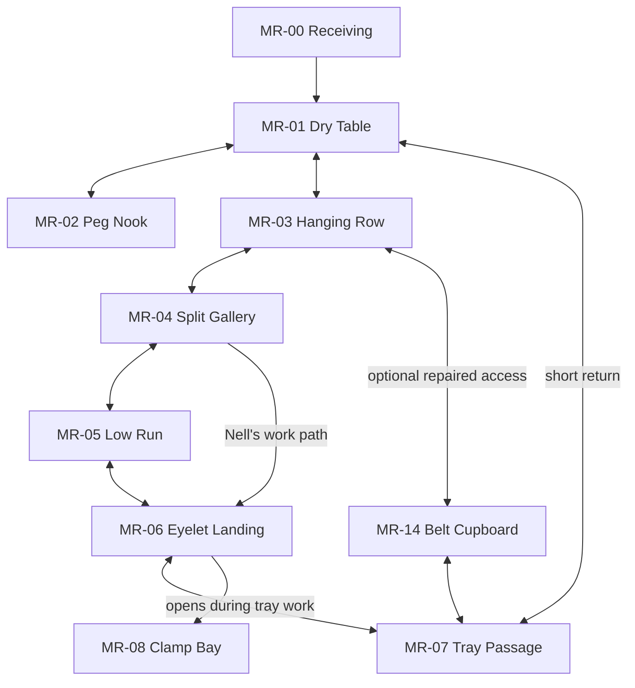
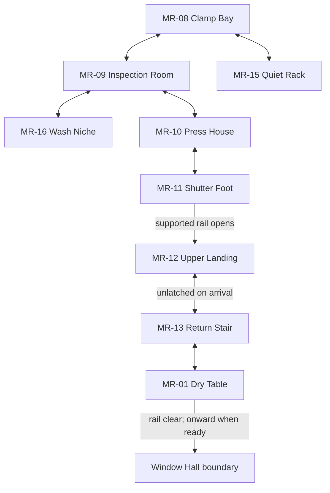

# Rizo Dungeon — narrative package v0.2

**Version:** 0.2 · 3 October 2026  
**Form:** addendum, critical review, decision dossiers, and production treatment for **Chapter 1 — Mending Rows**.  
**Read first:** [Rizo-Dungeon-Narrative-Package-v0.1.md](Rizo-Dungeon-Narrative-Package-v0.1.md). This document does not replace or reproduce that historical package.  
**Repository / branch:** `taymarspencer/Rizo-World-` / `claude/rizo-codebase-audit-yuqlns`.  
**Art/runtime head inspected:** `8b4f9c2c726cb1b774dd8c220ced49b82d5210f0`, “Rizo Dungeon art pass: a visual signature, authored rooms and characters.” The remote branch was checked before editing; it matched this checkpoint. The clean reference checkout was fast-forwarded from Run 2.  
**v0.1 preservation:** the authored file was copied without edits. Its SHA-256 is `953e6d9c869c992681a6c69b169808f2a02c2ba8e828aca1b21960d702c01105`.

## Authority: what publication means

### LOCKED CANON

The owner’s foundations and accepted playable facts identified in v0.1 remain locked. The completed art at the inspected checkpoint is additional accepted visual evidence: its actual silhouettes, materials, props, room composition, portraits, and presentation rules are the baseline for this pass. The exact existing opening and Threshold dialogue remain evidence, including the argument in the van.

No runtime code, art, styles, controls, save behavior, or proof homecoming is changed by this document. The actual raised Rizo remains the protagonist. Latch’s rescue and reciprocal help, SIT / GO, First Knot, and the accepted proof’s return to the real Den remain intact.

### PROPOSED FULL-STORY DEVELOPMENT

**Every new motive, history, character detail, room, interaction, dialogue draft, future payoff, and recommended revision below remains a proposal.** “Production treatment” means specific enough to review and later build; it does not mean approved for implementation. Committing a proposal makes its authorship permanent, not its adoption automatic.

The owner has not resolved v0.1’s ten decisions. The full campaign connection still assumes **P-01**, the explicitly proposed edition boundary after First Knot. Mending Rows cannot silently be attached to the accepted proof’s home door. The proof is a completed real journey; a campaign edition is a deliberate later product decision.

If adopted, the specific Mending Rows treatment here takes precedence over the corresponding broad v0.1 scene descriptions. Until then, both versions remain reviewable proposals. A future implementation brief must cite the adopted decision and scene version. It must not pick whichever version is easiest to code.

### Scope held back

Window Hall, Warm Main, confinement, the final Nell encounter, relocation, and homecoming receive only critique, dependencies, and decision alternatives here. **There is no authored betrayal scene or final betrayal dialogue in v0.2.** Proposed order: v0.3 review and Window Hall; v0.4 Warm Main before rupture; v0.5 confinement only after the relationship works in play.

## 1. Art ↔ story crosswalk

### 1.1 Evidence actually inspected

| Source | Relevant evidence |
|---|---|
| [dungeon-art.js](../../../modes/dungeon/dungeon-art.js) | Constitution; `P`, `RULES`, scale; material and repair helpers; Keeper, van, three hoods, seated figures, Latch, Porter, Draftling, Needle, cooler, bowl; portrait families. |
| [dungeon-scenery.js](../../../modes/dungeon/dungeon-scenery.js) | Authored opening and Threshold spaces; `vanStatic`, `roadStatic`, `drainStatic`; `ROOMS` for Slip, Clatter, Hem, Hearth, Queue, Porter; dynamic lights and signs. |
| [dungeon-content.js](../../../modes/dungeon/dungeon-content.js) | Actual geometry, inspectables, encounters, speaker identities, portraits, accepted lines, proof edition and home exit. |
| [dungeon-view.js](../../../modes/dungeon/dungeon-view.js) | Canonical Rizo markup, camera width, depth composition, portrait presentation, stepped light, shapes above darkness, shell transition. |
| [dungeon.css](../../../modes/dungeon/styles/dungeon.css) | Real screen and dialogue constraints, 56px portraits / 46px on smaller screens, SIT / GO presentation, physical Rizo poses and reduced-motion behavior. |
| [dungeon-core.js](../../../modes/dungeon/dungeon-core.js), relevant portions of [dungeon-mode.js](../../../modes/dungeon/dungeon-mode.js) | Existing input and interaction limits, necessary to distinguish playable proposals from things already supported. |

Paths above go from this folder to the repository root. These are source-code observations, not claims of a new live-game playtest. Nell and Mending Rows have not been drawn or implemented. The chapter’s timings are authoring targets.

The constitution already gives narrative direction: repairs are consistent marks made by particular hands; wobble is seeded and stable; warm light uses stepped pools; light from above is a visual orientation. A changed room should retain its seams and wear. It should not look like somebody generated a replacement room with a similar palette.

### 1.2 Treatment key

**Atmosphere:** evidence of life that carries no reveal obligation.  
**Recur:** something encountered again through ordinary use.  
**Plant → payoff:** a particular recognition or action is deliberately earned.  
**Unexplained:** the game allows a question to survive, without dangling an implied answer.

A detail can recur without being a plot clue. No checklist, collectible reward, omniscient caption, or compulsory close-up is implied by this table. The “later use” column is proposed development; the “observed” column records the accepted visual.

### 1.3 Characters and the theft

| Detail actually present | Treatment | Proposed later memory / use | Boundary |
|---|---|---|---|
| **Latch’s folded-paper A-line coat**, high stiff collar, visible folds, taped hem tear, sewn shoulder stamp | Recur; practical plant | Nell repairs the load-bearing cuff/strap attachment while leaving his recognizable folds and taped hem. Much later the same little coat arrives at a promised junction. Recognition precedes dialogue. | Do not redraw it as ordinary wool, armor, or a new “upgraded courier” outfit. Paper is visible material, not proof he is a letter brought to life. |
| **Brass throat clasp and satchel clasp** | Recur | Latch’s throat clasp clicks when he lowers his collar enough to eat; the satchel flap is opened for his real delivery. Nell’s work does not require touching the throat clasp. | Neither clasp is a magical seal, plot key, or counterpart to Nell’s future gate. Keep the two clasps physically distinct. |
| **Satchel pulling one shoulder down** | Plant → payoff | In Rows, Nell asks Latch to take the packet out before she repairs its anchor. Its weight visibly changes his posture. A later packet arrival can be understood as completed work, not teleportation. | Never make the satchel hold an entire campaign inventory. A repair improves comfort; it does not erase his asymmetry. |
| **One mustard odd sock** | Atmosphere; recur in humor | Latch insists it is the dry sock. Nell offers to mend a hole; he declines a matching pair. This is an ordinary preference she accepts. | No missing partner theory, dead child reveal, secret faction color, or special sock item. Do not turn a charming asymmetry into grief evidence. |
| **Porter’s hollow greatcoat**, lantern head, no visible feet, blank luggage tag, sewn closed seam | Recur; delayed safety payoff | Later shelter uses his coat as a windward screen and his light as a clear position marker. He opens the side toward the traveler’s exit. The same shape that occupied a lane makes room beside it. | There is no concealed human to unmask. “Living person” describes agency and relationships, not an invented anatomical occupant. Do not identify him as Eda’s ghost. |
| **Cracked lantern pane with repair tape** | Atmosphere; recur | The uneven taped pane makes his light recognizable across a dark corridor. Someone adjusts its mounting, not its identity. The pane remains repaired afterward. | No lamp soul, dead-person fuel, stolen Rizo flame, or late reveal that the crack contains a message. |
| **Sewn front seam and worn lining opening from the hem** | Plant → payoff through conduct | The boss opening already exposes a vulnerability. In later safe scenes his coat can stand partly open without becoming an attack tell; placement, lane inactivity, and an unobstructed exit establish the difference. | Do not reward Nell for “sewing him shut,” equate mending with control everywhere, or replay his combat state in sanctuary. |
| **Small Hood filming**, maroon puffer, mustard pom beanie, crooked eye slot, phone as cold light | Plant → payoff | A limited later image can corroborate the curb and theft crew. The useful part is an accidental reflection or van door in a recording made to show off, not a cinematic confession. | Do not make the phone a prophecy scanner or a cybervillain’s control network. No compulsory replay of the abduction for humiliation. Filming is not evidence that the crew knew Rizo’s powers. |
| **Tall Hood:** long slouched hoodie, uneven strings, too-short sweatpants, slides and pale socks | Recur for recognition | A later distant depot glimpse uses posture, hem length, and footwear together. Rizo may recognize him before a face or name is supplied. | Keep him specifically careless and intimidating. Do not replace him with a military silhouette or absolve the theft because his clothes are funny. |
| **Wide capped hood**, track jacket, stripe, pillowcase over shoulder; Driver portrait and seated silhouette | Atmosphere; identity evidence held open | Preserve the three on-foot roles. Identify Driver by the existing spoken role until the artist/owner chooses whether he is also the capped figure. | The art shares some clothing vocabulary, but the runtime does not explicitly settle that identity. v0.1 left Driver distinct; neither a fourth-person reveal nor a merge is approved here. |
| **Van’s primer replacement door**, taped handle, rust, one missing hubcap | Plant → payoff | The primer rectangle plus missing hubcap can identify the vehicle in a later image or depot sightline. The poor door fit makes the existing rain gap physically credible. | Do not add a sinister logo to solve identification. The door’s outer depiction and interior geography need a later art check; do not claim a precise failure mechanism the current art has not shown. |
| **Crushed chips, cans, cup/straw, cable, food bag, tickets, tree freshener** | Atmosphere | The van belongs to people with ugly ordinary habits. One crushed-chip joke can be remembered through an unrelated intact bag later; no explicit callback line is needed. | No item-by-item criminal biography. No humanizing scene that asks Rizo to comfort its abductors. |
| **Red cooler, white lid, dent, small mustard sticker** | Existing plant; delayed playable payoff | Recognition can use those three details in Outer Line. Cargo can again slide while Rizo has agency and cover. | A diagram can move through records; the physical cooler must have a credible journey. Avoid replaying the same opening encounter as filler. |

### 1.4 Places and ordinary human evidence

| Detail actually present | Treatment | Proposed later memory / use | Boundary |
|---|---|---|---|
| **Curb’s dry strip**, bent umbrella rib, taped awning, OPEN reflected in a puddle | Atmosphere; recurrent shelter vocabulary | Nell also clears a small dry place before discussing a route. The surface return can restore familiar shelter dimensions without recreating the curb abduction scene. | The awning is not a coded route mark. The umbrella belongs to YOU’s established silhouette, not Nell. |
| **Roadside bowl containing rainwater**, distant warm windows | Existing plant; delayed context payoff | The Den’s actual bowl finally belongs to Rizo. Lit windows establish that other homes exist while none is its destination. | The roadside bowl is explicitly “Not his.” Never make it the Den bowl, evidence YOU discarded Rizo, or Eda’s possession. |
| **Bus shelter, timetable, empty bench, deflated balloon, mile marker 14, torn bag, crushed can** | Mostly atmosphere; shelter may recur | An adult-sized waiting place provides partial safety without an arriving rescuer. A later shelter can be useful because somebody is actually there. | No balloon child investigation; no numerology from 14; no bus boss. No promise that the roadside bus will eventually arrive. |
| **Dry glove and trolley wheel in the drain** | Unexplained; shelter evidence | A place can have been used before Rizo without being destined for it. A Rows work glove may resemble the shape without claiming to be its pair. | Do not assign the glove to Eda merely to connect all absences. |
| **Concrete → brick/plaster → stitched deep architecture; inward-running trickle** | Recur; intentionally incomplete explanation | Rows makes repair load-bearing: lashings hold an old platform, cloth insulates a pipe. Recognizable infrastructure remains under impossible repairs. | Do not invent a sewing god, five material realms, or a portal cosmology. Some spatial wrongness should remain felt. |
| **Slip’s key-scratched HOME ↑**, distant lit upward door | Existing plant; practical payoff | The direction points up through service access, not to Rizo’s exact Den. A route is corrected later through visible work. | v0.1’s Eda authorship should be optional and remains a proposal. Do not make every scratch hers or delay main navigation until the sign’s author is found. |
| **Clatter’s unclaimed parcels, hanging tags, belt, pilot lamps waking near Rizo** | Recur; practical mystery | Warmth can briefly wake local controls. Window Hall can clarify how parcels and notices move. A bag’s ownership is separate from its routing label. | The near-Rizo lighting is already visual behavior; it does not establish a city powered by Rizo or a magical “chosen flame” interface. |
| **Hem’s swept path**, broom, mop, bucket | Atmosphere; recur | On return, the path stays swept although a different route is now used. Ordinary care outlasts a crisis. | Do not retrofit an unseen cleaner as a compulsory sixth principal character. Work can be distributed among the existing cast. |
| **Hem’s grouped chalk day tally** | Unexplained, with optional mundane context | Someone has counted days here. Latch can remember that the wall was already marked when he started this route. | Do not equate the count with his present captivity, give an exact BELOW time ratio, or turn it into Eda’s death date. The art comment establishes counted days; it does not identify the counter. |
| **Hem’s tin cup and folded route map** | Recur; practical plant | If Latch retrieves them on a later round, the old room loses those exact props and his satchel gains a believable small load. Nell can use a separate copy of a route diagram. | Do not make these magically follow him in every scene. Record any actual movement. The current Threshold does not show him retrieving them. |
| **Hem’s taped caged work lamp** | Atmosphere; practical recurrence | Distinguish working light from fire: a lamp reveals a job; a stove warms a place. Nell points the work lamp toward Rizo’s low task. | No lamp-fuel lore explanation required. Do not make everything amber produce heat. |
| **Hearth’s two differently colored cushions, folded blanket, braided rug, kettle, two cups** | Recur; relationship memory | Latch’s seat remains his offered shared place. On a later round, one cushion is shifted closer to the fire while the route remains open. The rug’s worn bands persist. | Two seats do not prove two dead occupants. GO does not retrospectively mean Rizo sat; no guilt for leaving. |
| **Child’s house drawing**, little flame, blue door, tape; sock and scarf on a line | Unexplained; ordinary recurrence | Someone drew a home and somebody kept the drawing dry. It can remain in the same room after other objects move. | Do not identify the little flame as Rizo, predict the Den’s layout, invent a dead child, or give the picture a coded ending. Childlike drawing is not proof its artist is a child. |
| **Hearth’s cold bowl corner and frost** | Existing plant | The warm room has a cold edge. Later bowls distinguish care, habit, and absence through use. | The Threshold bowl remains unassigned. Avoid making every bowl a grave. |
| **Queue’s polished zigzag standing positions**, nearly lost WAIT HERE, bolted chairs, ticket stubs, SHUT card | Recur; delayed changed-use payoff | A later route can walk directly across the old queue because somebody opens a useful staff path. That physical shortcut makes obsolete authority legible. | No spectral queue reenactment; no ancient bureaucracy exposition; no long compulsory waiting for a number. |
| **Queue’s NOW SERVING display continues counting** | Atmosphere; practical contrast | Tally can acknowledge that the number advances while the counter does not serve anybody. In the changed district it may be switched off by a resident doing a normal task. | Its current number is time-driven presentation. No puzzle solution, countdown, death count, exact timeline, or canon numeral. |
| **Maroon coat abandoned on Queue chair** | Optional plant held lightly | Optional property work can distinguish “left here” from “unwanted.” A future claimant needs ordinary evidence, not a famous family crest. | Do not automatically make it Eda’s, Nell’s, the Return Coat, or a personified hostage. The main story does not require an owner. |
| **Porter’s key board: all hooks visible, one without its hanging key** | Recur; potential practical payoff | In a later inspection round he can return an ordinary key to that hook before moving his working ring. This proves an old round was completed. | The code draws the hook and omits one key. It is not literally a missing-hook artifact or guaranteed lost master key. No first-frame mystery quest should promise an answer. |
| **Stopped clock over the door** | Atmosphere; intentionally unexplained | Preserve its stopped hands when the room changes. People consult a delivery schedule or their work, not that clock. | No exact death time, time loop, reset ending, or explanation that everybody is dead. |
| **Worn runner and left-luggage pigeonholes** | Recur; character evidence | Porter’s repeated patrol has a physical path. Later he can stand off the runner to shelter an actual traveler. | Keep the runner’s wear. Do not polish it clean after a boss or fill every parcel with a tragic letter. |

### 1.5 Limits on planting

For Mending Rows, commit authoring attention to **four reusable memories**: an accommodated low work position; a kept rendezvous; a recognizable opening/fitting gesture; a useful coat with ordinary workmanship. The rest can live without a payoff.

Do not score every kindness with a motif. Nell also drops crumbs, loses her place in a tally, tells a pointless story, changes a tool, and gets annoyed. Those moments must be permitted to end where they happen.

Repairs should differ by maker and purpose, not by moral alignment. Nell’s repair can be careful and unattractive; Latch’s ugly knot can work. Tape is a shared habit above and below. It cannot mean “this person will betray you.”

## 2. Attack on v0.1

These judgments recommend changes to the proposed treatment, not edits to the historical file. **KEEP** retains a useful foundation; **STRENGTHEN** changes execution or causal evidence; **REPLACE** withdraws a proposed default. None resolves an owner decision by itself.

### 2.1 Nell — STRENGTHEN

**Keep:** competent mender; sincere guide; food and relationships independent of Rizo; asking before adjusting worn things; later care and later harm both true.

**Weakness:** her v0.1 private need and biography are organized almost entirely around preventing another loss. That makes her a thematic device before she becomes somebody one enjoys knowing. Garment repair, boiler knowledge, guidance, shelter management, and combat expertise also risk making her conveniently good at everything.

**Revision:** she is excellent at fitting loads and repairing seams, lashings, wraps, straps, and the small clamps she services daily. She is not the boiler’s inventor or sole engineer. She checks a posted procedure when uncertain and accepts a correction from Orr. Give her a preference for the crunchy edge of a meal, an impatient pencil tap, one story with a bad ending, and a specific habit of restarting a count after interruption. Let her be pleased by a neat repair, vain about one ugly but successful patch, tired, hungry, and occasionally wrong.

**Cost accepted:** some scenes do not advance the campaign mystery. They earn the person who must survive it. Cut duplicate instructional dialogue before cutting ordinary life.

### 2.2 Kidnapping motive — REPLACE the recommended default; retain the alternative

**Keep:** the accepted theft, cooler, argument, pothole, rain gap, fall; opportunistic selection; recognizable ordinary crew; no destiny and no Nell involvement.

**Problem:** the Driver says he thought Rizo did not do “that fire shit”; Tall Hood answers “probably.” A planned trade in living heat devices can be made compatible by distinguishing useful warmth from uncontrolled flare, but that is an additional explanation designed to protect our first idea. The phone also makes careless showing off more immediate than organized extraction.

**New recommendation, pending D-02:** opportunistic pet theft for resale, with the small hood filming for his companions. They noticed a small unattended desirable creature, not a rare sacred power. The fire is a capability they did not responsibly understand. Heat becomes useful after Rizo reaches BELOW. That makes Nell’s later categorization a choice by a person who knows it, rather than the whole campaign repeating one pre-existing industry.

**Evidence consequence:** v0.1’s heat-category docket must be rewritten in a later approved Window Hall pass. Use “animal / live” or a crude image and failed delivery, not a secretly altered opening line. Do not settle motive through a clip that conveniently records a full confession.

**Alternative remains credible:** a small stolen-equipment fence accepted “contained warming pet,” while Driver was misled about its flare. If chosen, show that specific misunderstanding once. Do not build a Rizo slavery economy to rationalize it.

### 2.3 BELOW’s heat infrastructure — STRENGTHEN, with a causal gate

**Keep:** human-scale fuel, stove work, insulation, repairs, schedules, a local circuit rather than a world reactor. Rizo’s role is small.

**Problem:** “sustained warmth at a control joint” can sound like an invented socket that only the protagonist fits. A burning creature locked in a room also invites a simple question: why not put a lit lamp there? Local need alone cannot answer that. A mender should not also be the only person capable of all heating work.

**Required later evidence:** separately show heat source, control, and distribution. Fuel heats a small bank; a damaged sheltered release needs **repeated responsive warming at reachable moving points**, within Rizo’s already demonstrated abilities. Stationary fire can warm one point but cannot follow the returning clamp safely. Residents have safer alternatives requiring a route, staffing, or moving work. Nell’s plan uses a convenient person to avoid disruption; it is not physically the only possible plan.

**Gate:** no confinement scene is ready until a model room demonstrates both the bad plan and a credible non-Rizo alternative without an exposition panel. This pass does not specify the final mechanism. Rows teaches only local joints, fuel-supported warmth, and distributed work.

### 2.4 Five-district campaign — KEEP geography; STRENGTHEN variation

**Keep:** Threshold, Rows, Window Hall, Warm Main, Outer Line, and revisits. They are parts of an ordinary service world, with actual connections.

**Problem:** the broad spine sometimes reads “find blocked machine; defeat moving machine; open next door.” In a game about returning to a person, five mechanical locks can become an unrelated campaign with a home label attached.

**Revision:** each district must change the kind of progress. Threshold: survive and help. Rows: learn another body’s route and work together. Windows: establish destination and recognition. Main: attempt a genuinely finite crossing while responsibilities collide. Outer: act with knowledge acquired in companionship and find an alternative. Return: leave changed relationships and places. The next chapter must not simply copy the Rows maintenance climax.

**Scope boundary:** no sixth district is added to solve sameness. Meaningful optional exploration uses the same routes under different circumstances.

### 2.5 Nell’s betrayal — KEEP moral structure; STRENGTHEN pressure

**Keep:** she genuinely helped; she does not secretly work for the kidnappers; she knowingly withdraws departure; care afterward does not erase coercion.

**Weakness:** a sudden isolation notice followed by a perfect Rizo-shaped emergency would make the writer, not Nell, responsible for the turn. Her grief cannot be a universal explanation.

**Required before v0.5:** show a previous attempt at a conventional repair, another resident’s workable but costly proposal, Nell’s concrete obligation, and a departure plan she actually advances. Her final bad decision is hers. Fear and loyalty explain it; engineering inevitability does not absolve it.

**What not to plant now:** hidden keys, sinister pauses, “you must stay with me,” a ledger classifying Rizo, or a musical shadow under the fitting. In Rows, she is available because her work takes her there, not because she is tracking a future captive.

### 2.6 Confinement — REPLACE the Rows staging; KEEP the later structural possibility

**Keep:** loss of freedom has consequences without torture; player movement, refusal, and escape matter; no permanent-stat wound required.

**Problem in RD-104:** a conspicuously cozy locker introduced chiefly so the same door can trap Rizo later announces the plot. If Rizo is placed in a latched box twice, the memory becomes a mechanism lesson more than care.

**Rows revision:** the safe drying recess sits inside an **open inspection room**. Nell holds a light slatted screen across a passing carriage lane, never locks Rizo inside the recess, and leaves a readable side route. The screen opens promptly; Rizo can instead use cover. Nobody praises obedience.

**Later structural continuity:** if confinement is adopted, the **outer inspection-room exits** may be withdrawn, not an off-screen teleport into a box. Familiar gestures and the same route can become frightening. Exactly which closure, what delay, and what physical danger await v0.5. Do not author them here.

### 2.7 Final Nell encounter — STRENGTHEN; change the default presentation

**Keep:** the conflict ends because she relinquishes control, not because Rizo earns forgiveness, kills her, or delivers a speech.

**Problem:** a conventional boss health bar on a former guide converts a painful relationship into a sanctioned beating. Repeated attack reactions can teach the wrong emotional conclusion.

**Recommendation, pending D-08:** a finite gate-release encounter using distance, cover, warming, and positioning, with no personal HP bar. Nell operates the contested mechanism while the player gains independent exit control. Direct disarm remains an alternative if it can preserve her body and familiar motions.

**Boundary:** this is an encounter requirement, not its room layout or dialogue. She must physically stop enforcing retention. Merely slipping away while she still claims the right to keep Rizo is not sufficient resolution.

### 2.8 Community relocation — STRENGTHEN

**Keep:** smaller functioning shelter; an old room left cold; residents carry their own lives. Returning home is not paid for by saving a city.

**Problem:** the proposed return chapter can make Rizo the relocation project manager. If it must carry everyone’s home to earn departure, coercion has only changed its uniform.

**Revision:** residents decide and begin moving independently. Rizo clears a route it also needs and may volunteer one small load. Main-route evidence shows continued cooking and heat with Rizo standing away. Unfinished shelving and an unheated room remain; no promise of universal future safety.

**Ordinary continuity:** the cushion, work lamp, CLOSED sign, and stove do not all have to move together. A practical inventory later identifies the few objects moved, by whom, and why. Do not strip every Threshold room into a generic final village.

### 2.9 Return Coat — STRENGTHEN; remove genealogy from its first encounter

**Keep:** one practical borrowed weather coat, altered through use; later permanent availability; optional wearing; First Knot stays distinct.

**Problem:** a conspicuous “bad old seam” plus Nell’s dead mentor plus final fitting can make the coat an inherited sacred relic. It risks replacing the actual pet’s clothing and making acceptance look like forgiveness.

**Rows revision:** a work-store weather wrap is fitted around Rizo’s real shape. Its uneven old repair is one of several repairs and is safe. No Eda attribution, memorial silence, named rarity, armor statistic, or “this was made for you.” The coat can travel folded in the route kit or remain available if fitting is declined. Later authorship of an old repair is optional and requires object evidence.

**Later requirement:** coat ownership and exit are independent of reconciliation; the final version cannot automatically equip over the chosen accessory. If the coat renderer cannot accommodate all Rizo stages, solve the product choice deliberately rather than transforming Rizo into a fixed costume.

### 2.10 Ending — KEEP; STRENGTHEN the scale change

**Keep:** same actual Rizo, real Den, ordinary care, familiar habits, funny bodily specificity, a positive mark rather than a trauma meter.

**Problem:** a recap montage, a triumphant “home” overlay, an NPC speech at the doorstep, and an immediate reward panel would prevent the ordinary room from doing the emotional work. A Den that visibly copies BELOW would also spend the changed perception as decoration.

**Revision:** the journey’s last strong image is a doorway and an available way out. Back home, Rizo encounters ordinary care and a ridiculous small inconvenience. It need not suddenly become solemn or clingy. The Den retains its actual familiar arrangement. A later small adjustment in approach or attention can carry the memory without reducing every future meal to trauma.

**Care constraint:** low bond, different stage, different variant, absent accessory, or an owner who plays quickly must still receive a genuine return. Do not invent an ending tier for “good” caretakers.

### 2.11 Revision register

| Proposal being hardened | v0.2 recommendation | Adoption needed |
|---|---|---|
| P-01 proof / full-edition boundary | Retain explicit edition choice | D-01 |
| Heat-directed theft | Prefer ordinary pet resale; retain bounded heat alternative | D-02 |
| Porter as generic “living resident” | Agency without invented inner human anatomy; accepted hollow silhouette | Ontological details D-03; silhouette already visual baseline |
| RD-100–105 broad Rows cards | Expand into MR scenes below | Chapter approval plus D-01 connection |
| Locked safe locker in Rows | Open inspection recess and held screen | Chapter approval; later confinement D-04 |
| Heat-joint convenience | Demonstrate responsive task and viable alternative before rupture | Future v0.4 / v0.5 approval |
| Final disarm as standard boss | Prefer finite gate release without personal HP | D-08 |
| Eda seam as early coat emphasis | Remove early attribution; optional later history | Chapter approval; loss D-06 |
| Relocation dependent on Rizo | Resident-led work; one optional small contribution | D-09 |

## 3. The ten owner decisions — real alternatives

All ten are **OPEN**. Option A is the version recommended in this pass; Option B is a credible story worth building, not a straw alternative. The consequences compare them. These are decision dossiers, not a vote or hidden adoption list.

### D-01 — Where does the campaign leave the accepted proof?

**Option A — Explicit full-campaign edition.** Keep the accepted proof and completed proof journeys intact. In a later campaign edition, First Knot precedes a real service lobby into Rows, while the final route reaches the actual Den. Latch’s existing departure remains sincere: something upstairs is waiting; he has not promised an instantaneous Den portal.

**Option B — Two real journeys.** Rizo truly returns at the proof endpoint. Ordinary care resumes. After a meaningful interval, Rizo voluntarily accompanies a thank-you delivery to Latch, through a now-known safe entrance. A local closure separates it from the return route. The full story becomes a second, initially voluntary visit that turns into being lost. The Keeper does not abandon it twice in the same store.

| Consequence | A | B |
|---|---|---|
| Long-term | One continuous lost journey; clean proof / campaign distinction needs product documentation. | Literal runtime history preserved inside one campaign; two inciting events and two homecomings must remain dramatically distinct. |
| Gameplay | Campaign edition needs deliberate continuation/save migration decisions; no silent replacement of old completion. | Requires playable Den interval, voluntary visit entry, and new separation; can dilute the early urgency. |
| Visual | New lobby preserves the existing door’s material vocabulary; proof retains its established light. | Actual Den appears twice; safe descent must look and feel different from the drain fall. |
| Emotional risk | Existing proof players may feel an ending was taken away if the edition distinction is concealed. | “Home” becomes an intermission; the second loss may feel engineered to reach the proposed plot. |

**Recommendation:** A, with the distinction communicated in the eventual product and save policy. Documentation alone cannot authorize a runtime endpoint change.

### D-02 — What did the kidnappers think they were taking?

**Option A — Opportunistic pet resale.** Small Hood spots a creature waiting alone and films the grab. Tall Hood acts confident, misrepresents what he knows, and does not understand the flare. Their van and depot belong to a small informal resale route. The theft is mundane, deliberate, and harmful. BELOW discovers Rizo’s useful warmth independently.

**Option B — Bounded heat resale with a false specification.** The crew’s fence wants small portable warming animals or equipment. Tall Hood told Driver this one would provide contained warmth without dangerous flare. Driver’s existing complaint exposes that lie. The trade has one local route, not an empire of captive Rizos.

| Consequence | A | B |
|---|---|---|
| Long-term | Keeps kidnapping and Nell’s later choice causally separate; fewer institutional villains to service. | Makes commodification a campaign-wide thread; requires defining enough trade and buyer behavior to avoid vague menace. |
| Gameplay | A recent failed-delivery image and depot contact answer motive; route reconstruction optional. | Records must distinguish warmth from flare; some load/ventilation evidence supports the specification. |
| Visual | Existing phone, masks, junk, primer door, and cooler carry the evidence. | The same assets work, but a bounded cargo specification needs new readable evidence; no redesign of hoods. |
| Emotional risk | The crime may feel slight if presented only as a joke; lost-player experience must retain its weight. | Repeated “Rizo is equipment” scenes can become reductive and make Nell’s pressure look preordained. |

**Recommendation:** A. It is more economical with the actual dialogue and visual behavior. If B is chosen, the opening remains untouched and the extra distinction must earn its place.

### D-03 — What sort of people live BELOW?

**Option A — Real people with heterogeneous strange bodies.** Latch is materially paperlike and individually alive; Porter is a hollow coat-and-lantern person; other residents need bodies suited to their work. Their meals, rest, repair, death, and travel are real, but there is no universal species explanation. “Person” is evidenced by conduct and continuing life.

**Option B — Particular objects acquiring personhood through continued use.** Some residents are literally work objects that became persons: a courier coat, a porter’s coat/lantern, an attendant’s service assembly. This process is real but local and uneven. Human presence and human-made spaces remain the source; they are not all deceased humans wearing props.

| Consequence | A | B |
|---|---|---|
| Long-term | Flexible small cast; mystery can survive without a taxonomy. Every new body still needs internal rules. | Strong material continuity; requires boundaries for which objects become people and how agency begins or ends. |
| Gameplay | Protection and warmth differ by body; no universal “repair person” heal button. | Some material care can affect bodies directly; must separate repairing a seam from owning its wearer. |
| Visual | Preserves every authored silhouette. Nell/Orr must be designed within the existing scale and cutout language. | Preserves them too, but Nell/Orr may need more visibly object-based bodies and a larger approved art brief. |
| Emotional risk | “Unexplained” can become evasive if food and death contradict bodies. | Personification can make everyone seem whimsical or reduce loss to replacing an object. |

**Recommendation:** A. Specifically reject adding an occupant to Porter to make “living” familiar. Decide bodily needs per character before animating a meal. Neither alternative makes BELOW an afterlife.

### D-04 — What harm does confinement do?

**Option A — Consequential nonlethal coercion.** Nell withdraws a known exit, misses Rizo’s viable departure, separates it from friends, and forces a dangerous independent detour. The player can test, refuse, and escape. Later closeness changes. No permanent physical injury is needed.

**Option B — A bounded, lasting material cost.** The same confinement also damages the borrowed wrap or singes a visible non-body repair when Nell’s retaining plan fails. Rizo remains the same playable pet with normal care needs. The damaged object remains a concrete loss of safety; it is not automatically transformed into a stylish reward.

| Consequence | A | B |
|---|---|---|
| Long-term | Trust, separation, and route loss carry the consequence; requires sustained aftermath. | A durable object record makes the cost legible but complicates later coat and repair continuity. |
| Gameplay | Active escape and aftermath must occupy real play; no punitive wait. | Recovery includes practical repair or choosing another shelter; no required stat debuff. |
| Visual | Familiar gestures, closed exits, distance, and changed approach suffice. | Requires a stable damaged-object variant and readable cause, never gore. |
| Emotional risk | Too brief an escape could make the wrong seem merely an inconvenient gate. | Physical damage may dominate the violation of freedom or make Nell irredeemably violent for the intended ending. |

**Recommendation:** A. Test its aftermath before adding B. Permanent bodily harm, torture, or a randomly killed friend is not the strongest credible alternative for this game.

### D-05 — What reconciliation belongs in the main ending?

**Option A — Accountability and release; closeness remains open.** Nell names her action plainly and stops enforcing it. Rizo can take practical help at a distance, decline touch, or leave. Optional later contact can show repeated respect. No ending states that accepting a coat equals forgiving her.

**Option B — One limited, player-chosen renewed act.** After exit is already secure, Rizo can initiate a small cooperative action with Nell, such as holding the loose edge of a repair she has offered. This restores one working interaction, not the previous relationship. Declining gives an equally complete homecoming.

| Consequence | A | B |
|---|---|---|
| Long-term | Leaves room for honest unresolved attachment and later visits. | Gives a concrete beginning to repair on the main route, with more branching continuity. |
| Gameplay | Exit and wardrobe availability are independent of contact. | Player initiation must be unmistakable; a repeated Primary press cannot accidentally accept closeness. |
| Visual | Distances and hands waiting remain important; no obligatory embrace. | Requires distinct “offered / initiated / withdrawn” staging, with no celebratory portrait on refusal. |
| Emotional risk | Some players may want clearer acknowledgment that affection survives. | A short final task can look like purchased forgiveness or put repair of the adult’s feelings on Rizo. |

**Recommendation:** A as the main requirement; B only if its initiation and independence are proven. Forced forgiveness is not a credible alternate ending.

### D-06 — Where does irreversible loss enter?

**Option A — Eda is already dead, and ordinary routines persist.** Orr’s extra portion and Nell’s inherited work lead to a plain truth in Warm Main. Earlier details never imply a rescuable missing person. Eda has faults, preferences, and work unrelated to how she died.

**Option B — One currently present friend leaves permanently during play.** Orr is the strongest candidate if this is chosen: an existing illness or failing body is established openly, and his final absence follows ordinary preparation rather than a surprise combat sacrifice. He remains an active person for much of the game. His loss is not caused by Rizo leaving or by Nell’s confinement.

| Consequence | A | B |
|---|---|---|
| Long-term | Living cast has time to deepen; loss can coexist with warm recurring routines. | A major living relationship has a fixed ending; meals, relocation, and optional arcs need substantial rewriting. |
| Gameplay | Warm the second bowl, carry present food, continue work; no rescue countdown. | Offer bounded help without promising cure; continuation must not become a medical quest. |
| Visual | Ordinary unused objects carry absence, without a ghost or memorial biome. | Requires changed occupied space and careful restraint in physical deterioration. |
| Emotional risk | Eda can feel like a convenient backstory if remembered only through fear. | Loss may overwhelm the betrayal and make the small cast into emotional ammunition. |

**Recommendation:** A. Do not put both versions into one story to increase sadness. The Rows meal is ordinary appetite now; Eda’s explicit death belongs to the later approved chapter.

### D-07 — How present is YOU while Rizo is lost?

**Option A — Sparse physical evidence of search.** One later surface sound/notice has a credible connection to the store or neighborhood. It confirms that somebody is looking without showing a Keeper movie or giving Rizo an exact rescue appointment. Actual return proves care continues.

**Option B — Search entirely off-screen until home.** Rizo hears ordinary surface life but receives no conclusive evidence YOU knows where to look. The internal answer remains that YOU searched and kept home accessible. The Den is the first confirmation available to the player.

| Consequence | A | B |
|---|---|---|
| Long-term | Grounds YOU’s continuing attachment while retaining separation. | Keeps viewpoint extremely close to Rizo; later retellings must not treat uncertainty as abandonment. |
| Gameplay | A brief optional listening position can support recognition; main route never depends on hearing it. | Navigation relies on remembered landmarks and staffed routes. |
| Visual | One ordinary notice or ceiling sightline, without a face reveal; consistent Keeper silhouette. | No additional Keeper art needed before the Den. |
| Emotional risk | Too-specific evidence promises immediate rescue or manipulates the real player’s guilt. | Some players may infer the Keeper forgot Rizo; ordinary home care needs enough space to answer that. |

**Recommendation:** A, very limited. Never invent real-world activity by the actual user, demand an apology, or penalize their game attendance.

### D-08 — What does the final Nell conflict ask the player to do?

**Option A — Secure the gate independently.** A short physical release encounter combines route knowledge, safe positioning, cover, and warming. Nell operates the barrier; she eventually stops enforcing it and opens a final catch. No personal HP bar. Familiar work motions remain recognizable.

**Option B — Direct nonlethal disarm.** Nell physically holds the control. Rizo uses Flare/Tuck openings to disrupt her grip and reach the release. The target is her working hold, not injury; a finite progress model replaces body damage. She remains present and accountable afterward.

| Consequence | A | B |
|---|---|---|
| Long-term | The ending centers departure and relinquished authority; aligns with mechanical knowledge earned together. | More visceral resistance; requires unusually careful combat language and animation. |
| Gameplay | Fewer new combat rules, but a meaningful contested mechanism must replace passive lever hunting. | Existing verbs apply directly, but targeting and feedback must distinguish disarm from hurt. |
| Visual | Hands, gate, stance, and path do the work. No villain transformation. | New familiar-motion variants, no blood, pain flashes, or triumphant defeat pose. |
| Emotional risk | Can feel like quietly avoiding a confrontation if she never visibly yields. | Can turn discomfort into pleasure at punishing her, undermining coexistence of care and harm. |

**Recommendation:** A, revising v0.1’s default. Keep B available until the gate prototype proves A has agency and conflict. No final scene dialogue is drafted here.

### D-09 — What changes when the community stops relying on Rizo?

**Option A — Resident-led smaller shelter.** Orr moves cooking, Latch moves notices, Porter changes watch, and Tally moves a working counter. Nell contributes repair without controlling departure. One old warm room is left cold. Rizo sees a new fuel-supported fire continue after stepping away.

**Option B — Keep the rooms, reduce their use.** Residents repair a partial return but must stagger work and close one heated function. The old community remains physically recognizable; some routines change and a cold room remains. Rizo can leave because staffing and fuel, not its body, now bridge the gap.

| Consequence | A | B |
|---|---|---|
| Long-term | Changes the neighborhood visibly and gives residents agency beyond Nell. | Strong spatial familiarity; requires an understandable plan for reduced use instead of a miraculous full restoration. |
| Gameplay | One new shared route and a few voluntary carrying opportunities; Rizo is not the moving foreman. | Revisits reveal schedule and function changes; fewer moving-prop states. |
| Visual | A few recognizable objects appear in practical new placements; former room retains wear. | Existing rooms keep their identities but some lights and active jobs change. |
| Emotional risk | “Everyone moves because of Rizo” can sound like displacement blamed on the traveler. | Reduced use can hide ongoing hardship and imply the problem was easily solved after all. |

**Recommendation:** A if the residents visibly choose it before Rizo’s help. B is a strong scope-conscious alternative; neither requires a saved-everyone ending.

### D-10 — Can a home Rizo visit BELOW?

**Option A — Safe optional visits after completion.** A known service route with an independent return replaces the loss entrance. No repeat abduction, compulsory repair shift, or ongoing heat obligation. Friends have new routines and can be absent for ordinary reasons.

**Option B — Final pre-departure neighborhood walk.** Once the exit is secure, Rizo can visit remaining people and rooms, then return home for good within this game. Optional arcs have clear completion windows. The world persists fictionally, but post-ending exploration does not pretend Rizo is still lost.

| Consequence | A | B |
|---|---|---|
| Long-term | Friendship can continue; authoring must account for later care sessions and new routines. | More finite ending and smaller maintenance burden; later visits require another deliberate edition decision. |
| Gameplay | A separate voluntary visit state with a reliable exit; no endless quest refresh. | Finish optional work before final departure; missed content cannot hide essential plot. |
| Visual | Safe known entrance, changed occupied spaces, a few ordinary alternate placements. | One final walk through secured routes; no extra visit interface or arrival state. |
| Emotional risk | Repeat travel may flatten the enormity of coming home or become unpaid duty. | “Never see them again” can be inferred if the fiction makes departure look like a sealed world. |

**Recommendation:** A if scope can sustain finite meaningful visits; B is the production fallback, with explicit continued life and no world-destruction closure. Neither choice changes the genuineness of homecoming.

## 4. Chapter 1 — Mending Rows: production contract

**Status: PROPOSED FULL-STORY DEVELOPMENT.** This is the only chapter developed to room and performance level in v0.2.

**Immediate want:** Rizo needs the dry service route to the staffed windows that can locate the way above.  
**Local obstacle:** a hanging load has seized the drying rail; a pressing carriage keeps returning to an empty job; the delivery shutter cannot clear until the load is safely supported.  
**Nell’s existing job:** keep protective garments and load-bearing repairs usable, maintain the Dry Table’s small shelter, and leave a safe work route for the next meal and courier deliveries. She would be doing this if Rizo never arrived.  
**Material outcome:** two ordinary repairs, a safe lower route, two shortcuts, an open upper shutter, and an available weather wrap.  
**Relationship outcome:** Rizo has experienced Nell accommodating its body, trusting it with useful work, meeting where she promised, accepting correction, and remembering it during ordinary work.  
**Question left open:** the upper route is used less often than the work rooms it serves. Some service notices are old. No crisis countdown or capture implication is needed yet.

The chapter’s strongest memory should be **a little place made beside an adult’s continuing work**. The place is offered; the work continues if Rizo leaves. The actual onward doorway is at the Dry Table hub, cleared by the connected drying rail. The upper work landing is the far maintenance end of that rail, not a second direct exit into Window Hall. Its sightline lets Rizo see the destination; the newly opened stair brings it past the lived workshop to the usable door. This is physical circulation, not a requirement to accept Nell’s gift.

### 4.1 What the chapter must earn, and what it must not earn

It should earn “Nell knows what she is doing here,” “I can do something she cannot easily do,” “she said she would be there and she was,” and “I like being near this person.” It need not earn “Nell can fix everything” or “Nell is my new owner.”

Rizo’s desire to leave survives every safe room. Looking up, attending to a route, or going early is not coldness. Nell’s good acts happen on the efficient main route; optional hanging around adds specificity. Her later wrong cannot be made contingent on whether the player accepted food, sat, wore her coat, or helped an extra time.

### 4.2 Duration and density

Target **65–80 minutes for an unhurried first main-route playthrough**, within v0.1’s chapter allocation. A practiced traversal will be shorter. Optional Rows work and ordinary moments contribute roughly **25–40 additional minutes**, plus voluntary resting of any length; these are portions of v0.1’s optional allowance, not hours added to it. Later returns are budgeted in their later chapters.

| Module | Authoring allocation | Why it occupies play |
|---|---:|---|
| Receiving, useful repair, Dry Table introduction | 7–9 min | Real delivery; body-height access; one cooperative repair and optional fitting. |
| Hanging Row and two routes | 13–16 min | A readable threat, separated paths, two local releases, reunion. |
| Tray crossing and first return | 8–10 min | A low task, shortcut opened through work, meal with a sympathetic disagreement. |
| Clamp Bay and inspection recess | 10–12 min | Second cooperative load repair, safe passage with an alternate route, one main quiet beat. |
| Press House and shutter | 14–17 min | Three spatially different phases; knowledge, cover, and durable route changes. |
| Upper landing, return stair, remembered work place, departure | 13–16 min | Inspect independent route; kept appointment; coat offered; normal work/rest; actual onward walk. |
| **Total** | **65–80 min** | No minimum sitting time, repeated damage sponge, or mandatory long speech. |

These allocations include navigation, observation, and first attempts. They are not timers. A designer must not add corridor length to hit them. If meaningful play falls below the target, review encounter variety and shared work; if it exceeds it, cut repeated releases before cutting Nell’s ordinary memories.

## 5. Nell as a person in this chapter

### 5.1 A workable body and a specific trade

**Appearance proposal for later art approval:** about **80u standing**, within the accepted 66–98u people range, compared with Rizo’s roughly 28u and Latch’s 38u. A service-green work coat over darker cloth, one sleeve rolled farther, a removable tool cuff, and one plainly visible light patch. Face and hands should use the accepted cutout and ink rules; final bodily material awaits D-03. No needle halo, hidden eyes, cape, ominous asymmetry, or villain palette.

Her single immediately readable detail is the **uneven rolled sleeve**, caused by one cuff getting wet at the wash trough. Chalk on a palm is occasional work residue, not a permanent mystic mark. Tools live on the bench or roll; she is not festooned with weapons. The large work clamp belongs to a machine, not her costume.

She is excellent at seeing where a load is pulling wrong. She rotates an object, supports its weight, and repairs the stressed join rather than prettifying the whole thing. She understands the daily warm joints in this workshop because she services them. She consults the work card for a shutter sequence and asks Orr about the tray route. Expertise has a boundary.

### 5.2 Questions answered through action

| Question | Specific answer | Where it is playable / visible |
|---|---|---|
| What does she notice first? | Rizo is standing in the drip line below an adult-height delivery ledge. She moves the ledger, angles the lamp lower, and clears a dry floor patch. She notices its situation before its unusual fire. | MR-S01; moving closer makes the adjustment visible. |
| What does she misunderstand? | She initially thinks Rizo wants the local warm room. When it repeatedly faces the upper shutter, she corrects herself: it wants a route out. She does not pretend to know the Den address. | MR-S02; either LOOK at the route board or walking toward the upper door supplies the same recognition. |
| What does she fix without being asked? | The rough bench corner / projecting staple that would catch passing cloth. She removes or covers the hazard on the workshop, not the player’s clothing. Later she lowers a work support after seeing Rizo’s reach. | MR-S02, MR-S11. |
| What does she ask before fixing? | A worn strap, wrap, or equipped garment edge. Hands stop outside the body’s outline until the player chooses the fitting position. No inferred consent from simply approaching her. | MR-S02, MR-S12. |
| What does she refuse to fix? | Latch wants his satchel made larger without taking anything out. She will repair the loaded anchor after he empties it, not sew a bigger pocket around the problem. She also refuses to turn the odd sock into a matching set without his agreement. | MR-S01; Rizo can put the packet on the low support. |
| What makes her laugh? | Rizo obediently follows a loose chalk line around the bench to reach the same place it started; Nell realizes her “shortcut” is a circle. It is her mistake, and the joke works without speech. | MR-O03; no clue or later plot function. |
| What annoys her? | Somebody moving the chalk while she counts, a tool put back point-first, and Orr answering a yes/no work question with a story. She can be annoyed while still considerate. | MR-S07, MR-O02; one irritated reaction, not a bark loop. |
| Who disagrees with her sympathetically? | Orr refuses to serve food across her precious cleared work strip; food belongs within reach. He puts the tray on the low shelf, she moves her tools, and she eats. Latch refuses a tidy replacement for a working knot. | MR-S07, MR-S01. Neither is stupid or punished for disagreeing. |
| How does she know Latch? | He has delivered work slips along this circuit for years. She fitted his strap when a wet packet made it sag, and he later carried her replacement-lamp request through a closed official window. They know specific inconveniences, not a melodramatic blood debt. | Delivery slip’s existing crease and strap anchor; their present disagreement. Optional short story MR-O02. |
| How is she tired? | She starts the same count twice, rests her elbow on the table, rolls the wet sleeve up again, and sets a tool down before answering. She eats the crunchy edge first and temporarily forgets she already moved the chalk. | Return to Dry Table, MR-S11 / MR-O04. |
| What does she do without Rizo? | Completes Latch’s repair, drains the safe drying tray, checks the lamp, fits Orr’s carrying strap, records returned garments, and takes her meal. The rail job pre-exists Rizo and still needs human-sized work. | Work positions before departure and after returns; MR-O05; independent-life schedule below. |
| What is she afraid of failing now? | Returning a protective repair that looks sound but will fail under somebody’s weight. She checks the repaired strap with a real load. This chapter does not explain that fear through Eda’s death. | MR-S03 / MR-S08, not a monologue. |
| What promise does she keep? | “Eyelet landing. Other end of this row.” Later: “I’ll be at the table.” The named places have distinct shapes and reachable approaches. | MR-S04 → MR-S05; MR-S10 → MR-S11. |
| What ordinary work proves reliability? | A strap holds the delivered load; a screen opens after the carriage clears; a low landing remains usable on return; the lamp still works when she is elsewhere. | The player uses the results, not just a repair animation. |
| What does Rizo do for her? | Warms a small seized join while she supports its load; carries one manageable cloth roll / helps the tray; notices her chalk is under her elbow. No city, sacred fire, or gratitude debt. | MR-S03, MR-S06, MR-S11. |
| What does Rizo misunderstand about her? | Her quick competence can look like unlimited power. Her consultation of a card and her accepting Orr’s correction gently establish otherwise. | MR-S08 / MR-S07. |

### 5.3 Physical vocabulary of care

Each gesture has a practical reason. Never chain them into a greeting ritual or zoom in as if the player is being told to memorize a future villain tell.

| Motion | Exact performance | Present function | Continuity restriction |
|---|---|---|---|
| **Clear low space** | Move a tool roll sideways; lower the lamp’s cone; withdraw her own foot from the dry patch. | Rizo can stand / sit somewhere useful without becoming the center of all work. | This is her most frequent care motion. It need not be corrupted later. |
| **Flat palm** | Palm parallel to the floor at Rizo’s shoulder height, fingers together; elbow rests where possible. Hand stops outside its body outline. | Requests stillness while a loose edge is measured or a moving load is supported. | Never a forced pose lock; present use is not a command that cancels movement. |
| **Two taps** | Two soft taps on a fitted clasp or supported strap, with a brief gap; hand then withdraws. | Checks a physical join. Sound is small wood / brass, no dramatic accent. | Not used on Rizo’s head. If touch was declined, tap the sample or folded wrap instead. |
| **Open clamp first** | Show the unloaded jaws, release them away from the body, then bring cloth into position. | Makes a repair visually comprehensible; prevents the tool looking like restraint. | Never point it toward the creature or close it around the creature. |
| **Support from below** | Palm under a strap or brace; other hand works. Weight visibly rests on her hand until Rizo completes warming. | She does her share of dangerous work. | Rizo is never a fuel object she inserts into a holder. |
| **Fit, then step away** | Smooth only the worked edge, leave clasp accessible, turn three-quarter toward the exit. | A garment is useful and removable. | No intimate cuddle as payment, no hands lingering after refusal. |
| **Brace the opening** | Shoulder or tool against the screen; free hand indicates the side passage; feet do not occupy the exit. | Keeps a crossing available while Rizo chooses when to pass. | This is safety through placement, not an invincibility power. |
| **Remember a position** | Put the short plank on the low supports again; turn the lamp toward it while still facing her work. | Rizo’s previous contribution has become part of an ordinary shared task. | No “friendship earned” banner or named special chair. |

**Future structural reservation only:** if confinement is adopted, flat palm / stillness and the checked join are candidates for a changed meaning because they previously involved consent and a visible way to withdraw. No frightening alternate Nell animation is commissioned here. No score, camera linger, or “remember this” line should announce that reservation in Rows.

### 5.4 Voice without a nameplate

**Nell:** short practical nouns, imperatives followed by a reason when needed, occasional amused self-correction. She says what part she is working on. She does not use Latch’s official terminology, Tally’s categories, Orr’s long serving complaints, or a therapeutic vocabulary. “It’ll hold” must be demonstrated before it becomes characteristic.

**Latch:** procedural distinctions and defensive precision. He is funny because he has a real job and does not want it misdescribed. Preserve his existing dry/soft/startled portraits.

**Orr:** talks in quantities, reachable food, and minor stories that take a wrong turn. His argument can be longer than Nell’s, but he does not narrate grief here. He can finish a disagreement by moving a tray.

**Rizo:** attention and action. LOOK can produce a sparse existing-style narrator line; it does not make Rizo explain itself. No new spoken catchphrase, opinion selection wheel, or eloquent response text.

## 6. Complete room and module graph

### 6.1 Spatial conventions

Room IDs below are authoring IDs, not additions to the current frozen room list. **MR-00 through MR-16 exhaust this proposed chapter.** A room is a module with a fixed logical footprint, not necessarily a whole building. N/E/S/W describe the local entry face; connections between rooms can turn a stair. The edge table is authoritative for adjacency.

Use the existing approximately 320u camera width and 28u Rizo scale. Listed sizes are first-layout targets, not tested collision coordinates. Main lanes should allow roughly 48u clear width; refuge pockets at least 48×48u; human work paths roughly 64u wide. A low route fits Rizo without forcing a changed sprite or permanently shrinking it. Latch can use some low hatches; Nell cannot. Surface “doors 40u” in the existing rules are a readability baseline, not an excuse to draw Nell clipping through a tiny opening.

Keep major hand work, Rizo, the relevant join, and the next safe floor pocket within one viewport where possible. Never put the only hazard cue behind dialogue, a foreground garment, or the DOM actor. An illustrated narrowing must agree with collision. Stitches supporting a bridge need anchors on both ends; loose decorative thread cannot masquerade as a walkable route.

### 6.2 Lower work circuit

### 6.3 Inspection and upper circuit

The Nell-only work path is visible but not a Rizo shortcut. The chapter connections become walkable in both directions after their listed work, including the return to the settled Threshold **if P-01 is adopted**; the current proof has no such connection. There is no hidden fast-travel network. The edge table, not an implied direction on a diagram, governs the exits.

### 6.4 Room inventory and actual traversal

| Room / target size | Entry → movement → exit | Identity, human evidence, warmth | Safe / encounter / job |
|---|---|---|---|
| **MR-00 Receiving, 320×240** | P-01 entry S; Rizo crosses the drip line to the dry west ledge, then E to MR-01. Back entry remains visible; campaign return behavior requires the edition decision. | Plaster over concrete; paper ledge, bell pull, damp folded packet, hanging apron. Caged work lamp reveals; screened stove next door warms. | Entire floor safe. Latch delivers. No front desk demanding tickets. |
| **MR-01 Dry Table, 320×340** | W from Receiving; N to Hanging Row; E to Tray Passage once its grille opens; NE landing to Return Stair once opened; S to Peg Nook. A separate north/east **onward service doorway** is initially blocked by the drying load, then clear after MR-11. Rizo can circle the central low bench on its way through. | Workbench raised on old wood blocks, short plank, dark tool roll, screened small stove, current fuel box, low rug offcut. One swept work strip. Rail continues visibly over the onward doorway. | Free shelter/checkpoint on first usable visit. Open approaches, two sitting positions, Nell’s home work station. No healing payment or meal quota. |
| **MR-02 Peg Nook, 240×180** | N from Dry Table; return same opening. Coat pegs on east wall; low empty peg within reach. | Current spare weather wraps, one oversize sleeve, drip tray, repaired peg. Warm by the table’s air; cooler at the back. | Optional fitting and ordinary clothing joke. No secret rear exit, collectible closet, or key. |
| **MR-03 Hanging Row, 320×400** | S from table, proceed along west dry stripe, cross one clear gap between hanging sheets, N to Split Gallery. E access to Belt Cupboard initially blocked by a slack belt, visibly so. | Concrete floor with new boards over a worn channel; sheets dry overhead, not across all sightlines. One patched pipe wrap, chalk work zone. | One Draftling in a draft pocket. Dry cover on both sides; no Nell HP. Her lamp marks the next refuge. |
| **MR-04 Split Gallery, 320×300** | S entry; inspect the separated high work path. Rizo goes E/down into Low Run; Nell goes N along balcony to Eyelet. The landing can be seen across the gap. | Old rail above; lashed board landing below; glazed window too high to reach. A real size difference, not magical geometry. | Quiet local join after Draftling settled. Nell supports while Rizo warms, then takes her visible path. No forced leap. |
| **MR-05 Low Run, 240×300** | W from split; wind through two staggered support blocks, N to Eyelet. Return is always possible. | Under-platform crawl, ordinary screws above, floor warmed at one pipe crossing and cold at a break. No tunnel extending for minutes. | One Needle in a straight side lane with offset cover; optional avoidance route remains longer but clear. Player acts independently using known tells. |
| **MR-06 Eyelet Landing, 320×260** | S from Low Run; Nell arrives at the west work edge. W grille to Tray Passage opens during tray work; N to Clamp Bay. | Worn eyelet plate, borrowed short board, repaired lashing, lamp set lower. One tall stool Nell can sit on, not a throne. | Main rendezvous; all local threats stopped. Low support is offered before any conversation. Orr arrives with food after this reunion. |
| **MR-07 Tray Passage, 320×220** | E from Eyelet after grille release; go along low shelf to W door into table. N branch to Belt Cupboard after optional repair. | Service hatch with a tray slide and low floor gap; one bent wheel, a cloth folded around a handle. Stove warmth reaches near the table end. | Carry/slide/clear-path choice. No food damage timer. Shortcut remains open afterward. |
| **MR-08 Clamp Bay, 320×320** | S from Eyelet; use outer cover, cross the now-idle loading foot, N/E to Inspection. W to optional Quiet Rack. | Hanging load on a supported bar; simple spring clamp; visible fuel-supported drying pipe; work procedure card. | Second cooperative repair. No WARM while a live threat is active; maintenance position is quiet and physically stable. |
| **MR-09 Inspection Room, 320×340** | W/S from clamp; open drying recess on west side, independent east cover route, N to Press House. S narrow opening to Wash Niche. | Slatted folding screen, shallow drying locker/recess with visible floor, external release lever low to the floor, drain tray, one readable route diagram. | Screen protects during one carriage pass. Recess is never latched around Rizo. Both arrival and retreat remain possible. |
| **MR-10 Press House, 320×420** | S entry behind the screen; move through left/right safe pockets around an empty pressing path; N to Shutter Foot after staged settlement. | Weighted pressing carriage on floor guides, empty garment frame, serviced brake, worn return track. Mixed cloth and metal work, not furnace arena. | Main staged encounter. Each phase visibly changes something; no inflated boss HP or endless repeating job. |
| **MR-11 Shutter Foot, 320×220** | S from press; warm the safe external release after all movement has stopped; N through cleared 48u passage to Upper Landing. | Raised clothesline load, shutter, low release, sunlight-colored upper lamp without actual daylight promise. | Quiet completion; Nell supports the load from the work side. The shutter is tested by movement, not a key award. |
| **MR-12 Upper Work Landing, 320×240** | S from shutter; W to Return Stair after Nell unlatches it. An east **high service window**, not a walkable doorway, looks toward Window Hall. The route card points down the stair to Dry Table’s now-clear onward doorway. | Work card clipped on the ledge, two ordinary hooks, dry rail, fixed service lamp. Window Hall remains visibly service infrastructure. | Safe. Independent exit route is shown before optional fitting. Nell promises the table, then walks down the real stair. |
| **MR-13 Return Stair, 240×300** | N/E from upper landing; broad zigzag descent to S/W Dry Table. First arrival opens table-side catch. | Repaired handrail for tall workers; separate low toe-board along the same steps; posted meal-route mark. | Safe new shortcut. This chapter does not make stairs a new jumping mechanic. No forced repeat encounters. |
| **MR-14 Belt Cupboard, 240×220** | W from Hanging Row after optional belt repair; S exit joins Tray Passage. Both catches open from the cupboard. | One spare belt, stacked cleaning cloths, a current repair basket; ambient pipe warmth, no hearth. | Optional finite repair; useful loop, not a loot room. No mandatory lost person. |
| **MR-15 Quiet Rack, 240×200** | E from Clamp Bay after safe load repair; return same opening. | Rack of waiting garments, one humming lamp, two cups on different shelves, a chair with an awkward cushion. | Optional shelter and stupid story. No ambush, secret confession, or loss reveal. |
| **MR-16 Old Wash Niche, 320×260** | N opening from inspection; walk across dry side of trough, warm a fixed external valve, return same route. | Old good and bad repair side by side, one penciled direction partly covered by current work. Different workmanship without a signature. | Optional groundwork for O-02’s later route; no Eda identification yet. Its small safe repair is not required for main shelter survival. |

### 6.5 Edge and gate ledger

| Connection | Initial condition | Cause of opening / allowed use | Persistent result |
|---|---|---|---|
| Threshold → MR-00 | Not part of current proof | Only an adopted campaign edition under D-01 / P-01 | Chapter entry; no false Den. |
| MR-00 ↔ MR-01 | Open within chapter | Walking | Delivery and shelter reachable. |
| MR-01 ↔ MR-02 | Open | Walking; fitting offered, never required | Choice of coat position independent of route. |
| MR-01 ↔ MR-03 ↔ MR-04 | Open | Known cover / settle or avoid Draftling | Threat resolution durable for main backtracking. |
| MR-04 → Nell path → MR-06 | Tall work path | She unloads and crosses after the local repair | Her arrival has a physical route. Rizo cannot use this edge. |
| MR-04 ↔ MR-05 ↔ MR-06 | Low path opened by first joint repair | Rizo warms supported join; Nell moves catch | New low route stays open. |
| MR-06 ↔ MR-07 ↔ MR-01 | Grille initially closed at Eyelet; table end already accessible as far as grille | Nell works catch while Rizo carries/clears/slides the tray support | First shortcut; no repeated tray tax. |
| MR-06 ↔ MR-08 ↔ MR-09 | Open route, with a loading foot intermittently occupying lane | Cooperative repair parks load clear; safety cycle completes | Clearer return path; useful work remains. |
| MR-09 ↔ MR-10 | Open after passing carriage; safe retreat always exists | Screen or alternate cover, then carriage passes | No captured state; scene remembered without forcing use of recess. |
| MR-10 ↔ MR-11 | Moving carriage initially blocks north work lane | Three-stage settlement described below | Safe maintenance target now usable. |
| MR-11 → MR-12 | Shutter/load initially blocks | Warm released external join, Nell lifts supported bar | Upper passage opens and remains open. |
| MR-12 ↔ MR-13 ↔ MR-01 | Upper stair catch shut | Nell unlatches from upper side; player walks down | Second shortcut; no personal approval needed on later use. |
| MR-01 → Window Hall | Drying load initially blocks onward doorway; its rail reaches the MR-11 work end | MR-11's supported release raises the load; from MR-12, the stair returns Rizo past the table to this clear doorway | Ordinary onward transition; no coat, sitting, helping, or permission required. |
| MR-03 ↔ MR-14 ↔ MR-07 | Slack belt obstructs cupboard doorway | Optional safe belt repair; catches released inside | Optional loop; no main timing dependency. |
| MR-08 ↔ MR-15 | Load originally blocks side aisle | Same main bay repair | Quiet rack available without an extra quest. |
| MR-09 ↔ MR-16 | Open, safe side route | Walking; optional valve repair | Optional workmanship observation. |

No route opens because Rizo likes Nell enough. No door closes because it refuses a fitting. Scene order is controlled by actual work completion and location, not by elapsed real time or a hidden trust score.

### 6.6 The player’s route in concrete terms

1. Enter the receiving floor. Latch is already handing Nell a wet packet. Approach the low ledge; Nell moves the lamp and removes a projecting staple.
2. At the Dry Table, see the upper route marked as a workshop path, not a guaranteed home portal. Help the supported join / strap; Nell’s completed repair is used immediately. A clothing adjustment is optional.
3. Walk beside her through Hanging Row. One threat uses the existing silhouette/tell vocabulary. She moves to shelter and remains visible rather than fighting for the player.
4. At Split Gallery, help with the low joint, see her take the high path, and use Rizo’s lower route. The separation is brief, spatially intelligible, and untimed. Reach Eyelet and find her there.
5. Orr’s tray is too large for its intended access. Carry a small support / cloth roll, slide the tray, or clear the bent wheel. Nell and Orr do the tall work. The route opens back to the table.
6. Return through the new shortcut for a real meal. Orr wins a small argument. Rizo can eat, sit, inspect, or face the onward route; the chapter does not wait for a long dinner.
7. Continue by the now-clear loop to Clamp Bay. Nell supports the load while Rizo releases the cold join. Step aside; Nell tests the repair, checks the card, and accepts that a posted diagram was rotated.
8. Cross Inspection using the open recess or east cover. Nell holds the screen and opens it promptly after the carriage passes. The low release is present without a forced close-up.
9. In Press House, make three different changes to the repeating empty job. Nell’s access and hand work are visible; Rizo handles low routes and threats. No companion damage or simultaneous warming-under-enemy rule is assumed.
10. Once still, reach Shutter Foot, warm the external release, and watch the load lift clear. Use the passage yourself.
11. On Upper Landing, see Window Hall through the high service window and the diagram pointing to the hub’s onward doorway. Nell opens the return stair and names her appointment at the table. Go down the shortcut; she arrives by its tall path.
12. Find the low work position already set up. Nell remembered Rizo’s size and the small job it did. Rizo can finish one ordinary cloth-support task with her, notice her misplaced chalk, or simply approach and go. Offer/fitting of a weather wrap follows, independent of the exit.
13. Leave through the hub’s now-clear onward doorway, beside the work that continues. Nell accompanies the next route if the later chapter is adopted. There is no forced bedtime, obedience test, captured “rest,” or betrayal sting.

## 7. Playable systems, encounters, and safe life

### 7.1 Existing verbs first

| Verb | Rows use | Input / presentation rule |
|---|---|---|
| Walk / position | Share a route, choose dry floor, use low access, carry a manageable load, return to a named place | Existing movement. Nell adjusts her pace/placement to the route, never to a visible friendship meter. |
| Primary / LOOK / USE | Inspect a support, open a safe catch, offer cloth, place a roll, initiate fitting | Existing contextual Primary vocabulary. No chat wheel. The offered action must be apparent before the player presses. |
| WARM / Kindle | Release a small supported join, warm a fixed brake release, restart a small stove if appropriate | Existing short action. Current core starts it on Primary press and Secondary cancels; movement is suspended during the action. Do not describe it as a new continuous “hold warmth” input. |
| Flare | Deal with the two established enemy forms; free a readable carriage obstruction during its exposed phase | Existing combat timing and telegraphs. No social use against Nell in this chapter. |
| Tuck | Avoid lanes, cross clear committed hazards, cancel warming, express quick withdrawal | Existing Secondary. No assumption that Tuck means a long voluntary sitting pose. |
| Sit / go | Settle by the Dry Table, share a meal, leave a conversation | Existing contextual choice / movement-based departure. Sitting is optional; a checkpoint is not conditional on SIT. |
| Wait | Stand nearby while ordinary work proceeds; let a single carriage pass | Existing non-input and safe positioning. Essential clearance is short and visibly caused; no minute-long wait gate. |
| Carry / place | One cloth roll or low tray support; later folded wrap in route kit | **Proposed contextual extension**, not a currently implemented mechanic. Primary TAKE / PLACE; no new permanent button or inventory puzzle. Use the fallback below if carrying is not adopted. |
| Refuse / withdraw | Step away from an offered fitting, select GO, choose alternate shelter | No route, warmth, character help, or ending penalty. A refusal records only what happened. |

**Carrying constraint:** Rizo is not given human hands or a backpack silhouette. A soft light roll is held against its front / balanced in a cloth loop; a large tray moves on its shelf, not in the tiny creature’s arms. One object at a time. Primary PLACE sets it on marked safe floor/support; Secondary places it safely before Tuck. No simultaneous attack while balancing a load, no breakable meal, no loss across a down/reload.

**Fallback with the same story:** Rizo pushes the roll along the low shelf / warms a release while Orr slides the tray. The meaningful action is a tiny useful contribution, not the carry implementation itself. Choose one production form in a later implementation brief; do not quietly implement both and double the work.

### 7.2 Current-runtime contradictions to resolve later, without changing code now

| Current fact | Narrative implication | Documentation instruction |
|---|---|---|
| `CAMPAIGN_KIND = "proof"`; current upper exit goes to home | Rows is not a currently available continuation. | D-01 is a product/canon decision first. Preserve completed proof saves and handoff. |
| Focus targets are disabled whenever an encounter is active | WARM cannot currently target a machine while its enemies remain active, even during their recovery. | Separate danger and quiet maintenance. New situational behavior, if needed later, must be deliberately scoped. |
| Kindle briefly suspends movement; Secondary cancels | “Warm while walking alongside Nell” is not an existing action. | Stop at a supported join; companionship continues before/after it. Never make the player hold an undefined input. |
| Current NPC renderer handles existing opening figures and Latch, not Nell/Orr | Their movement and portraits do not exist yet. | Treat appearance/animation here as an art brief proposal, not a current asset request or substitute sprite. |
| Current dialogue UI and scene control may pause play; barks are brief | A long walking conversation cannot simply be pasted into text boxes. | Directions at safe points; brief optional barks; most shared movement silent. |
| Carrying / fitting / new chapter state are not in current content | New contexts are narrative proposals using old controls, not verified runtime support. | Prefer one manageable carry context or the shelf fallback. Do not invent new buttons while coding. |
| The same actual pet may have different stage/variant/accessory | A snag, clasp, heat gesture, or coat cannot presume one default body/outfit. | Workshop hazard works for everyone; adjust sample cloth if no wearable is equipped. Keep canonical pet markup. |
| Porter is hollow and lantern-headed; no standalone friendly portrait yet | Human face expressions or ordinary handheld-lamp gestures would redesign him. | Future safety uses placement, lantern aim, coat opening, and key handling. |
| Queue display is time-driven scenery; clock is static | They cannot encode elapsed plot time or secret sequence. | Keep their numbers/hand positions out of quest conditions. |

### 7.3 Encounter specification

**E-MR-01 — Draft under the sheets, MR-03.** One Draftling uses its accepted paper-dart nose, squash, lunge, and crumpled recovery. A hanging sheet is an anchored obstacle with a clear lower edge, not a full-screen veil. The player can draw the lunge toward a solid laundry frame, use Tuck/cover, then Flare during recovery; alternatively take the longer dry side. Nell stands behind a frame on the next safe patch. She indicates the patch once and does not dispense combat quips. No spawning waves to inflate travel time. On main completion, this Draftling remains settled for chapter backtracking.

**E-MR-02 — Thread across the low route, MR-05.** One Needle’s thread occupies a straight lane. The pincushion’s button eye and needle lean remain visible; the thread goes from slack/dashed to taut/solid. Offset support blocks permit a readable approach. The encounter is about Rizo using knowledge while Nell is elsewhere, not rescuing her from a monster. Avoidance is viable, but a dangerous lane must not be mistaken for Nell’s repair string: anchor posts and pale-bone tell distinguish it from dark static lashings.

**E-MR-03 — Park the hanging load, MR-08.** This is work, not an enemy with HP. First watch the load move into a safe rest. Nell braces it and inserts the ordinary stop. Only then does a WARM target become available on the low join. Rizo completes one short Kindle, the clamp releases, Nell reroutes the supported belt, and the load parks. If warming is canceled she keeps the support safely and resets the attempt; she does not lose health or fall. Player retreat is allowed. The successful state visibly persists.

**E-MR-04 — A single passing carriage, MR-09.** One authored pass establishes safety scale. Rizo can stand in the drying recess or east cover. Nell holds the screen; the body and painted lane show when it is safe. No live enemy and WARM interaction are mixed. Once past, the screen folds clear, her free hand leaves the exit, and the player walks out. Alternate cover receives the same route result.

**E-MR-05 — Empty job, MR-10 / MR-11.** A finite machine climax with three causally distinct stages:

1. **See / disable the unwanted pull.** A carriage returns along its worn track to an empty garment frame. A single Needle on the service side makes crossing difficult. Read the existing thread, use cover / Flare / Tuck or isolate it with an accessible frame catch. Nell moves a tall-side support. Threat removal or isolation ends this combat stage.
2. **Quiet brake service.** The carriage rests against Nell’s stop; the active threat is over and the maintenance target is available. Rizo reaches a low external brake release from a side pocket and warms it once. Nell uses the unloaded handle to change the return stop. If Rizo steps away/cancels, the stop remains safely engaged. This is cooperation, not a boss opening exploited by attacking Nell.
3. **One test, then the shutter.** Nell and Rizo each use their size-specific path as a single controlled test carries the empty frame to its parked position. Tuck/cover remain useful if the player crosses too early, with a safe reset. When the frame is parked, all movement stops. At MR-11, warm the now-safe external shutter join; Nell lifts the load while Rizo goes beneath the cleared passage.

Do not give the carriage thirty hit points, a face, a tragic identity, or a second Nell rescue debt. Its job is to make shared competence consequential. Her half is visible in each stage. Recovery restores the unfinished stage, not the whole chapter, and never undoes previous trusted work or choices.

### 7.4 Safe spaces and independent life

Dry Table is a real sanctuary: no surprise combat, no secretly draining resource, no capture triggered by sitting. Receiving and Upper Landing are safe but not new checkpoint farms. Quiet Rack is an optional pause, not a second full hub.

| Chapter phase | Nell’s work when Rizo is elsewhere | Latch / Orr life | What a return can actually show |
|---|---|---|---|
| Before first route | Delivery ledger; repair anchor; angle work lamp; count cloth rolls | Latch unloads and dries packet; Orr prepares tray off-route | Repair waits because its load is still present, not because Nell needs a quest accepted. |
| First route open | Shared route job; her high work path | Latch leaves for his real next delivery | Latch’s emptied packet support remains; no endless late arrival loop. |
| Meal shortcut open | Eat, finish seam, reset tools | Orr serves, wipes shelf, takes empty carrier | Tray moves because somebody carries it away. Nell’s work strip is rearranged after disagreement. |
| Clamp repaired | Check test load, inspect card, drain tray | Latch may pass with a small current notice; Orr returns to meals | Garments are out of the path; Quiet Rack accessible. |
| Upper route open | At the table: lower support, ordinary seam, tired count | Orr’s carrier strap on bench; Latch has left route evidence, not a secret message | The appointment is kept. Work and food do not freeze until Rizo returns. |
| Chapter boundary reached | Pack travel roll / hand off a table job, then accompany the approved next route | Orr keeps shelter; Latch continues route | No claim that the whole Rows stops functioning without Nell or Rizo. |

Actions advance on completed work / room visits, not on real-world elapsed hours. Repeated visits can show a few stable work stages; they need not simulate an economy. An NPC can be elsewhere with a visible destination. Important promises always use the named appointment anchor, even if the player explores for a long time.

## 8. Directed main-scene cards

All scene outcomes are proposed persistent facts, not current save keys. Performance can be interrupted by movement except a necessary short existing action. A dialogue pause is not permission to slide Rizo into an affectionate position. Every scene identifies an exit or withdrawal. Portraits illustrate a line; world staging must carry its meaning without the portrait.

### MR-S01 — A wet delivery has an owner

**Location / participants:** MR-00 Receiving; Nell, Latch, Rizo.  
**Player objective:** find the route keeper and a dry approach to her work.

**Literal event:** Latch is completing a delivery late. His loaded satchel drags the repaired anchor. Nell will not enlarge it around its contents. He empties the creased packet onto the ledge. Rizo can move the light cloth support beneath it / warm the fixed ledge catch, letting Nell lower the work. She repairs the unloaded anchor. Latch uses the satchel again.

**Emotional purpose:** Nell and Latch are people with familiar disagreements. Rizo is accommodated before being useful.  
**Playable portion:** walk across safe floor, approach either person, inspect the packet support, perform the small contextual action or watch them complete the tall-side fallback. Meet Nell when ready. No receipt quiz.

**Environment:** drip line below adult ledge; caged lamp; one dry wooden pad; the packet has a crease that does not disappear after unfolding.  
**Character placement:** Latch east of ledge; Nell behind its north edge; Rizo enters south, with west dry patch clear.  
**Body orientation:** Nell faces Latch’s strap, three-quarter away from Rizo, until the creature approaches. Latch faces the ledge, not an imaginary audience.  
**Approach / withdrawal:** Nell moves the tool roll and her foot away from the patch; she does not step into Rizo’s route. Rizo can pass to MR-01 without completing optional inspection.

**Rizo reaction:** if stationary, look from the weighted satchel to the lowered ledge; small shake if still wet. No automatic pleading gesture.  
**Hand / gesture:** Nell supports the anchor from below; opens the repair clamp away from any body; Latch unfolds the packet with sleeve cuffs. First low-space gesture is visible.  
**Portrait:** Nell `work` → `measuring`; Latch existing `procedural` → `dry`.  
**Sound:** packet crackle, two quiet brass taps on the repaired **satchel** clasp, rain reduced under the roof; no new character-arrival fanfare.  
**Important silence:** after the packet’s weight leaves the bag, allow its shoulder to lift before the next line.  
**Dialogue requirement:** short real dispute and introduction; final-ish draft in §10. No backstory of Eda or the crisis.

**Persistent state:** delivery completed; Nell encountered; satchel anchor repaired; Rizo’s assistance observed only if actually performed. The empty cloth support stays on the ledge.  
**Future memory / payoff:** Latch’s work and reliable arrivals; Nell’s load-first method. This repair is genuinely helpful even in a story with no betrayal.

### MR-S02 — The bench is the problem

**Location / participants:** MR-01 Dry Table; Nell, Rizo; Latch may finish leaving.

**Player objective:** inspect the upward route and use the shelter.  
**Literal event:** a projecting staple catches the sample cloth when Nell draws it across a bench corner. She covers the staple / moves the dangerous edge before asking to adjust anything worn. She initially indicates the warm nook; Rizo’s attention to the route board or upper passage corrects her understanding.

**Emotional purpose:** a small body is welcome because the environment changes, not because it becomes obedient. Nell can misread and correct herself.  
**Playable portion:** circle the bench, kindle/approach the already usable shelter, LOOK at the diagram, choose a fitting position or step away. The route explanation can be received on either approach.

**Environment:** low plank on two supports; normal workbench above; stove screened from paper and garments; fuel box visibly present.  
**Character placement:** Nell at the bench’s north corner; cloth sample on east edge; Rizo has south and west approaches.  
**Body orientation:** she kneels to work on the corner, then turns toward the board when Rizo does. She is not perpetually bending over the protagonist.  
**Approach / withdrawal:** hands remain at the bench. Offered fitting space is offset from the onward lane; entering it requires a deliberate USE, not incidental collision.

**Rizo reaction:** approach-and-stop if inspecting; look up toward the route; withdraw instantly under movement. Optional settling does not change its goal.  
**Hand / gesture:** flat palm first measures a sample edge; if fitting accepted, same open hand requests stillness before contact. If declined, she repairs the sample and leaves the worn garment alone.  
**Portrait:** Nell `measuring` → `listening` → `work`.  
**Sound:** staple scrape, cloth on wood, lamp bracket click, small stove with a real log settling.  
**Important silence:** she notices Rizo’s upward orientation without a narrator telling the player it misses home.  
**Dialogue requirement:** one correction about destination, one practical permission request / response. Draft in §10.

**Persistent state:** Dry Table shelter available to all; bench hazard fixed; route understood; optional first fitting method `worn / sample / declined / not attempted`.  
**Future memory / payoff:** competent environmental accommodation; permission is concrete. The main route does not depend on fitting or on the current accessory existing.

### MR-S03 — A small job that holds

**Location / participants:** MR-01 work edge, then entrance to MR-03; Nell, Rizo, Latch briefly.

**Player objective:** release the loaded work support and start the dry route.  
**Literal event:** Nell braces the low metal join of the work support. Its catch is cold and seized. Rizo uses one short WARM action on the metal, at a safe distance from the paper packet. She shifts the released catch, tests it with the satchel’s real load, and lets Latch take his packet. She can now move the small support into the first work route.

**Emotional purpose:** being given a job one can actually do; useful warmth is cooperation, not payment for safety.  
**Playable portion:** choose the reachable safe position, inspect or warm, cancel with Secondary, reposition, complete. Nell continues supporting the load if the player stops. This local route action is required; wardrobe work is not.

**Environment:** sheltered metal support against wood bench; pale top face on the target; cloth/paper outside warming radius; clear reset floor.  
**Character placement:** Nell opposite the join with both feet planted; Rizo on its low south side; Latch beyond the load’s path.  
**Body orientation:** her eyes are on the join while her body shields the load, then glance toward Rizo after completion.  
**Approach / withdrawal:** she shows the free low side with an open hand and waits. No lifting Rizo into position; retreat remains clear.

**Rizo reaction:** slight anticipation when starting Kindle; after completion look between the moving catch and Nell’s hand. Pride may be a tiny upright stance, not a victory pose.  
**Hand / gesture:** palm beneath the load; free hand points to metal, not to Rizo’s flame. Two taps test the supported join; she opens it before moving the tool.  
**Portrait:** Nell `work`; one `amused` only if Rizo inspects the finally moving catch again.  
**Sound:** cold metal creak resolving into a clean click; Latch’s paper rustle; keep the successful warmth sound modest.  
**Important silence:** let the player see the weight stay supported after its own action ends.  
**Dialogue requirement:** target instruction and one acknowledgment; no “you saved us” or “I knew you were special.”

**Persistent state:** work support released/tested; low job completed; Latch packet departed by its actual route.  
**Future memory / payoff:** a demonstrated useful task, Nell’s half of a repair, and an ordinary reason for Latch’s absence. No later plot explanation required.

### MR-S04 — Different-sized routes

**Location / participants:** MR-03 Hanging Row → MR-04 Split Gallery; Nell and Rizo.

**Player objective:** travel the dry row and open the lower path.  
**Literal event:** Nell walks beside / one refuge ahead of Rizo. A Draftling occupies the exposed sheet gap. She waits behind the next frame while Rizo uses the known enemy behavior or longer side. At Split Gallery she supports the low catch, Rizo warms it in quiet, and the two routes open. She identifies Eyelet Landing and takes the visible balcony.

**Emotional purpose:** companionship is more than an escort following a cursor; different bodies contribute differently. A stated meeting place is worth testing.  
**Playable portion:** normal walking, cover, combat/avoidance, safe repair, choose when to enter the low route. No companion health or abandoned-friend failure.

**Environment:** overhead drying garments with unobscured ground; fixed lamp pools; low lashing and high balcony meet at a recognizable square eyelet plate.  
**Character placement:** Nell at side refuges, never in the lane or on the player’s target; at split she stands across the catch.  
**Body orientation:** walking body faces route; head turns once at a junction. She points toward the actual landing while facing her own stairs.  
**Approach / withdrawal:** slows at refuges; does not chase backtracking Rizo with dialogue. If it returns to the table she resumes a small job at the named safe point; no scolding.

**Rizo reaction:** look toward Nell in the far pocket only if paused; heading remains player-controlled. At separation, optional brief look-back never delays entering.  
**Hand / gesture:** supports catch; flat palm signals one stable work position; later uses the rail on her own stairs.  
**Portrait:** directions use `work`; no `worried` portrait at separation.  
**Sound:** differentiated paper flutter, restrained step sounds, rail click; her footsteps continue briefly on the visible high path.  
**Important silence:** most walking is silent. No ominous drop in ambience when she leaves view.  
**Dialogue requirement:** next safe patch and named meeting point only; brief optional work complaint.

**Persistent state:** Draftling resolved/avoided by actual method; low route open; Eyelet appointment made; Nell takes high path.  
**Future memory / payoff:** MR-S05 proves the appointment; subsequent return routes use the same repaired catch. No future absence is hinted.

### MR-S05 — Somebody at the other end

**Location / participants:** MR-05 Low Run → MR-06 Eyelet Landing; Rizo, Nell; Orr arrives only after reunion.

**Player objective:** traverse independently and rejoin at the named place.  
**Literal event:** Rizo crosses the Needle lane through known cover / avoidance. Emerging into Eyelet, it finds Nell already working there. She has set the short board between the low exit and landing and angled the work lamp at floor height. Her tool roll occupies the place she might otherwise sit; she moves it sideways when Rizo reaches the landing. She does not stop all work to announce that she kept her promise.

**Emotional purpose:** relief through a visible person and a remembered size. This is **major playable trust beat 1: the kept rendezvous**.  
**Playable portion:** take the low path, choose approach to landing, walk over the board she prepared, stand near her ongoing repair or continue toward Orr’s arrival. The player completes the reunion by movement.

**Environment:** square plate / eyelet, warm board top in a cold floor, stable lashing at both ends, lamp without a magical glow trail.  
**Character placement:** Nell offset west of exit so her body does not block the view; board leads toward an open north path.  
**Body orientation:** she is three-quarter toward her work, turns head then shoulder at Rizo’s arrival, and returns to the repair.  
**Approach / withdrawal:** one half-step back creates space; Rizo has room to come close or pass. No forced approach camera or hugging distance.

**Rizo reaction:** voluntary pause can trigger an ordinary look-up and relaxed stance; moving players simply cross. Do not force a delighted emotion over an anxious player’s heading.  
**Hand / gesture:** move tool roll; steady board once under load; point lamp down; nothing grabs Rizo.  
**Portrait:** Nell `work` → brief `amused`; no saintly soft-focus expression.  
**Sound:** lamp bracket, wood under a small body, workshop sounds from the same room.  
**Important silence:** board use occurs before a dialogue box. Recognition should be available muted.  
**Dialogue requirement:** a short arrival acknowledgment, not “I will always be there.” Draft in §10.

**Persistent state:** Eyelet reached; appointment kept; low board usable; approach observation only if stationary.  
**Future memory / payoff:** MR-S11 remembers the same low support; later shared routes can refer to an actually known place. Safety is a performed act, not a promise of omnipotence.

### MR-S06 — The tray is larger than the task

**Location / participants:** MR-06 / MR-07; Rizo, Nell, Orr.

**Player objective:** get the meal route clear and open the short return.  
**Literal event:** Orr’s carrier reaches the wrong side of a closed grille. Nell works its tall catch while Orr holds the tray. Rizo can carry the soft support roll to the low shelf, slide the support into its gap, or clear the bent wheel / warm the safe catch. With the supported tray moved, the grille folds open and the shortcut reaches Dry Table.

**Emotional purpose:** allowed into work one is normally too small for; a tiny contribution is useful without becoming heroic. **Major trust beat 2: shared mundane work.**  
**Playable portion:** TAKE / PLACE or shelf fallback, position and warm, then walk through the passage opened by the result. No timer, fragile dish, or “perfect delivery” score.

**Environment:** low shelf, cloth handle wrap, practical aperture; the large food carrier never passes through a Rizo-sized hole.  
**Character placement:** Orr east with tray; Nell north at catch; Rizo south on floor path. They leave the shelf approach open.  
**Body orientation:** both adults face the awkward tray until they realize Rizo can reach its support. Orr turns the reachable portion toward it.  
**Approach / withdrawal:** Nell indicates the small job, not a demand to carry the entire meal. Step away and she holds position; alternate method is equally valid.

**Rizo reaction:** study the oversized tray, then the manageable roll. With successful placement, an optional little hop is allowed if not moving; no spoken answer.  
**Hand / gesture:** Nell opens the unloaded clamp; Orr keeps tray level; Nell checks support with one practical press rather than repeating all care motions.  
**Portrait:** Nell `work`; Orr `serving` → `irritated` at the bent wheel, not Rizo.  
**Sound:** tray rattle, wheel scrape, grille hinge; food preparation from table side.  
**Important silence:** after the tray slides, let its size explain the joke; do not add a narrator line about Rizo’s importance.  
**Dialogue requirement:** one small-job instruction; one Orr complaint about the hatch dimensions. No theme line.

**Persistent state:** first shortcut open; contribution method; tray at table; any carry object safely placed.  
**Future memory / payoff:** meal is physically credible; rerouting a shared load is knowledge Rizo can later use. No future debt or heat obligation.

### MR-S07 — Food belongs within reach

**Location / participants:** MR-01; Nell, Orr, Rizo. Latch need not be brought back for the scene.

**Player objective:** restore ordinary care / choose whether to pause, then continue the route.  
**Literal event:** Nell wants the food out of her cleared work strip. Orr places it on the low shelf where someone can eat and tells her to move the tools. She does. She eats a crunchy edge first and complains only after discovering there is no second edge. Two portions are present in the carrier; nobody explains a missing person.

**Emotional purpose:** Nell is fallible, hungry, mildly irritating, and not the only authority. Warmth serves food and ordinary company.  
**Playable portion:** SIT / GO, optional small food-use context, carry an empty cloth back onto the shelf, listen or move around the table. Shelter is already available; no mandatory food item purchase.

**Environment:** meal shelf near work, stove screen, used cloth napkin, a reachable small dish distinct from the roadside bowl.  
**Character placement:** Orr beside shelf; Nell at table edge, half-seated on tall stool; Rizo on low rug or near route. Extra portion stays on carrier, not spotlit as an empty shrine.  
**Body orientation:** Nell initially toward work; Orr faces the food’s recipients; after correction she turns to shelf and eats.  
**Approach / withdrawal:** Orr moves his tray, not Rizo’s body. Nell makes space without asking it to prove appetite. GO leaves both eating / cleaning.

**Rizo reaction:** bowl-shaped dish may prompt approach-and-stop if inspected; actual eating/settling follows player action. Do not equate eating with replacement home.  
**Hand / gesture:** Nell moves chalk/tools; Orr rotates the shelf dish to reachable side; her work clamp is laid down before the meal.  
**Portrait:** Nell `irritated` → `amused`; Orr `serving` → brief `irritated`.  
**Sound:** stove, plate scrape, crust crunch / tiny dish sound, carrier strap against wood.  
**Important silence:** eating occupies a short ordinary pause; no grief cue under the second portion.  
**Dialogue requirement:** disagreement and small food joke. Draft in §10. No Eda name or “people you love” line.

**Persistent state:** meal scene encountered; actual sit/eat observations separately if chosen; table strip rearranged; empty carrier later leaves with Orr.  
**Future memory / payoff:** Orr remains a sympathetic person who can correct Nell. Duplicate portion is optional observation here; its later meaning must be understandable without this scene’s inspection. Crunchy edge joke has no required plot payoff.

### MR-S08 — The diagram is upside down

**Location / participants:** MR-08 Clamp Bay; Nell and Rizo.

**Player objective:** park the load safely and open the inspection approach.  
**Literal event:** the load settles, Nell inserts a stop and supports its strain, and Rizo warms the low join. She consults the procedure card before rerouting the belt, initially holds it rotated, then turns it and changes her grip. The parked load passes an actual weight test. She is skilled without being omniscient.

**Emotional purpose:** **major trust beat 3: reciprocal reliance**. Rizo’s useful position and Nell’s strong support are both necessary; her self-correction is safe and ordinary.  
**Playable portion:** watch one short settling motion, choose accessible side, complete/cancel Kindle, step out of test lane, cross the changed space. No failure harms Nell.

**Environment:** supported rail, stop pin, visible fuel-supported pipe, static lashings distinctly darker than Needle thread.  
**Character placement:** Nell on work side carrying the strain; Rizo on low accessible side outside the load’s path; clear refuge behind.  
**Body orientation:** feet wide for load, shoulders toward join; card held sideways only in idle stable pause.  
**Approach / withdrawal:** she offers the free side with palm down. Withdrawal makes her keep the stop engaged; she does not beg for a last-second rescue.

**Rizo reaction:** inspect join / card; an upward look can meet her quick self-correction. No contempt animation.  
**Hand / gesture:** support from below; open jaws and reroute only unloaded; two taps on the repaired strap then a real load test.  
**Portrait:** Nell `measuring` → `work`; brief `amused` at her own card error if the player is nearby.  
**Sound:** metal load settling, strap tension, card flutter, clean stop click.  
**Important silence:** hold the successful supported state for observation, with movement fully available.  
**Dialogue requirement:** low join / step clear; one optional self-correction. No explanation of future circuit crisis.

**Persistent state:** load parked and tested; inspection and Quiet Rack approaches open; cooperative bay work completed.  
**Future memory / payoff:** Rizo knows a safe load has visible support and a release. Nell’s competence includes checking a procedure. This is groundwork, not the finished later heat mechanism.

### MR-S09 — An opening stays an opening

**Location / participants:** MR-09 Inspection Room; Nell and Rizo.

**Player objective:** cross the single carriage pass safely.  
**Literal event:** Nell braces the folding screen while the carriage crosses the adjacent lane. The drying recess is open; east-side cover also works. Rizo chooses one. Once the body clears, Nell folds the screen away, takes her hand off the release, and moves to the far safe patch. Rizo chooses when to leave.

**Emotional purpose:** physical protection with clear spatial agency. **Major trust beat 4: she makes the crossing safe and available.** It is not a memory lesson staged as confinement rehearsal.  
**Playable portion:** choose cover, wait a short visible pass, move out independently, inspect low release if curious. Never automatically enter a locker.

**Environment:** slatted screen with daylight-sized gaps, shallow recess, exposed side path, external low lever in normal work sightline.  
**Character placement:** Nell at the screen’s work edge; Rizo anywhere outside painted lane; carriage stays beyond her braced surface.  
**Body orientation:** her shoulder braces outward; free hand indicates side route, not the recess alone.  
**Approach / withdrawal:** she backs away from the exit after clearance. Rizo can retreat toward Clamp Bay at all times.

**Rizo reaction:** voluntary settle or tuck if in shelter; standing-still attentive pose if using alternate cover. No relief pose forced on players still moving.  
**Hand / gesture:** brace; ordinary handle release; palm withdraws entirely before the crossing. No key, bolt, lock click, or two taps on a cage.  
**Portrait:** Nell `work`; no ominous or uncharacteristically tender expression.  
**Sound:** brief rail pass, cloth/screen creak, then ordinary inspection-room ambience.  
**Important silence:** no reassurance speech while the player watches her physically keep the lane safe.  
**Dialogue requirement:** clearance function only. The safe exit is not a line promising eternal protection.

**Persistent state:** safe inspection pass completed; method `recess / east cover / retreat then cross`; outer room geography known; low release inspected only if actually used/looked at.  
**Future memory / payoff:** the familiar place can later be changed if confinement is adopted; the memory is an open route and visible hand withdrawal. Later escape cannot require an optional inspection here.

### MR-S10 — Stop an empty job

**Location / participants:** MR-10 Press House → MR-11 Shutter Foot → MR-12; Nell and Rizo.

**Player objective:** settle the pressing carriage, support the drying load, and open the upper route.  
**Literal event:** execute E-MR-05’s three distinct phases. Nell changes the tall return stop and braces the load; Rizo resolves the low threat/access, warms quiet external joins, and goes beneath the newly cleared shutter. Nell tests the path from her work side. On landing she opens the return stair and names the table appointment.

**Emotional purpose:** the partnership materially improves Rizo’s journey. Neither merely watches the other win.  
**Playable portion:** Flare/Tuck/cover, finite maintenance pauses, physical route test, independent movement to upper landing, optional onward sightline. No final speech or heroic tableau.

**Environment:** worn track, empty garment frame, opposing low refuges, shutter/load physically connected. Each repaired stage stays changed.  
**Character placement:** Nell tall service side; Rizo floor side. They are separated by function, not by a glass wall for a cutscene. On landing she stands beside the stair catch, not across Window Hall’s route.  
**Body orientation:** body follows each task; she turns to the stair only after the shutter has visibly cleared.  
**Approach / withdrawal:** no collision crowding, no forced aid animation dragging Rizo. If the player backtracks, she waits at the current safe work station with a short functional acknowledgment.

**Rizo reaction:** ordinary action weight / anticipation; look upward when crossing an actually open path if stationary. No imposed victory dance.  
**Hand / gesture:** open unloaded clamp, support load, test join, release stair catch. Do not repeat fitting hands in every phase.  
**Portrait:** Nell `work` / `measuring`; no laughing over danger.  
**Sound:** each changed job removes one machinery sound; final stop leaves a small quieter workshop, not total emotional silence.  
**Important silence:** let the open shutter and empty stopped track carry the completion before any acknowledgment.  
**Dialogue requirement:** useful phase direction; one table appointment. No lore explanation or “we make a good team” line.

**Persistent state:** staged carriage settlement; shutter open; return stair unlatched; table appointment made; upper route reachable.  
**Future memory / payoff:** useful shared competence, known shortcuts, and a credible route advanced by Nell. Actual access is not withdrawn for declining the next fitting.

### MR-S11 — The table remembers your height

**Location / participants:** MR-13 → MR-01; Nell and Rizo; Orr’s empty carrier strap is an ordinary work object.

**Player objective:** return by the new short route, find the promised person, and choose whether to spend a little time near her.  
**Literal event:** Nell is at the table as promised. The short board used at Eyelet has been brought down by her along the real stair and put on the low supports. She has angled the lamp toward it. Her own high work surface remains occupied by Orr’s strap. When Rizo approaches, she moves her tool roll and slides the loose cloth edge onto the low support. The player can hold/position the light edge while she stitches its far end, warm the supported metal clasp, or simply stand/sit nearby. When the job finishes, she checks the join, moves the lamp slightly closer, and continues her next seam. Her chalk is under the elbow she is resting on.

**Emotional purpose:** **the primary “NPC becomes my friend” hypothesis**. Rizo’s earlier little job and body were remembered while it was elsewhere. Work now has a familiar place for it. Nell does not stop being a person to become a friendship scene.  
**Playable portion:** walk down the route Nell opened; approach the low board; voluntarily take the small job or SIT / GO. The helpful action is short and unscored. A player can notice the chalk and nudge/place it with Primary; Nell can also discover it herself.

**Environment:** same bench wear, same stove, moved short board, partly eaten meal, strap with real load later tested by Orr. No new cozy set dressing created only for this beat.  
**Character placement:** Nell north of bench, elbow down, side open; Rizo arrives past the low west board; the onward service door and stair remain clear. The low prepared place is in the main arrival view even if the player immediately goes.  
**Body orientation:** she is working three-quarter to Rizo, head turns at arrival, then both can face the same task instead of face-to-face dialogue.  
**Approach / withdrawal:** her low-space gesture is an invitation; she does not point Rizo into a chair. Leaving ends the offered job safely and she completes it herself.

**Rizo reaction:** if the player stays, a normal settle / small lean toward the work is available. If it helps then turns toward her, she briefly looks back. No automatic cuddle, name nickname, or bond jump.  
**Hand / gesture:** slide cloth to reachable support; steady join; two taps then withdraw. Chalk discovery interrupts her own count, not the player’s control.  
**Portrait:** Nell `tired` → `work` → quick `amused` at chalk.  
**Sound:** needle through cloth as ordinary stitching, stove, lamp click, low tool put down; no new friendship leitmotif.  
**Important silence:** after the small job finishes, she continues working with Rizo still beside her. Nothing immediately asks the player to leave or collect a reward.  
**Dialogue requirement:** familiar work invitation, mundane missing-chalk exchange. Draft in §10. Remove the nameplate and this should still sound like Nell.

**Persistent state:** table appointment kept; short board moved from Eyelet to table; optional return job / chalk / sit actually observed; Orr strap repair complete by Nell or jointly. **No `friend` flag.**  
**Future memory / payoff:** a particular remembered place and shared boring job, even if the betrayal were removed. Later boundary scenes can respect actual approach history without ranking affection.

**Direction priority:** if this reads as “return to quest giver, receive coat,” it has failed. The route must already be open; the first visible thing is the remembered work position, and the coat is not in the dialogue until that ordinary return has had room to exist. Do not lengthen it with a mandatory wait. Allow the player to stay after its task is over.

### MR-S12 — A wrap with enough room

**Location / participants:** MR-01 edge / MR-02 Peg Nook; Nell and Rizo.

**Player objective:** choose how to take practical weather protection before the next route.  
**Literal event:** Nell offers a spare work-store wrap with a visibly uneven but safe old seam. She measures against a cloth sample / Rizo’s chosen position, not by picking it up. She adjusts the strap around its actual outline if permitted. Otherwise she folds it with the accessible clasp on top and leaves it on the low peg / places it in the small route kit.

**Emotional purpose:** care makes the journey better while departure remains the goal. Wearing is not payment for the relationship.  
**Playable portion:** deliberate USE to fit, TAKE folded, or GO; movement cancels a pending fitting request before contact. The wrap remains available. No automatic inventory-equip popup in this scene.

**Environment:** ordinary pegs and other work wraps; low support; old repairs among current ones. No relic display.  
**Character placement:** Nell at side of the low peg; Rizo has an open approach and a clear path back to the stair.  
**Body orientation:** she faces the folded wrap first; when fitting is chosen she turns three-quarter, leaving Rizo’s front and exit visible.  
**Approach / withdrawal:** hand stops outside body until action selected; one step back after adjustment. A declined contact uses the sample cloth without disappointment.

**Rizo reaction:** look at clasp, stand, approach, or retreat according to player choice; no affection required. If equipped outfit is incompatible, show the fold/available object instead of substituting the pet.  
**Hand / gesture:** open clasp, flat palm, adjust edge only, two taps, smooth seam, withdraw. This is the only full fitting sequence, not a repeated gesture montage.  
**Portrait:** Nell `measuring` → `work`; `amused` for a practical seam remark.  
**Sound:** cloth, small clasp; no reward sparkle, tragic chord, or mystical sewing hum.  
**Important silence:** a refusal is accepted through hands withdrawing; do not fill it with a defense of Nell’s feelings.  
**Dialogue requirement:** weather use, permission, practical acknowledgment. Draft in §10; no Eda, inheritance, Return Coat name, or future promise.

**Persistent state:** wrap offered/available; fitting method `worn / folded / peg / deferred`; actual equipped choice preserved; clasp accessible.  
**Future memory / payoff:** proposed Return Coat is this useful object only if later adoption tracks its physical location and repair. Later acceptance cannot retroactively change this choice.

### MR-S13 — Go on through a route that works

**Location / participants:** MR-01's onward doorway and Window Hall boundary; Nell, Rizo; Rows work continues behind them.

**Player objective:** use the route to the staffed window.  
**Literal event:** the drying load stays clear of the hub's onward doorway, the stair is now a short known maintenance route, and Nell packs a small tool roll. She checks a work card, hands off a table job by leaving its visible current work note, and travels toward the next service corridor when Rizo goes. Rizo can turn back for optional spaces. There is no timed departure.

**Emotional purpose:** she is materially helping it leave. A friendship need not require staying.  
**Playable portion:** walking, looking at changed work, optional final SIT / GO, taking the known route. No confirmation screen asking whether to abandon Nell.

**Environment:** lifted load above the usable doorway; table lamp still lit; short board stays prepared; work note has a current job, not a warning. The parked carriage is encountered only if the player revisits its actual room.  
**Character placement:** Nell ahead at the next safe threshold, then beside the broader passage; Rizo’s center lane open.  
**Body orientation:** route-facing body, occasional glance toward its actual location.  
**Approach / withdrawal:** she does not rush it; she waits at a named boundary if it backtracks. When it returns she resumes movement without a guilt line.

**Rizo reaction:** attention up/forward; optional look back to the workbench under player pause. No authored sadness for GO.  
**Hand / gesture:** lift her own tool roll, test the open catch once, leave it open.  
**Portrait:** Nell `work`; no late shadow or wary smile.  
**Sound:** feet and ordinary service hall; Rows stove/machine sound recedes with distance, not a foreboding music cue.  
**Important silence:** the first few steps into the next route are quiet shared travel.  
**Dialogue requirement:** destination function only; do not script the next chapter here.

**Persistent state:** Rows local route completed; next chapter boundary reached; optional chapter opportunities remain accessible under the adopted campaign policy.  
**Future memory / payoff:** this departure help remains sincere after any later betrayal. The old room stays a place with continuing work.

## 9. Optional and mundane scene cards

These are finite moments, not side-quest chains to earn sufficient friendship. They share the existing rooms and cast. Each is available without a timer or reward economy. Main-route trust does not depend on seeing them.

### MR-O01 — The good sock

**Location / participants:** MR-00 or MR-01 before Latch’s next delivery; Latch, Nell, Rizo.  
**Player objective:** optional LOOK at the satchel/low repair; continue when ready.  
**Literal event:** Nell offers to mend Latch’s sock; he insists she not replace the good dry one with a matching pair. She accepts, mends the actual hole if he chooses, and keeps the mismatch.  
**Emotional purpose:** ordinary preference survives someone’s competent help.  
**Playable portion:** inspect, stand near, or go; no sock collection.

**Environment:** low work edge, satchel unloaded, two cloth scraps.  
**Placement / orientation:** Latch side-on perched on ledge, sock within Nell’s reach; Nell looks at repair, Rizo can walk around.  
**Approach / withdrawal:** no player targeted; both continue if Rizo leaves.  
**Rizo reaction:** optional look between bright sock and the plain scrap.  
**Hands / portrait:** Nell holds thread away from paper hem, then shrugs with open hand; `amused`. Latch `procedural` / `dry`.  
**Sound / silence:** tiny cloth pull; silence after his overly precise explanation.  
**Dialogue requirement:** at most a brief exchange; Latch sounds procedural and Nell practical, not a double act with six punchlines.  
**Persistent state:** optional sock exchange observed; mismatch stays.  
**Future memory / payoff:** no required payoff. His visible odd sock remains a personal detail.

### MR-O02 — A stupid story with no useful ending

**Location / participants:** MR-15 Quiet Rack after bay repair; Nell, Orr briefly, Rizo.  
**Player objective:** optional pause, then return to work route.  
**Literal event:** Orr begins telling how Latch once delivered a work lamp to the right building but the wrong side of a closed window. Nell corrects the part that matters to her: she had to hold the lamp request up to the window for him to see. Orr remembers instead that the attendant’s lunch was in the way. The story ends because Orr needs his tray back, not because it proves a lesson.

**Emotional purpose:** acquaintance has a shared past that is partly boring and badly remembered.  
**Playable portion:** sit/stand, move a light cloth from the chair if desired, leave mid-story without losing anything.

**Environment:** waiting garments, awkward cushion, cups on different shelves, no new memorial object.  
**Placement / orientation:** Nell at rack checking a sleeve; Orr doorway with carrier; Rizo low corner near open return. Bodies face tasks as much as speakers.  
**Approach / withdrawal:** Nell never blocks the door; Orr retrieves tray and leaves by a real route.  
**Rizo reaction:** optional look toward actual work lamp, then normal settle.  
**Hands / portrait:** Nell turns the sleeve; Orr demonstrates the lunch obstruction with his own carrier; `amused` / `story`.  
**Sound / silence:** cup clink and cloth; a dry gap after the story’s bad ending, without laugh-track cue.  
**Dialogue requirement:** optional short story, no more than one small dialogue cluster; not final-scripted here. No kidnapping connection, failed part request, or prophecy.  
**Persistent state:** story heard partially / finished only if actually viewed; no unlock.  
**Future memory / payoff:** **none assigned**. It can remain an accidental memory.

### MR-O03 — Nell’s shortcut is a circle

**Location / participants:** MR-01 during a safe work pause; Nell and Rizo.  
**Player objective:** optional follow the loose chalk curve around the bench.  
**Literal event:** Nell has drawn a chalk boundary for the work strip. Rizo follows it and returns to its original spot. Nell notices she indicated the curve as if it led past the bench, laughs at herself, and erases one tiny segment to make the actual exit clearer.

**Emotional purpose:** she can be funny without quipping or possessing superior knowledge.  
**Playable portion:** walking is the joke; no dialogue needed. The player can simply ignore the chalk.

**Environment:** real bench circumnavigation, simple chalk line that does not resemble a quest trail.  
**Placement / orientation:** Nell at one edge watching her own repair; Rizo controls circle.  
**Approach / withdrawal:** hand indicates direction once; after mistake she opens space. No forced follow or lap count.  
**Rizo reaction:** look at repeated starting position / tiny pause if stopped, never a voiced gag.  
**Hands / portrait:** chalk rub with heel of palm; brief `amused`; laugh catches in exhalation rather than a large bounce.  
**Sound / silence:** short breath laugh / chalk scuff; no comic sting.  
**Dialogue requirement:** optional single admission of bad directions; muted version complete.  
**Persistent state:** chalk segment erased if scene performed; no discovery reward.  
**Future memory / payoff:** **none assigned**. The joke does not predict her later moral failure.

### MR-O04 — Counting after eating

**Location / participants:** MR-01 after upper route open; Nell and Rizo.  
**Player objective:** optional sit near the continuing seam.  
**Literal event:** Nell restarts a count, realizes the chalk is again under her elbow, and moves it onto a marked tray. She takes a bite, puts the food down, and rests her head on the other hand for one ordinary breath before resuming. Rizo may sit on either reachable side.

**Emotional purpose:** quiet company when nothing needs to happen. Nell’s life is neither nonstop competence nor covert scheming.  
**Playable portion:** SIT / GO; leave at any point. No reward for remaining through the loop.

**Environment:** stove, tray, used plate, strap already repaired, same bench.  
**Placement / orientation:** side-by-side angles toward work; no face-to-face confession.  
**Approach / withdrawal:** she makes low space then returns to job; Rizo’s seat leaves stair path open.  
**Rizo reaction:** normal breathing/settle only, with immediate movement cancellation.  
**Hands / portrait:** tired elbow support, food set aside before needle picked up; `tired` / `work`.  
**Sound / silence:** stitch, stove and room ventilation; **no speech for this breath**.  
**Dialogue requirement:** none.  
**Persistent state:** only actual sit observation, if remembered at all; no “spent X seconds” tally.  
**Future memory / payoff:** **none required**. Rest is allowed to be rest.

### MR-O05 — The repaired strap is somebody else’s

**Location / participants:** MR-01 / MR-07 after MR-S11; Orr, Nell, Rizo.  
**Player objective:** optional follow the carrier’s return or help place a light cloth.  
**Literal event:** Orr collects the strap Nell repaired at the table. He tests it under his own meal load, gives it one practical tug, and leaves. Nell reaches for another job. Rizo can watch the repair become useful outside its own journey.

**Emotional purpose:** care independent of the protagonist; responsibility continues.  
**Playable portion:** walk alongside carrier over the cleared shortcut, position a cloth, or stay by table. No escort event or reward.

**Environment:** same tray slide now usable, bent wheel still visibly bent but aligned.  
**Placement / orientation:** Orr on route, Nell on work side, Rizo free side; bodies follow their own tasks.  
**Approach / withdrawal:** Orr sets carrier down before taking cloth; does not sweep Rizo aside.  
**Rizo reaction:** optional look at the strap’s successful load.  
**Hands / portrait:** Orr tests grip; Nell brief palm-up acknowledgment then work; `serving` / `work`.  
**Sound / silence:** load creak now controlled; few footfalls; no praise speech.  
**Dialogue requirement:** one functional acknowledgment at most.  
**Persistent state:** repaired carrier returned and leaves table; record physical location, not “Nell cared about Orr.”  
**Future memory / payoff:** later relocation has a known meal carrier and independent workers; exact event need not be called back in text.

### MR-O06 — Two repairs disagree

**Location / participants:** MR-16 Old Wash Niche; Rizo, Nell only if she is at the inspection work position.  
**Player objective:** optional release the fixed valve and inspect a useful / awkward old repair.

**Literal event:** one old wrap keeps a pipe warm; a clever lashing obstructs the service hatch beside it. Rizo warms the reachable valve after inspecting, moves the loose cloth edge with a contextual action, and opens the little access enough to see the direction beneath it. Nell admits one repair is better than her version and the other is in her way. No person is named.

**Emotional purpose:** people leave work with mixed consequences; repairing something is not proof of sainthood.  
**Playable portion:** short route, LOOK, one quiet WARM / cloth action, return. No puzzle requiring text interpretation.

**Environment:** trough with dry side, old/current joins, penciled practical direction, no grave-like abandoned chair.  
**Placement / orientation:** Rizo low access, Nell stays work side if present; nobody appears inside the optional dead end just to deliver lore.  
**Approach / withdrawal:** safe retreat available; opening does not demand completion.  
**Rizo reaction:** study warm/cold material difference through proximity; no grief posture.  
**Hands / portrait:** Nell tests her own comparison with fingers, `measuring` / `work`; no reverent touch.  
**Sound / silence:** valve click, trickle, cloth; a quiet observation gap without music cue.  
**Dialogue requirement:** craftsmanship function only, no Eda reveal.  
**Persistent state:** niche valve released; old repair observed; practical access open.  
**Future memory / payoff:** optional O-02 can later identify workmanship if adopted. Main navigation, grief understanding, and coat remain complete without it.

## 10. Final-ish dialogue for the highest-value Rows scenes

**Status: proposed chapter dialogue draft, not approved replacement content.** Existing opening and Threshold lines are not edited. Only six Rows scenes are scripted here. All other cards give the required function without pretending the rest of the game is written.

Bracketed directions describe performance; they are not narrator text. Each numbered line is one small UI unit. An optional branch is played only when its condition is true; do not concatenate all variants. Directions during movement are brief barks at safe points. Fitting/meal dialogue uses the existing readable portrait panel while the relevant physical act is safe.

### MR-S01 — Ledge, load, introduction

[Latch’s loaded satchel sags. Nell supports its torn anchor with one hand.]

1. **Latch / procedural:** “It needs to be bigger.”
2. **Nell / measuring:** “It needs to be empty.”
3. **Latch / dry:** “That would interfere with delivery.”

[She opens the flap. He removes the folded packet. The shoulder lifts; the strap slackens. Give that change room before advancing.]

4. **Nell / work:** “There. Now I can mend it.”

[Rizo approaches the wet side of the ledge. Nell moves the tool roll, angles the lamp down, and shifts her foot out of the dry patch.]

5. **Nell / work:** “This bit’s dry.”
6. **Latch / procedural:** “Nell. He’s going up.”
7. **Nell / listening:** “Through the work room, then. Let me finish this.”

[Her work continues. Rizo can enter Dry Table; no next line demands it stand still for the whole repair.]

**Cut rule:** if the room reads as an exposition introduction, cut line 6 and let the next scene establish destination through orientation. Preserve the ordinary satchel dispute.

### MR-S02 — Route, rough corner, first permission

[Nell indicates the warm nook. Rizo looks / moves toward the upper route board instead.]

1. **Nell / work:** “Warm room’s here.”

[A beat in which she follows its attention.]

2. **Nell / listening:** “Oh. Further up.”
3. **Nell / work:** “The dry way’s through the rows. Rail’s stuck.”

[The sample cloth snags. She removes/covers the projecting staple; the bench is safer before any fitting is offered.]

4. **Nell / measuring:** “That corner’s taking bites.”

[Optional fitting offer: hand stops outside Rizo’s outline. The USE / GO context is clear.]

5. **Nell / measuring:** “Can I straighten that?”

**If the player explicitly chooses the worn fitting:**

6a. **Nell / work:** “Hold still. Just the strap.”

[Adjust only the worked edge. Two taps; hands withdraw. If movement withdraws before contact, stop and use the decline acknowledgment.]

**If fitting is declined / player leaves:**

6b. **Nell / work:** “All right.”

[She works on the sample instead. No sigh, wounded portrait, or follow-up question.]

**If no worn item exists:** do not play line 5 at Rizo’s bare body. She places the sample on the low support and asks, **“This edge. Can you keep it there?”** The tiny job uses position / contextual USE; refusal remains harmless. Do not animate a nonexistent collar.

### MR-S05 — Eyelet reunion

[Nell has already put the short board across the gap and angled the work lamp down. Rizo crosses under its own control.]

1. **Nell / work:** “There you are.”

[She moves her tool roll from the low place; returns to fastening the lashing.]

2. **Nell / work:** “Mind the eyelet. It catches cloth.”

**Only if Rizo inspects the catch / pauses on the plate:**

3. **Nell / amused:** “Yes. That one.”

[No additional reassurance. The player can stand nearby or continue. Orr’s arrival is physical, not an immediate dialogue teleport.]

**Voice rule:** do not append “I told you I’d be here” or a declaration that Rizo can trust her. The already prepared crossing is the answer.

### MR-S07 — Nell loses a small argument

[Orr puts the tray on the low shelf. Nell has chalk and tools across the eating edge.]

1. **Nell / irritated:** “Not on the cleared bit.”
2. **Orr / serving:** “It’s food. It wants the reachable bit.”
3. **Nell / work:** “I just cleared it.”
4. **Orr / irritated:** “Then move the chalk.”

[Nell moves the chalk and tools. Orr keeps serving; neither watches Rizo for a verdict.]

5. **Nell / work:** “Fine.”

[A real bite. No line immediately underneath it.]

**If the player stays by the meal long enough to encounter the ordinary follow-up:**

6. **Nell / amused:** “Where’s the other crunchy edge?”
7. **Orr / serving:** “On what you just ate.”

[She checks her plate. The joke stops there. The second portion remains an ordinary carrier detail.]

**Cut rule:** remove lines 6–7 before making the scene a chain of quips. The important event is that she moves her own tools and eats within Rizo’s reach.

### MR-S11 — Familiar work; missing chalk

[The low board is back on its supports. The lamp points toward it. Nell is working on Orr’s strap at the high edge; she kept the appointment.]

1. **Nell / work:** “Same end?”

[Player voluntarily approaches the low board / takes the little task. No forced response caption.]

2. **Nell / work:** “That edge. I’ve got the heavy bit.”

[The short cooperative action finishes. She tests the join; her hands withdraw. Continue ordinary stitching rather than immediately opening a reward panel.]

3. **Nell / tired:** “Where’s my chalk?”

**If Rizo nudges / places the chalk from under her elbow:**

4a. **Nell / amused:** “Ah. I was keeping it warm.”

**If Rizo does not act:** she lifts her elbow while reaching for the next tool, sees the chalk, and gives a quiet exhale. No alternate line required.

[She returns to counting / stitching. Rizo can sit beside her with no new interaction prompt for a reward.]

**If player declines the little job:** do not play line 2 as an order. She moves the edge onto a support and does it herself; the low place stays available. There is no “you used to help me” branch.

### MR-S12 — Practical coat offer

[Window route is already open. The wrap hangs among ordinary work-store clothing. Nell draws it onto the low support, uneven old seam visible.]

1. **Nell / work:** “Next hall’s draughty. This keeps it off your back.”
2. **Nell / measuring:** “Wear it, or take it folded.”

[USE fitting / TAKE folded / GO. This is a deliberate context, not automatic dialogue advancement.]

**If fitting chosen:**

3a. **Nell / work:** “Hold still. Strap’s twisting.”

[She opens the clasp first, fits the edge without covering the player’s face/flame, checks with two taps, and steps back.]

4a. **Nell / amused:** “Ugly seam. Good seam.”

**If folded chosen:**

3b. **Nell / work:** “Clasp on top. Easier to find.”

**If deferred / left on peg:**

3c. **Nell / work:** “Low peg. It’ll stay dry.”

[She leaves the exit open. No apology, hurt expression, item-rarity name, or mention of Eda.]

**Existing First Knot branch, only if visibly equipped:** she works around it rather than unties it. A brief **“Leaving that knot alone.”** is enough if clarification is needed. Do not repeat Latch’s joke or imply a hidden heirloom she recognizes.

### 10.1 Lines deliberately excluded

No “I won’t ever let you go,” “you’re safe with me,” “I failed someone before,” “you’re just what we need,” “stay where I can see you,” “we’re family now,” or “good little flame.” Those would telegraph the rupture, annex the Keeper’s role, or explain an emotion the gameplay should earn.

Nell does not repeat “Be good.” in Rows. The original phrase belongs to the actual separation. “Hold still” is ordinary workshop language after an offered fitting, not a slogan pasted across the chapter.

## 11. Portrait, animation, sound, and prop direction

### 11.1 Portrait proposals

Nell’s portrait needs the existing 64×64 art space, rendered at the real 56px / smaller-screen 46px size. Two flat value bands, one ink weight, stepped background light, a readable uneven cuff/shoulder detail. Expressions change gaze, head angle, brow and mouth economy; no lighting code that signals her eventual moral role. Preserve the same base silhouette across the campaign.

| Nell expression ID | Face / body change | Typical use | Avoid |
|---|---|---|---|
| `work` | Level head, gaze slightly down toward task, mouth neutral | Practical direction | Permanent frown / stern-parent caricature |
| `measuring` | Head tipped a little, one brow raised, shoulder/cuff within frame | Fitting and load assessment | Suspicious narrowed villain eyes |
| `listening` | Gaze lifts from task, head turns toward Rizo’s attention | Correcting destination misunderstanding | Large sentimental smile |
| `amused` | One corner of mouth, eyelids ease; slight exhale | Her own mistake, chalk, sock | Wink, giant toothy grin, joke on every line |
| `irritated` | Mouth compressed, brow lower; same gaze direction | Tool/food dispute | Anger at player refusal |
| `tired` | Lower eyelids, shoulder relaxed, chin slightly supported | Counting / rest | Melancholy saint or concealed menace |

Latch uses the authored `procedural / startled / dry / soft / urgent` set; new text must not choose a generic face asset. Orr needs a small approved `serving / irritated / story` set in the same visual language; body material remains D-03. He does not need a “mourning” portrait in this chapter. Porter is not redesigned or assigned a human face.

### 11.2 Animation production list

| Performance | Required readable poses | Movement/control requirement |
|---|---|---|
| Nell working idle | Support object; stitch; check edge; tool down; glance; resumed stitch | A few stable variations, no boiling procedural wobble. Work may continue while player leaves. |
| Low accommodation | Tool roll slides; foot withdraws; lamp angle lowers | Entire task and exit readable together. No forced Rizo reposition. |
| Offered fitting | Open clasp; hand waits; measure; smooth worked edge; two taps; withdraw | Separate offer from accepted contact. Immediate safe stop if player withdraws before contact. |
| Supporting load | Wide feet; palm beneath brace; weight response; released hand | Do not pose her as idle while Rizo “does all the work.” |
| Walking / stairs | Route-facing stride, working coat weight, hand uses rail where needed | Companion paths are real; no teleport in view, no invisible blocking collider. |
| Brief laugh | Exhale, shoulder settles, tiny mouth change | One natural breath, not a canned comic bounce. |
| Tired work | Count starts, pencil/chalk stops, elbow rest, tool safely set down | No work timer or animation that traps Rizo watching fatigue. |
| Screen safety | Brace outward; point alternate route; fold clear; hand off release | The player’s exit is never covered by her body. |
| Latch repair | Unload; shoulder lifts; satchel taken; cuff check | Preserve coat folds, stamp, clasp locations, sock. Change only intended repair state. |
| Orr serving | Carry supported load; place tray; rotate reachable dish; wipe shelf; collect strap | Human-sized tray stays human-sized. Ordinary competence, no pratfall gag. |
| Rizo attention | Look-up, approach-stop, settle, little action anticipation, optional look-back | Use canonical pet and existing physical vocabulary; every flavor pose yields to input. No new long speech animation. |

Rizo variants/stages change the fit solution and tiny body staging, not the authored identity or route eligibility. Do not draw a second generic story Rizo. An unaccessorized protagonist is not less complete.

### 11.3 Sound opportunities

**One room, many ordinary distances.** Dry Table has stove, small ventilation, cloth on wood, paper and tool sounds. A work lamp has a bracket click and perhaps a restrained electrical hum; it is not a second campfire. Nell’s two taps are wood/brass checks already motivated by the object. Do not create a sinister “two taps” motif that tells the player how to read her.

Hanging Row adds taut/slack fabric, the accepted paper-like enemy, and pipes. Low Run narrows the sound and exposes the Needle’s thread tension. All hazards retain visual cues; sound enriches rather than supplies required reaction timing.

At Eyelet, her lamp/board and normal work sound can arrive before her line. At the table return, the low light and familiar tool sounds precede the coat offer. Food has carrier scrape, a crust, and the stove; one crunchy edge is enough.

Press House sheds sound sources as real mechanisms stop. The room becomes quieter through work; no emotional music cue needs to certify success. Keep enough residual stove/ventilation to show life continuing.

**Music proposal:** a restrained ordinary workshop texture may share the Threshold’s warmth without copying it. It should survive Nell’s absent work positions, proving it belongs to the place. No future-betrayer instrumentation, recurring minor chord under her portrait, or warm theme revoked when the player says GO.

Reduced motion and muted audio should preserve direction, threat, invitation, clearance, and refusal. No animation or sound is the only signal of a persistent change.

### 11.4 Prop continuity inventory

| Prop ID / material | First placement | Allowed chapter movement | End-of-chapter state |
|---|---|---|---|
| `mr.packet` / creased paper | Latch satchel → Receiving ledge | Completed delivery to Nell’s ledger pocket | Filed, not still carried by Latch |
| `mr.satchel-anchor` / strap/repair | Latch shoulder | Unloaded, repaired, tested | Worn repaired anchor; same satchel and silhouette |
| `mr.short-board` / wood | Dry Table support → route use | Nell carries along tall path to Eyelet; after work returns via stair | Dry Table low supports; Eyelet has a fixed safe crossing after its lashing is completed |
| `mr.work-lamp` / caged metal | Receiving / bench bracket | If one portable lamp is used, Nell physically carries it on the tall path; otherwise separate fixed lamps get separate IDs | Returned bench angle low; never duplicated by scene shorthand |
| `mr.chalk` / paper-family pale mark | Work edge | Under Nell’s elbow; returned to marked tray | On tray; circle segment erased only if MR-O03 happened |
| `mr.tool-roll` / dark cloth | High work edge | Slides to clear low place; Nell packs it at departure | Travels with Nell; table retains ordinary spare tools |
| `mr.tray` / carrier, shelf | Orr arrival at Eyelet | Through Tray Passage with valid support; table; collected by Orr | Orr’s meal route, not duplicated permanently at table |
| `mr.carrier-strap` / repaired fabric | Table after meal | Nell’s ordinary repair; Orr collects | Tested under meal load if MR-O05 seen; independently returned otherwise |
| `mr.screen` / slatted wood/cloth | Inspection work edge | Braced for carriage pass, folds aside | Open, room exits unchanged; never an early locked cage |
| `mr.weather-wrap` / cloth, accessible clasp | Work-store peg | Fitted / folded in route kit / left on low peg | Known location and availability; no automatic equip |
| `mr.fuel-box` / wood + stored fuel | Dry Table stove side | One visible ordinary log/use stage; no quest consumption counter | Work shelter continues without Rizo |
| `mr.work-card` / current paper | Clamp Bay | Consulted/rotated, put back; upper landing has its own route card | Distinct cards; no magic instructions changing with plot |

The short board must not vanish from a required Eyelet crossing: Nell completes a fixed lashing/board replacement there before taking the portable piece back. A later layout may instead use two boards; if so, give them different IDs and remove dialogue implying the same object. This physical check is more important than a poetic claim of continuity.

Likewise, the art has **separate Hem lamp, cup, and route map**. None is silently imported here. If a future story moves one, show or record its retrieval and its former absence.

## 12. Persistent facts, branches, and replay continuity

### 12.1 Fact ledger

These are plain authored outcomes. Names are illustrative, not a required data schema. A coding pass should map them to the approved content/save contract after adoption. They are not affection points.

| Fact / allowed value | Set by | Later use |
|---|---|---|
| `rows.nellMet` | MR-S01/S02 encounter | Correct introductions / avoid repeated introduction |
| `rows.deliveryComplete` | Real packet handoff | Latch leaves with a real job; packet is filed |
| `rows.satchelRepair` | Unloaded repair complete | Visual patch/posture; no regression on re-entry |
| `rows.tableShelter` | Shelter reached/available | Free safe resume independent of sitting |
| `rows.benchSafe` | Staple/edge fixed | Hazard stays removed, regardless of worn item |
| `rows.goalRecognized` | Rizo attention to route / functional conversation | Nell knows onward desire, not a precise home address |
| `rows.firstFit` = worn / sample / declined / unattempted | Actual MR-S02 branch | Future touch offers respect method; no righteousness judgment |
| `rows.firstSmallJob` | Supported join released | Real contribution available on main route |
| `rows.lowRouteOpen` | Split join / catch | Geometry durable; not a friendship lock |
| `rows.eyeletPromise` / `rows.eyeletReached` | Named point / actual reunion | Promise acknowledged once; placement remains consistent |
| `rows.draftRoute` = settled / avoided | Actual route method | Stable threat/backtrack behavior; neither is cowardice |
| `rows.needleRoute` = settled / avoided / isolated | Low Run / climax as separate encounter IDs | No fabricated kill history; maintenance quiet conditions satisfied |
| `rows.trayMethod` = carry / shelf / wheel / warm-catch | Actual small task | Specific work acknowledgment only, no better branch |
| `rows.trayShortcut` | Grille released | Return route and carrier movement |
| `rows.mealSeen` / `rows.mealSat` / `rows.mealUsed` | Actual separate events | Physical food/rest variants, never inferred from entering room |
| `rows.duplicatePortionSeen` | Optional carrier inspection | Extra later detail; main loss exposition never depends on it |
| `rows.clampParked` | Bay support work | Inspection and optional rack accessible |
| `rows.inspectionMethod` = recess / cover / retreat-cross | Actual crossing | Later physical memory varies without retroactive locker use |
| `rows.releaseLookedAt` | Optional low-release inspection | Optional recognition; later required exit knowledge taught again if absent |
| `rows.pressStage` = pull resolved / brake serviced / test complete | Actual safe stage outcomes | Resume at unfinished stage; previous states visible |
| `rows.upperShutter` / `rows.returnStair` | Release / catch opened | Route remains available on coat refusal |
| `rows.tablePromise` / `rows.tableReturn` | Appointment / actual return | Kept work-table appointment |
| `rows.returnJob` = shared / Nell-only / not-yet | MR-S11 work outcome | Specific shared history without “friend” score |
| `rows.chalkFoundBy` = Rizo / Nell / not-seen | Actual little moment | One ordinary acknowledgment, no future plot dependency |
| `rows.wrapOffer` / `rows.wrapLocation` / `rows.wrapFit` | Actual MR-S12 outcome | Trace same object later; preserve current outfit |
| `rows.sockStory`, `rows.windowStory`, `rows.chalkCircle`, `rows.quietSit`, `rows.oldRepairSeen` | Optional moments individually | Optional specificity; no bundled “Nell trust level” |
| `rows.localComplete` / `rows.boundaryReached` | Actual work / onward traversal | Separate chapter completion from full-story completion |

Record doing / seeing only when it happened. Entering a room does not imply accepting contact, eating, hearing a whole story, or sitting. Short acknowledgments may remind a reloaded player what is already physically true; they cannot invent unseen choices.

### 12.2 Choice continuity matrix

| Player history | What still happens | Specific variation | Forbidden inference |
|---|---|---|---|
| Threshold GO | Latch delivery, Nell help, safe shelter, all route work | No claim Rizo shared the original seat | GO meant rejection / loss of boss aid |
| Threshold SIT | Same full access | Optional brief shared-place familiarity from Latch | SIT purchased help or made Rizo obedient |
| First Knot earned but unequipped | Ownership remains | Nell does not comment on an unseen knot | Wearing the wrap destroys or consumes Knot |
| No accessory equipped | Bench fixed, route unchanged | Sample cloth and actual body outline used | A default scarf appears just to support a scene |
| First fitting declined | Nell respects it; jobs and shelter available | Later offer waits outside outline / folded alternative clear | Betrayal later caused by refusal |
| Every optional scene skipped | Main history still includes useful work, two appointments, reciprocal support, sympathetic Orr disagreement | No fabricated stupid story, sock remark, or long sit | Player must grind friendship to understand rupture |
| Recess not used | Same safe crossing | Remember open cover route, not shelter inside locker | Teleport into a locker later / praise for obeying |
| Enemy avoided | Quiet maintenance reached through valid isolation / route | Acknowledgment of changed passage only | Claimed combat win; mandatory kill for trust |
| Carrying not adopted | Same tray work and shortcut | Shelf / warm-catch form selected in implementation brief | Added carry button anyway |
| Meal GO / food declined | Shelter/checkpoint and route unchanged | Food stays with actual recipients | Rizo is ungrateful or Nell disappointed |
| Return small job declined | Nell finishes her existing repair | Low place stays available; optional sit still offered | A trust flag goes down |
| Wrap folded / deferred | Onward route open; wrap remains available | Known physical location carried forward | Forced equip, colder death route, incomplete good ending |
| Rizo stage / variant differs | Same actual protagonist, same path | Adjust fit, flame-target staging, tiny pose scale | Beast must shrink or spark is excluded |
| Player backtracks for a long time | Nell keeps named appointment; stopped threats and repaired geometry persist | Ordinary work stage at rendezvous | Real-time appointment failure, secret abandonment, or punishment |
| Down/reload during a work scene | Previous completed stage remains; unfinished local attempt resets safely | Person at valid work anchor; carried object placed on nearest safe support | Full repair/meal repeated as new; missing garment; lost reward |

### 12.3 Replay and interruption rules

- Completing a join commits its physical result once. Re-entering shows the repair, not another first-time thank-you scene.
- A promised meeting begins with a destination the player can recognize. If the app closes before reunion, Nell resumes at the destination or the explicitly unfinished support station; she does not wander randomly.
- Interrupting a fitting before contact leaves it unaccepted. Interrupting after a confirmed completed fitting preserves that method and supplies a short practical acknowledgment, never a second unsolicited touch.
- The wrap is available once, with one current location. Do not grant another at each return or replace inventory state with the chapter’s preferred costume.
- A carry interrupted by combat, down, exit, or reload uses a safe placed state. No food or clothing becomes irretrievable because a presentation scene stopped.
- Optional dialogue can end mid-story. A later greeting may be ordinary without claiming the story was fully heard.
- Current proof saves are not migrated merely because these documents exist. Full campaign edition and new content IDs require their own later approved implementation pass.

## 13. Mending Rows plant / memory ledger

| Memory / plant | Main or optional | Establishment | Proposed later use | What must remain ordinary now |
|---|---|---|---|---|
| Low space made for a small body | Main | Receiving, bench, Eyelet, table return | Safe care can be recognized in a room before speech | No repeated camera emphasis or “this is your place” declaration |
| Support from below / load test | Main | Strap and bay work | Later alternatives must include real support and staffing | It is an excellent repair method, not a moral symbol on every object |
| Named Eyelet appointment | Main | MR-S04 → MR-S05 | Reliable history exists before any later changed appointment | No “always” promise, no suspense about betrayal |
| Named table appointment | Main | MR-S10 → MR-S11 | Remembered ordinary work becomes attachment | Appointment has a real route and wait position |
| Flat palm after permission | Main offered; contact optional | MR-S02 / MR-S12 | Structural candidate for changed meaning after adopted breach | Warm/neutral work gesture, not ominous command |
| Two join taps | Main / conditional fitting | Satchel, supported join, wrap | Recognizable workmanship; later use must respect actual touch history | Small object sound, not leitmotif |
| Open screen / side route | Main | MR-S09 | Later enclosure would remove a freedom the player knew | No locked cozy box or “never leave without me” |
| Low release location | Main visible; LOOK optional | Inspection work edge | Escape may use same geography, with re-teaching if needed | Not a highlighted future puzzle answer |
| Weather wrap, uneven safe seam | Main offer; wearing optional | MR-S12 | Same practical object may become Return Coat | No Eda attribution, inheritance, or rarity |
| First Knot respected | Main ownership; comment conditional | Existing gift; fitting works around visible knot | Latch’s kindness stays distinct from Nell’s | Not a combined magical friendship garment |
| Orr wins food argument | Main | MR-S07 | Later independent disagreement has a known sympathetic voice | He is hungry / serving, not narrating a thesis |
| Second portion | Optional observation here | Carrier at meal | Warm Main makes absence explicit on its own route | No ominous missing-person prompt |
| One loaded carrier repaired | Main work; collection optional | MR-S11 / MR-O05 | Residents have practical capacity to move work themselves | Rizo helps with a boring strap |
| Old workmanship mixed good/bad | Optional | MR-O06 | O-02 may identify a particular maker | No mentor saint, coded signature, or mystery shrine |
| Odd sock / circular chalk / bad story / crunchy edge | Optional or meal follow-up | Ordinary moments | **No required payoff** | They may remain remembered for being funny or pointless |
| Stove still warming after Rizo moves away | Main physical evidence | Dry Table | Infrastructure depends on fuel and people; Rizo is not the permanent source | Fire is kept alive through work, not explained as doctrine |
| Shortcuts through work | Main | Tray Passage; Return Stair | Revisits carry familiarity and changed use | Routes are useful now, not late-game collectible locks |

**Knowledge ceiling at chapter end:** Nell knows a lost small traveler wants the route above and can warm local joins; Rizo knows her work and directions, not her private history. Neither knows the theft motive through Rows. Orr’s extra portion has not been explained. Eda is not a rescue objective. BELOW’s origin remains unanswered. The upcoming circuit crisis is not announced as a timer.

## 14. Hard test — is Nell worth remembering without a betrayal?

These answers define review criteria, not claimed player research. A later playable review should ask for memories before mentioning betrayal. Do not tell testers what they were meant to feel.

### 1. Would Nell still be memorable if she never betrayed Rizo?

Yes, the authored candidate is a practical mender with a recognizable work body, a load-first repair method, a good relationship with an aggravating courier, an appetite for crunchy edges, a misplaced chalk habit, and a tendency to give a route she then corrects. She materially opens travel and remembers a small coworker’s place. Removing betrayal leaves a complete companion chapter with an ordinary goodbye.

**Failure sign:** testers remember only “the sewing NPC.” Strengthen the shared job or chalk/meal performance before adding a biography.

### 2. Can the relationship be understood with dialogue muted?

The low ledge, satchel unloading, supported join, visible separate routes, prepared board, kept appointment, screen opening, tested repair, food within reach, and returned low work position all function silently. Text names destinations and gives dry voice; it does not supply the care.

**Required review:** watch MR-S05 and MR-S11 without captions or music. A reviewer should be able to say what Nell did for Rizo and what Rizo can choose. If not, change placement and timing, not explanatory text.

### 3. What does she materially improve?

She removes a snagging workshop hazard, supports mechanisms a tiny body cannot lift, prepares a low crossing, opens the meal shortcut and return stair, parks the rail load, opens the upper shutter, and offers removable weather protection. These are playable paths and useful objects, not abstract reputation.

### 4. What does Rizo do for her without saving a world?

It warms a small supported join, supplies a tray support / clears a wheel, helps the low side of a load repair, and may steady a cloth edge or retrieve chalk. Nell’s life becomes a little easier. Nobody declares it the last hope.

### 5. What would she do if it never arrived?

Finish Latch’s strap, drain the drying tray, check the work lamp, maintain the shelter stove and repaired wraps, return Orr’s carrier strap, count repairs, and work the stalled rail by a slower tall-side method / wait for a second worker. Rizo expedites local work; the world did not invent a crisis to meet it.

### 6. Who can disagree and remain sympathetic?

Orr wins the meal-placement argument because food needs to be reachable. Latch keeps an ugly working knot and a dry odd sock. Nell accepts both. In later chapters they can disagree on larger matters because they already have independent judgment.

### 7. What mundane moment might survive three hours?

Nell searching for chalk while her elbow rests on it; the player can put it within reach. Or her checking for a second crunchy edge on an already eaten plate. Neither is a secret clue. Let the later player remember one without a forced callback.

### 8. Is foreshadowing too obvious?

v0.1’s cozy latched locker was too obvious and is replaced here. Two taps and flat palm are only motivated work acts, not ritual close-ups. Eda’s biography, ominous heat ledger, tracking behavior, hidden locks, false reassuring promises, and a betrayer music cue are excluded.

**Required review:** ask an uninformed reviewer which character they suspect and why. If they cite portrait lighting, a compulsory box scene, or repeated “hold still,” remove that signal. Ordinary friction and fallibility should remain.

### 9. Would a player voluntarily sit beside her without a reward?

The candidate gives them a place beside real ongoing work, an unobstructed exit, a warm stove, small changing work sounds, and occasional ordinary company. No score, item, hidden threshold, achievement, future help condition, or meter pays for sitting. The story should tolerate a player who goes immediately.

**Required review:** provide no prompt after the return job ends except ordinary SIT / GO context. Observe whether some players linger. If none do, improve comfort, proximity, and work rhythm; do not add a reward.

### 10. What exact playable moment changes “NPC” into “my friend”?

**MR-S11, at the low board after returning down the stair she opened.** The player reaches the table expecting her appointment. She is there, tired and busy. The low support is already reset to Rizo’s height, with a reachable cloth edge and lamp aimed down. Earlier Rizo helped from that end; she remembered it without being asked. The player can walk into that space and do its familiar little half of Orr’s strap repair. She carries the heavy half, checks the finished join, and resumes ordinary work with Rizo still beside her. No reward or next instruction claims the moment. The player decides whether to stay.

The friend-making act is not the coat offer, praise line, or flag. It is **using a place somebody prepared because they expected this particular small creature back**. It follows an earlier genuine rendezvous, shared travel, and two useful cooperative actions. Her ordinary work remains visible before and after it.

**Alternative player response:** a player can decline the little job and still see her remember the place and keep the appointment. They are not forced to call her a friend. The chapter earns the possibility; it cannot dictate affection.

**Acceptance threshold:** a first-time reviewer should recall the waiting person, the low prepared place, and one action of their own. If MR-S11 is recalled only as “she gave me a coat,” the scene is not approved. Re-stage the already open exit and continuing work, and separate the coat offer farther in space. Do not solve this by making her deliver a friendship speech.

## 15. Review gates, version boundaries, and next work

### 15.1 Authoring review of this pass

| Check | Result / remaining limit |
|---|---|
| Exact historical v0.1 preserved | Byte-identical copy; fingerprint recorded. No line edits. |
| Art examined as evidence | Characters, room props, scale, lighting, portraits, composition and relevant controls inspected at the accepted art head. No redesign performed. |
| All requested art details accounted for | Crosswalk distinguishes atmospheric, recurring, payoff and unexplained details; clarifies empty key rather than physically absent hook. |
| v0.1 challenged rather than defended | Theft default, Rows locker staging and final encounter default reconsidered; heat causality has an explicit later proof requirement. |
| Ten unresolved decisions converted | D-01–10 each retain alternatives, long-term/gameplay/visual consequences, emotional risks and a recommendation. All remain OPEN. |
| One chapter developed vertically | Complete proposed MR room/edge inventory, route, encounters, independent work, directed scenes, selected dialogue, visual/audio and persistent continuity. |
| Player-controlled trust | Rendezvous, tray work, reciprocal load support, open protected crossing, remembered table job; no montage or friendship meter. |
| Normal memories permitted to end | Sock, chalk circle, bad story, food edge and quiet rest do not need late plot payoffs. |
| Betrayal held back | Only structural continuity / decision requirements; no authored confinement or final betrayal dialogue. |
| Runtime contradictions handled in documentation | Current proof endpoint, active-encounter WARM restriction, missing carry/Nell systems, hollow Porter and variable actual pet explicitly recorded. |
| Timing and affection evidence | **Not yet playtested.** Budgets are targets. A room list does not prove 65–80 minutes or friendship; no runtime work is part of this pass. |

### 15.2 Before a coding model builds Rows

1. Owner adopts or revises D-01 and a Chapter 1 treatment. Record the actual choice; preserve historical v0.1.
2. Artist reviews Nell/Orr body concepts and scale under the existing constitution; no existing actor redesign is implied.
3. Choose one tray contribution form: contextual carry or shelf/warm-catch fallback. Confirm ordinary warmth targets work in quiet maintenance phases.
4. Lay out the complete graph and run an unadorned traversal. Verify the portable board, lamp, tray, packet, and wrap have real locations; no invisible NPC teleport or blocking companionship.
5. Review MR-S05 and MR-S11 muted. Do not attach the future breach yet. Ask what the reviewer remembers without leading them.
6. Measure route and encounter time. The target is a budget, not a passed duration claim. If meaningful main play is shorter, report the deficit and rebudget later chapters or author a genuinely distinct job. Never lengthen Kindle, wait, dialogue, HP, or corridors to make the clock agree.
7. Confirm early GO, declined touch, no accessory, different Rizo stages, avoided enemies, interrupted work, and folded/deferred wrap all retain the same essential route and true protagonist.
8. Only then approve the scene version for implementation and proceed to v0.3’s Window Hall review.

### 15.3 Deliberately unfinished

The ten owner decisions remain open; this publication does not answer them on the owner’s behalf. D-02 and D-08 have new recommendations compared with v0.1. D-03 must keep Porter hollow whichever ontology is adopted. D-04 must distinguish the open Rows memory from a later actual loss of departure.

The next pass should review this chapter’s likely memory, strengthen any weak shared action, then deepen **Window Hall only**. It should determine what theft evidence can physically reach Tally, preserve the crew’s actual visual roles, and establish the route home. Warm Main pressure and the responsive-heat mechanism belong in v0.4. Nell’s breach belongs in v0.5 only after her ordinary presence is worth losing.

No future model should infer that the return to the real Den is optional, that warmth can resurrect the dead, that Rizo owes the community its body, or that accepting practical care proves forgiveness. Those constraints survive whichever open choices the owner adopts.
