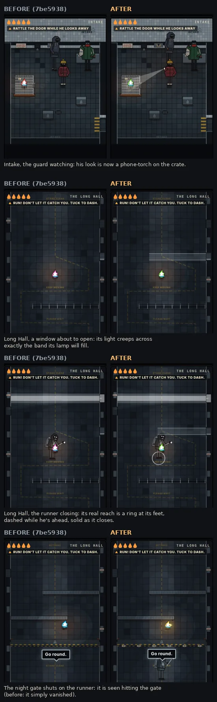
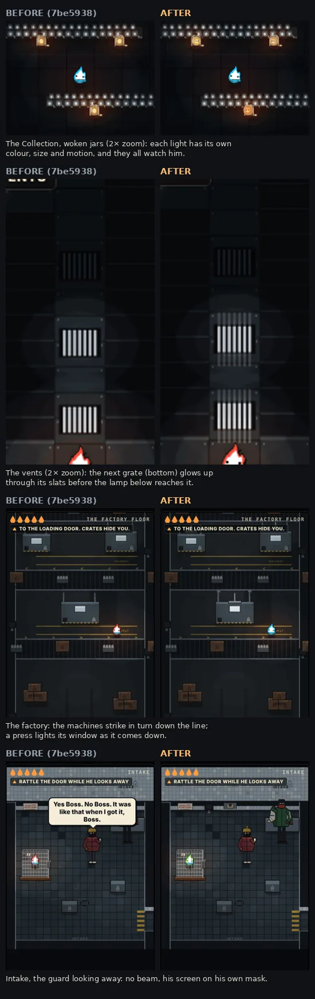

# Rizo Dungeon — Chapter 3 director's polish

**Branch:** `claude/dungeon-story-overhaul` (PR #33). **Started from:** `7be5938`.
**Companion records:**
- [EXPANSION-LOG](RIZO-DUNGEON-EXPANSION-LOG.md): Chapter 3 as built.
- [STORY-OVERHAUL](RIZO-DUNGEON-STORY-OVERHAUL.md).
- [Astra handoff](../dungeon/ASTRA-HANDOFF-CHAPTER3.md).

**Scope.** Presentation, sound and feel only. Nothing here changes a rule, a timing, a checkpoint or the save:

- `dungeon-core.js` is untouched.
- `dungeon-content.js` gains one data field: `factory.machineBeat`, which drives sound and light only.
- The save is still `threshold-v4`, and the package is still 166 files.

**Build marker: unchanged** (`v97-dungeon-collection`). Every file this pass changes is in `sw.js` `REQUIRED_SHELL`, which the service worker fetches network-first with `no-store`. No visitor can keep a stale copy, so neither `sw.js` nor the boot shell needed to change.

Evidence is Chromium at 390×844 unless stated otherwise. It is **not** Safari or physical-phone evidence (§5).

## 1. What was strengthened

The idea throughout: **every danger is shown before it lands, as light, at the place it will land.** Light was already the chapter's language (lamps catch, warmth wakes), so nothing new had to be learned. No tutorial text was added.

| Room | Before | Now |
|---|---|---|
| **Long Hall: windows** | The tell was a 1-unit jitter on a 16-unit sliver of wall. The danger band appeared only once the lamp was already on. | During the rattle, light creeps across the floor along **exactly** the band the lamp will fill. The lamp opens as the light reaches the far wall. Where and when, with no words. Under reduced motion the band shows whole and brightens. |
| **Long Hall: the runner** | Its catch distance was invisible. Its 80-unit sprite overlaps Rizo well before a catch (3/4 view), so catches could read as early. Nothing said how close it was. | Its real reach (`catchRadius` + Rizo's radius) is a ring at its feet: dashed and faint while he keeps ahead, solid white as it closes. The catch happens as his feet enter the ring. Its boots get louder as it closes, and inside about 80 units his heart starts. |
| **Long Hall: the night gate** | While closing: two blinkers. Shut on the runner: it simply vanished. | While it comes down, the hazard paint flashes red and the shutter's shadow grows on the floor. On landing, dust kicks up all along it. Shut out, the runner is seen hitting the gate (a slam, its lamp through the slats), then turns away. Then the radio says "Go round." |
| **Intake: the guard** | His look, the puzzle's only signal, was a few-pixel sprite flip. While watching he always faced west, even when Rizo was east of him, though the rule sees movement anywhere. | His phone is the torch he hunted Rizo with at the roadside. **Watching**, it is a beam on Rizo, or on the crate Rizo is behind, whose shadow keeps its edge. **Looking away**, it is a screen lighting his own mask, and he turns his back. **Just before he looks back** ("…hm?") the torch stutters on, and it clicks when it lands. Caught rattling or moving: the beam flares wide and a "!" pops. He always faces the way he is looking. |
| **Intake: the cage** | Five 1-unit pips, the same rattle sound every time, nothing when notches were lost. | The latch bar slides out a little per notch. Each new notch flares, and its click climbs in pitch, so the ear counts too. Rattling under his eye: the latch slides back with a falling clunk, the two lost notches blink red, and Rizo recoils. A good rattle makes him scramble. |
| **The Collection: the jars** | Six identical woken lights. Sleepers ignored him. Every wake played the same three notes. Leaving them had no response. | Each woken jar keeps the shape of where it was taken (its tag already says where): Moth flutters, pale (a porch light); Pip is small and hops, with rain on its edge; Bean rocks like a bus seat; Spark flickers like a candle; Wick glows steadily and blinks sleepily; the unnamed one is barely warm and slow, with frost still at its foot. All of them watch him. A sleeper he stands near stirs toward him (teaching WARM without words). Waking: frost chips off the glass and the light blooms. Each jar answers with **one note of HOME**, in order, so the woken ones play the tune from its start. At the promise ("He looks back once, so they know") they press to their glass one after another and hum their notes together. While he is at the grate leaving, they press hardest. |
| **The Vents** | A lit grate popped on with no warning. Nothing told the player that holding still works. A previous view's words could sit over the next view. His light filled the 40-unit duct. | The next grate glows up through its slats about half a second before the lamp below reaches it. Light comes up through a lit grate in bars, and the lamp's boots knock up through the metal as it moves grate to grate. Frozen on a lit grate he **holds his breath**: he curls, and his light pulls in. A grate view's words leave with it. His light is 20% smaller in the ducts, so the metal is close. |
| **The Factory** | The machines were static boxes. The Boss's voice came out of speakers that did nothing. | The machines are one line. They strike in turn, top to bottom, a beat apart, on pure sim time (pause holds them): a press head comes down, the window flashes, cold breathes out of the pipes, and the thump is louder the nearer he is. The wall speakers light while the Boss talks. |
| **Caught (everywhere)** | A hurt sound, then the fade. | A lamp full in his face for a beat (a cold flash on Rizo), then the fade. |
| **Window Hall, after the comic** | The comic ends on Nell's board CLONK; in the room after it, Nell and the collector stood frozen. | They keep shoving at each other through the window, with a knock now and then. Still under reduced motion. |

## 2. Weaknesses found, and how

I played every room with real keys at 390×844, captured a frame every ~0.5 s, and read the sim's state alongside the frames. The weaknesses are the "Before" column above. In order of how much they hurt play:

1. **Intake's guard was unreadable.** The puzzle is "act only while he looks away", and the look was a 2-pixel sprite flip. That is the chapter's weakest moment, so it got the strongest fix.
2. **The Long Hall's dangers arrived without anticipation.** The lamp was a surprise, and the runner's distance was a guess.
3. **The Collection's emotional beat leaned entirely on text.** The six were interchangeable, and leaving them had no answer from them.
4. **The vents' detection light had no warning,** and holding still gave no feedback.
5. **The factory was mechanically static.**

**Measured and left alone**, with the reason:

- **FLARE in the chase.** The big button says FLARE and Flaring slows Rizo for 200 ms. A bot mashing it every 300 ms on the hall route still escapes **30/30**, the same as not pressing it. There was no demonstrated harm, so the controls are unchanged. Listed in §6.
- **The factory checkpoint.** A catch on the floor goes back to the vent landing. That is a design decision in Contracts §7, and this pass doesn't change rules. Listed in §6.

## 3. Autonomous improvements

| Change | Why |
|---|---|
| A grate view's narration leaves when another view opens | Walking quickly from one grate to the next, the previous view's bubble could sit over the new view. |
| The intake guard faces where he looks | He always faced west while watching, even when Rizo was east of him. The rule sees movement anywhere, so the drawing now agrees with the rule. |
| The catch flash applies to every collector's catch, not only Chapter 3 | One meaning for "caught" across the Dungeon. |
| Window Hall continuity after the comic | The comic's energy stopped dead at the cut. |
| `dungeonLightForQA(x, y, r)`: tests read the drawn frame's brightness | The new work is visual. Asserting a flag would not prove anything is shown, so the new checks read the canvas. |
| The six jar personalities are in the Character Lab | Astra's reference for item 1 of the handoff. |

## 4. Before / after

Same moment on `7be5938` and on this branch, captured by script: the same flags, the same phase of each room's clock.

## 5. Tests

**Automated, Chromium (Playwright) and Node, in this container.**

Run on commit `2d214b0`, the code commit of this pass, with nothing else running. It used the release workflow's own list and order (`git diff --check`, `node --check` on every source file, every Node suite, `build-site.py`, then every browser suite):

| Suite | Result |
|---|---|
| `git diff --check`, `node --check` (all sources) | clean |
| Node suites (14 files, incl. `dungeon-core` 86/86) | 266/266 |
| `build-site.py` | 166 files, build marker v97 |
| `browser-home-world` | 115/115 |
| `browser-home-alive` | 57/57 |
| `browser-visual-uphaul` | 72/72 |
| `browser-dungeon` | 390/390 |
| `browser-dungeon-controls` | 185/185 |
| `browser-dungeon-cohesion` | 67/67 |
| `browser-dungeon-depth` | 45/45 |
| `browser-dungeon-gamefeel` | 63/63 |
| `browser-dungeon-character-lab` | 98/98 |
| `browser-dungeon-escape` (was 78; 10 new) | 88/88 |
| `save-safety` | 37/37 |
| `browser-defense-integration` | 78/78 |
| `mode-contract` | 25/25 |
| `training-contract` | 22/22 |
| `browser-launch-recovery` | 5/5 |
| `browser-v88-training-fixes` | 13/13 |
| `browser-v88-authored` | 25/25 |
| `browser-v87-arcade-freeze` | 66/66 |
| `browser-public-product` (built `dist`) | 150/150 |
| `browser-world-first` (built `dist`) | 77/77 |

Every suite passed. An earlier full run, made while I was also running a heavy bot session alongside it, failed one check: the new facing check. The cause was real: for one frame after the guard turned, his body lagged the beam, because room ticks run before the sim steps. The fix: `poseGuard()` now runs on the turn events themselves. That run also showed the test's failure detail could not be serialised; the detail is now a list. The run above is after both fixes.

**One continuous session, Window Hall to the loading door** (the code of `2d214b0`, 390×844, real keys for every move, rattle, WARM and Tuck). It was scripted, but it played through the rooms rather than teleporting. The QA clock only skipped waits inside scenes, as the suites do. Each trial was failed once on purpose, then retried:

| Room | What happened |
|---|---|
| Window Hall | The Rows card, STAY, RING. The `window-opens` comic. Out the staff door. |
| Long Hall | Stood still: caught. "CAUGHT! BACK TO THE HALL DOOR. RUN AGAIN.", back at the door. Then ran the hall and got under the gate. The `chute` comic. |
| Intake | Five rattles while he looked away opened the crate. Moved while he watched: "PUT BACK IN THE CAGE" with 2 notches kept. Three more rattles, then out while his back was turned. |
| Collection | The grate first: "won't turn for one small light". Woke Pip, Moth and Bean. **Reloaded the page**: resumed in the Collection with all 3 still awake and the goal on the grate. Warmed the grate; the promise played. Up through the grate. |
| Vents | The scale view, then the lab view. Walked straight up the lit duct: heard, back to the start of that duct. Then froze for the light and got past. The office view. The hatch. |
| Factory | Caught on the first crossing, back to the vent landing. Through on the second attempt. The narration, the card THE NIGHT IS NEXT, saved at `factory/fac-door` with `promised` and `factoryOut`. **Reloaded**: resumed at the loading door, with no card replayed. |

There were no page errors in the whole session. It took about 4 minutes of wall time.

**New checks** (in `browser-dungeon-escape.py`, 78 → 88). The visual ones assert brightness on the canvas, not flags:

1. Watching, the guard faces the crate; looking away, he turns his back.
2. Watching, the air between his phone and the crate is lit (about 104 vs 58 luma).
3. Late in a window's rattle, the floor along its band is brighter than when the window is off (about 75 vs 50).
4. The next vent grate is brighter in the ~250 ms before it lights than when it is far from lighting (about 70–95 vs 31).
5. A factory press striking lights its machine's window.
6. Frozen on a lit grate, he holds his breath (curled, light in) and is not heard.
7. Shut out, the runner is seen hitting the gate.
8. Each jar wakes in its own moment.
9. At the promise, the woken ones press to the glass.
10. No page errors in any of it.

Every original assertion is unchanged. None was loosened, skipped or deleted.

**Phone widths and reduced motion** (my own run on top of the suite):
- Widths: 320×568, 375×667, 390×844 and 430×932.
- Each width with and without reduced motion.
- All five building rooms at each, with the new visuals live.

Result: no page scroll at any width; every on-screen key at least 36 px and inside the viewport; no page errors. Under reduced motion:
- the window band shows whole instead of creeping;
- presses light without moving;
- the jars hold still;
- there are no frost chips, no slam shake and no shove;
- the catch flash doesn't grow.

**Performance.** Main-thread busy time per second of play, CDP `TaskDuration`, three samples each, `7be5938` → this branch:

| Room | Before (ms/s) | After (ms/s) |
|---|---|---|
| Long Hall | 301–342 | 293–324 |
| Intake | 339–375 | 371–406 |
| Collection | 435–468 | 426–455 |
| Vents | 270–283 | 243–287 |
| Factory | 349–412 | 369–416 |

Everything is within run-to-run noise except Intake, about 8% more because of the beam's gradient. With the CPU throttled 4×, frame pacing is the same before and after (median 33 ms, 16.7 ms in the vents).

**Not done: physical devices.** No phone, no Safari or WebKit, no real touch hardware. Sound was not checked by ear either: the container has no audio output. The new sounds use the same `host.audio` tone and noise calls as the existing ones. They are not covered by tests beyond "no page errors".

## 6. What remains

- **Physical-device and Safari play** of the whole chapter, with sound on. This is the biggest open item.
- **The factory checkpoint.** A catch near the loading door replays the whole floor. That is about 10 s of walking plus waiting for crates and sweeps. A mid-floor checkpoint (after machine 3) would cut it, but it is a rule change for the owner to decide.
- **FLARE is still the big button in the chase.** It is measured harmless (§2), but a child may press it expecting something. A "DASH" mapping would be a control-design decision.
- **Intake's ~8% CPU cost.** It is fine in Chromium. Check on a low-end phone.
- **The jars are about 10 px on a phone.** Their personality is carried by colour and motion alone until Astra draws them (handoff item 1).
- **The "Workers Builds: rizo-world" check** is still red. It is unrelated to this branch and needs the Cloudflare dashboard ([EXPANSION-LOG](RIZO-DUNGEON-EXPANSION-LOG.md) §1).

## 7. For Astra

See [ASTRA-HANDOFF-CHAPTER3.md](../dungeon/ASTRA-HANDOFF-CHAPTER3.md): eight specific elements in priority order, and the procedural cues that should keep their shape and timing.
