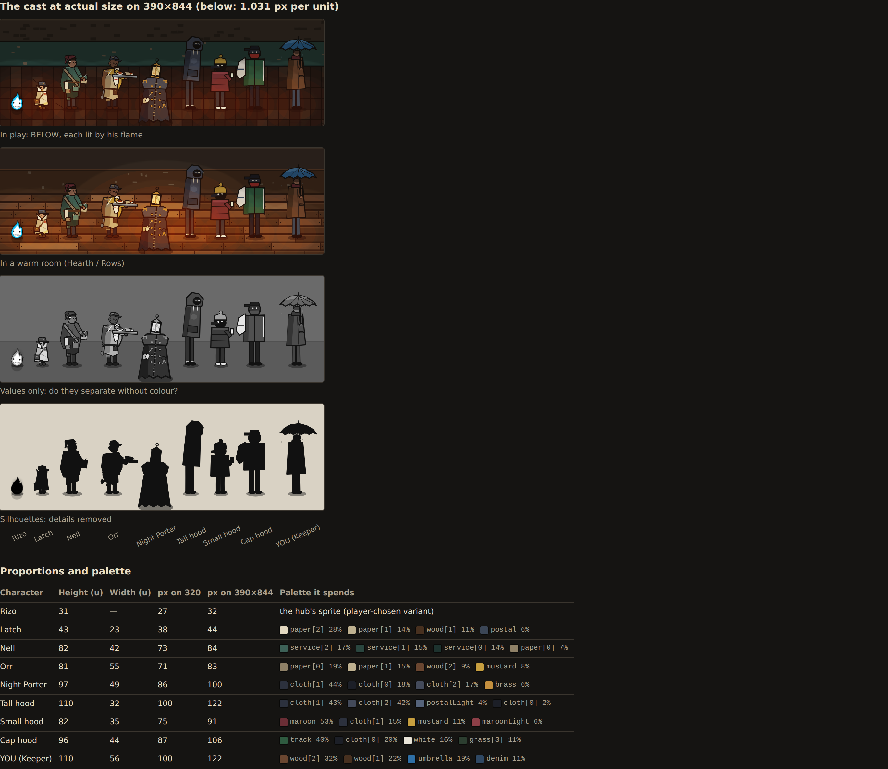
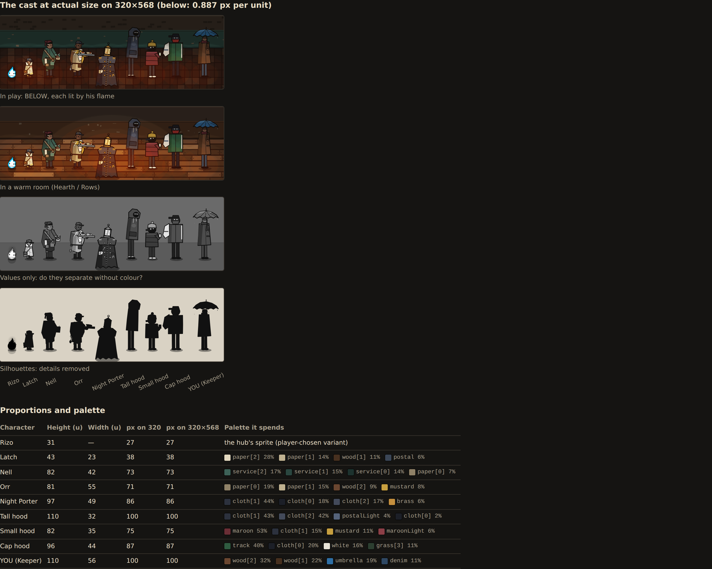
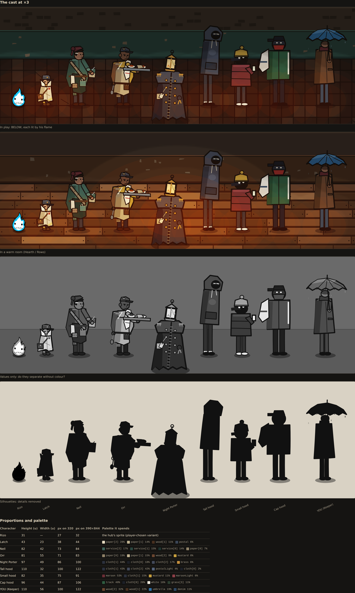
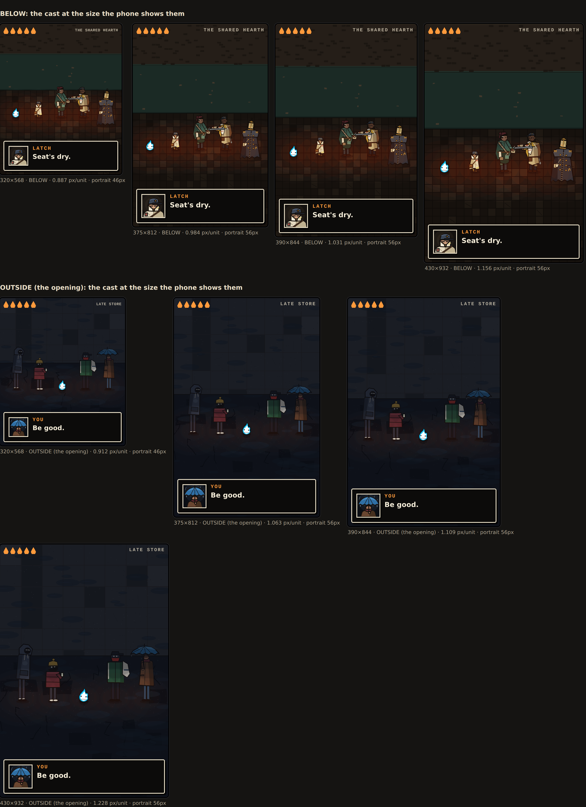
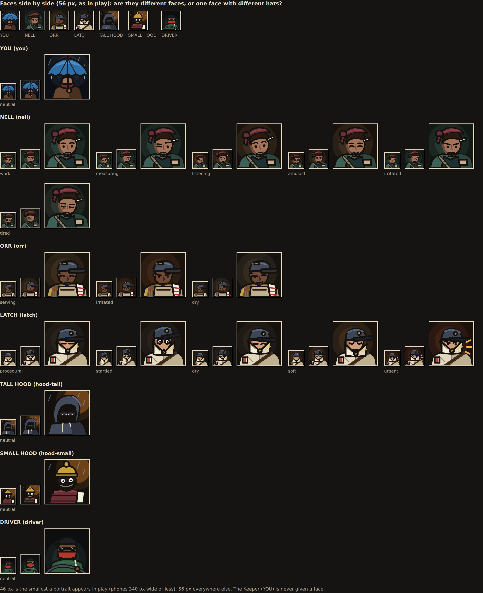
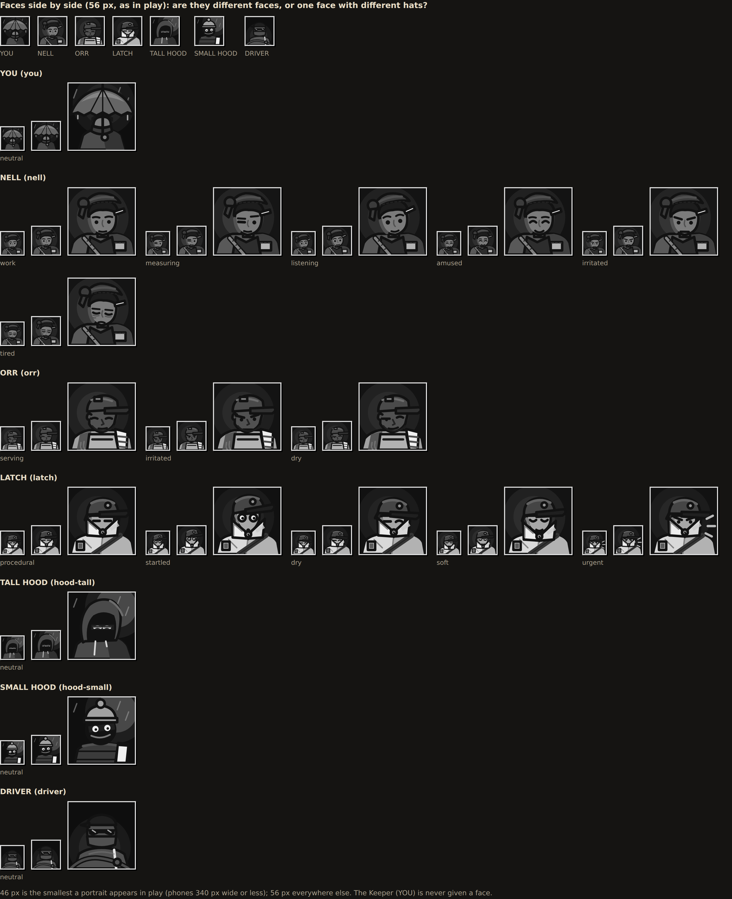

# Rizo Dungeon: Character Lab and the first character review

Starting commit: `055fbc6e9a95683675dedcff09fe0cbf9ca9d250` (`develop`).
Branch: `feat/dungeon-character-lab`, targeting `develop`.

This pass builds a review bench and uses it once. **No character is redrawn,
and no gameplay, story, save or shipped file changes.** The findings below
are what the bench shows; fixing them is the next pass.

## The lab

`tools/dungeon-lab/` is development only:

```sh
python3 tools/dungeon-lab/serve.py   # → http://127.0.0.1:8765/tools/dungeon-lab/
```

- **Isolated.** Nothing links to it, and the site build never copies
  `tools/`. Its test fails if a lab file, or any mention of the lab, reaches
  the built site.
- **No saves.** The lab never reads or writes storage. Its Rizo comes from the
  real hub, booted in a hidden `about:srcdoc` frame with its storage rewritten
  to in-memory maps. The test checks that the lab's `localStorage` and
  `sessionStorage` stay empty after every view.
- **Real art.** Every figure is drawn by the `dungeon-art.js` painter with the
  options `dungeon-view.js` passes for that state.
- **Real scale.** Each phone's screen size was measured in the live game, and
  the test re-measures it every run, together with Rizo's actor box and the
  portrait size.
- **Real rooms.** Backgrounds use the game's own materials and light pass.

The views (inspect, sheet, cast lineup, phones, portraits), the controls and
the full list of states are in `tools/dungeon-lab/README.md`.

Every image here comes from `python3 tools/dungeon-lab/capture.py`. Each
one is a lab URL, listed in that script, so any of them can be reopened live.
"Actual size" images are 2 device pixels per CSS pixel, which is what the
Dungeon canvas draws on a phone.

## Evidence

### The cast at actual size

On 390×844, below:



On 320×568, the smallest phone:



Enlarged ×3, for reading detail only (it does not count as a pass):



### Inside each phone's real screen

The real HUD and dialogue box at measured sizes:



### Portraits

Every expression at 46 px (the smallest in play), 56 px and 128 px:





### Each character, every state

Actual size on 390×844, in their own rooms:

- [Rizo](../dungeon/character-lab/sheet-rizo.webp) (37 poses)
- [Latch](../dungeon/character-lab/sheet-latch.webp)
- [Nell](../dungeon/character-lab/sheet-nell.webp)
- [Orr](../dungeon/character-lab/sheet-orr.webp)
- [Night Porter](../dungeon/character-lab/sheet-porter.webp)
- [Tall hood](../dungeon/character-lab/sheet-hood-tall.webp)
- [Small hood](../dungeon/character-lab/sheet-hood-small.webp)
- [Cap hood](../dungeon/character-lab/sheet-hood-cap.webp)
- [YOU](../dungeon/character-lab/sheet-keeper.webp)
- [YOU in the car](../dungeon/character-lab/sheet-you-seated.webp)
- [Van crew](../dungeon/character-lab/sheet-van-crew.webp)
- [Draftling](../dungeon/character-lab/sheet-draftling.webp)
- [Needle](../dungeon/character-lab/sheet-needle.webp)

Enlarged ×3, to read the detail:

- [Latch](../dungeon/character-lab/sheet-latch-x3.webp)
- [Nell](../dungeon/character-lab/sheet-nell-x3.webp)
- [Orr](../dungeon/character-lab/sheet-orr-x3.webp)
- [Night Porter](../dungeon/character-lab/sheet-porter-x3.webp)
- Latch inspected with his portraits: [inspect-latch](../dungeon/character-lab/inspect-latch.webp)

### Measured

Painted bounds, top to toe, at t = 1200. "Rule" is `RULES.scale`.

| Character | Painted height (u) | Rule (u) | px on 320 | px on 390 | Biggest colours |
| --- | --- | --- | --- | --- | --- |
| Rizo (kid) | 30.6 actor box | 28 | 27 | 32 | the hub's sprite |
| Latch | 43 | 38 | 38 | 44 | paper 28%, paper 14%, wood 11%, postal 6% |
| Nell | 82 | — | 73 | 85 | service green 17/15/14%, paper 7% |
| Orr | 81 | — | 71 | 83 | paper 19/15%, wood 9%, mustard 8% |
| Night Porter | 97 | 84 | 86 | 100 | cloth 44/18/17%, brass 6% |
| Tall hood | 110 | 98 | 100 | 122 | cloth 43/42%, postal light 4% |
| Small hood | 82 | 66 | 75 | 91 | maroon 53%, cloth 15%, mustard 11% |
| Cap hood | 96 | 84 | 87 | 106 | track green 40%, cloth 20%, white 16% |
| YOU | 110 | 94 | 100 | 122 | wood 32/22%, umbrella 19%, denim 11% |

## Why Latch reads (the benchmark, not a template)

At 38 px tall on a 320 phone, Latch is the smallest person on screen, and
still the one you recognise first. Five reasons, each visible in the images
above:

1. **One shape nobody else has.** The collar is turned all the way up into a
   funnel between the shoulders and the cap. The satchel drags one side down.
   In the silhouette strip he is the only figure whose head sits inside a
   collar, with a weight hanging off one hip.
2. **He owns a value.** His coat is the palest paper in the cast (paper
   tones are 42% of him). BELOW he is the brightest thing after Rizo's flame,
   and in the values strip he is the only light figure. One dark cap sits on
   top, and one red stamp is the accent.
3. **The face is framed, so expressions read.** All that shows is a strip of
   eyes between collar and cap. Each expression changes that one small,
   high-contrast strip. In the world at actual size, startled (round eyes)
   and soft (closed eyes) read. At 46 px, all five portraits read, and
   urgent adds the warm strokes.
4. **States change the outline, not just the inside.**
   - pinned adds the long coat tail caught in the gate;
   - pulling raises an arm above the cap;
   - seated drops the knees and pools the coat.
5. **A small palette.** Four colours do the work and one accent is spent.

So for the rest of the cast, the test is not "look like Latch". It is: one
shape no one else has, a value of their own, a face framed so its change is
legible, and states that move the outline.

## Findings, by the four identities

Each finding names the image that shows it.

### Silhouette identity

- **Passes:**
  - Night Porter: a bell coat with a lantern for a head;
  - tall hood: a pole;
  - small hood: a short box with a pom;
  - cap hood: a box with a cap and a pillowcase flap;
  - YOU: the umbrella;
  - Latch.
- **Nell and Orr are one body.** They are the same height (82 u and 81 u, so
  73 and 71 px on 320) and the same build: a round head under a soft hat, a
  coat that widens to the knee, and one arm out to the right. In the
  silhouette strip only Orr's tray tells them apart. In Orr's "hands free"
  state the tray is gone and the outlines are near twins. *(lineup-320,
  lineup-inspect-x3, sheet-orr-x3)*
- **Rizo is the smallest figure on screen.** He is 27 px on 320, below
  Latch's 38. He reads because he is the only blue-white thing and the only
  light source, not because of his shape. *(lineup-320)*

### Role identity

- **Clear:**
  - Orr: the tray, apron and towel;
  - Latch: the satchel and postal cap;
  - the Porter: the uniform, keys and lantern;
  - the crew: masks, the phone, the pillowcase.
- **Nell's role is carried by small props.** The ruler, strap and apron
  pockets are 1–2 px at actual size on 320. What reads is "person in a green
  coat". *(sheet-nell)*

### Face identity

- **The kidnappers share one face.** All four have a black ski-mask head
  with two pale eye marks:
  - tall hood: a slit;
  - small hood: two dots and a mouth;
  - cap hood: two dots and a red bandana;
  - driver: a red bandana and slits.

  They are told apart by hats and coats. That is in character for masked
  men, but at 46 px the **driver portrait and the cap hood look alike**: the
  same red bandana and dark cap. The driver also has no standing world model.
  *(portraits, sheet-van-crew)*
- **Nell and Orr share one face construction.** They have the same head
  oval, skin family and eye, brow and mouth marks. Nell's maroon wrap and
  Orr's peaked cap do the separating. *(portraits)*
- **Orr's three expressions don't survive 46 px.** Serving, irritated and dry
  differ by the angle of a 1 px brow and a mouth mark. In values they are one
  picture. *(portraits-values)*
- **Nell's six read in pairs.** Amused (closed, smiling eyes), irritated
  (angled brows) and tired (lowered lids) read at 46 px. Work, measuring and
  listening are hard to tell apart at that size. *(portraits)*
- **Latch's five all read at 46 px.** *(portraits)*

### Pose identity

- **Nell's 13 states change only her arms.** At actual size, these read as
  nearly the same figure:
  - support, walk, tired, fit and listen;
  - work and fix.

  Lift (the plank overhead), point (an arm straight out), brace (both arms
  forward) and sit change the outline and read. *(sheet-nell, sheet-nell-x3)*
- **Night Porter:**
  - Reads: opening, open, hit, charge tell (the lean), settled.
  - "lamp sweep" vs "closed" is a ~10° tilt of a 10 px lantern. At actual
    size they look the same. *(sheet-porter)*
- **Rizo's stagings are motion.** Most of his 26 `pose-*` stagings are CSS
  keyframes. In a still frame at actual size most are indistinguishable; tuck,
  hurt, down, lying, getup, curl and the wrap read. That is by design, since
  they play as motion: use Motion: animated to judge them. *(sheet-rizo)*
- **YOU in the car: "turn" and "look" are drawn identically.** The game uses
  "look" at the window and "turn" elsewhere, and the art draws both as the
  same head turn and hands. The lab labels them so, and its test allows
  exactly that pair. *(sheet-you-seated)*
- **Van crew: idle, talking and freeze differ only in motion** (nods). The
  freeze is the absence of motion, which is the intent. Only "stare" changes
  the picture (eye glints). *(sheet-van-crew)*

### Colour

- **Mustard is shared by four characters:**
  - Orr's sleeves;
  - the small hood's beanie;
  - Latch's odd sock;
  - the Porter's brass.

  `P.a.mustard` is `#c79f3f` and `P.a.brass` is `#c48f3e`: two names, nearly
  one colour.
- **Maroon is shared by two:** Nell's head wrap is the small hood's jacket
  colour (`P.a.maroon`, 53% of him).
- **Two greens:** Nell's service green and the cap hood's track green are
  both dark greens BELOW. They never share a room, so this is low risk.
  *(lineup-390, palette table)*

### Scale against the constitution

`ARCHITECTURE.md` and `RULES.scale` give "Latch 38u, people 66–98u". Painted
top to toe, figures run 5–16 u taller, because hats, poms and the umbrella
sit above the rule's head line:
- small hood: 82 u against a rule of 66;
- YOU: 110 u against 94;
- tall hood: 110 u against 98.

Not wrong, but worth knowing when comparing heights. *(the measured table)*

## Suggested order for the character pass (not done here)

1. **Separate Nell from Orr in silhouette.** Give one of them a shape the
   other can't have, independent of the tray.
2. **Make Orr's and Nell's expressions legible at 46 px.** Change a larger
   area, as Latch's eye strip does, or more contrast.
3. **Give the driver a face of their own.** Today it is the cap hood's
   bandana and cap.
4. **Let Nell's states change her outline.**
5. **Decide whether "turn" and "look" in the car should differ.**
6. **Re-spend the shared accents** (mustard, maroon), so each accent belongs
   to one person.

Each change: edit the painter, reload the lab, compare the lineup at 320,
re-shoot with `capture.py`.

## Limits of the current procedural art system (found while building the lab)

- **Rizo is DOM, not canvas.** He cannot be drawn into a canvas, recoloured
  or silhouetted with the cast. The lab overlays the hub's own markup in
  frames and filters it with CSS (greyscale, brightness 0). His height is the
  actor box, not painted bounds.
- **Facing:**
  - The Porter and YOU in the car have one facing; the game never mirrors
    them.
  - Everyone else mirrors with `ctx.scale(-1, 1)`, so asymmetric details
    swap sides (Latch's satchel, Orr's tray hand).
- **Motion-only states.** Walk, talking and sway are functions of `t`, so a
  still sheet shows them as the standing pose. The lab freezes at t = 1200 for
  repeatable captures; "animated" shows them moving.
- **No per-character palette.** Colours are shared families (`P.cloth`,
  `P.paper`, `P.a.*`), which is why accents collide. A character's colours
  are whatever its painter picks.
- **Portraits are separate hand-written 64×64 SVG strings.** They are not
  derived from the world painter, so a world change does not update the
  portrait. The lab puts them side by side so drift shows.
- **Painters take loosely validated options.** An unknown Nell state falls
  back to "work" silently. The lab's test proves every listed state paints
  differently, so a misspelt state would fail.

## Tests

New: `tests/browser-dungeon-character-lab.py` (88 checks), added to release
CI with evidence.

- **Isolation.** No lab file, folder or mention in the built site. The
  lab's storage is empty after every view. The hub bridge runs on in-memory
  stores with no service worker.
- **Completeness:**
  - every Nell state in `NELL_ARMS`, every Latch expression, and every
    portrait set and expression is in the lab;
  - every state of every character paints;
  - states the lab lists as different paint differently, except the declared
    car pair;
  - facing mirrors where the game mirrors;
  - all 37 Rizo poses load the hub's sprite with the game's pose classes;
  - all five views render without page errors.
- **Scale honesty.** For 320×568, 375×812, 390×844 and 430×932, the live game
  is launched and its screen (outside and BELOW), Rizo's actor box and the
  dialogue portrait are measured against the lab's table.

The suite found three things while it was being written, all recorded above
rather than hidden:
- the Porter's single facing;
- the identical "turn"/"look";
- the van crew's motion-only states.

## Not changed

Every file outside `tools/dungeon-lab/`, `tests/`, `docs/`, `ARCHITECTURE.md`
and the release workflow is untouched. The game, its saves and its
navigation are unchanged. The built site was diffed against a build of
`develop` and is byte-for-byte identical.
