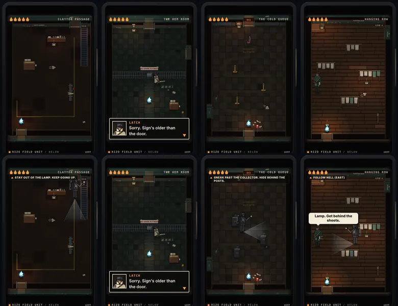
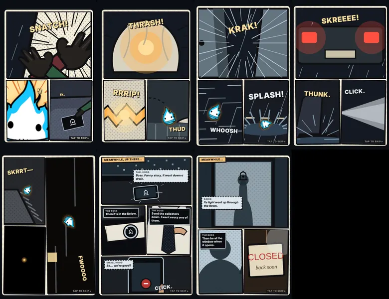
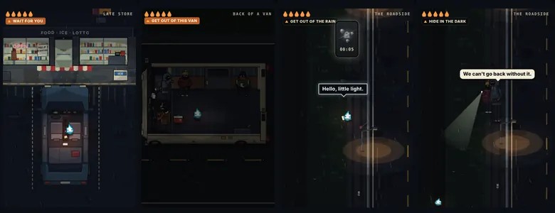
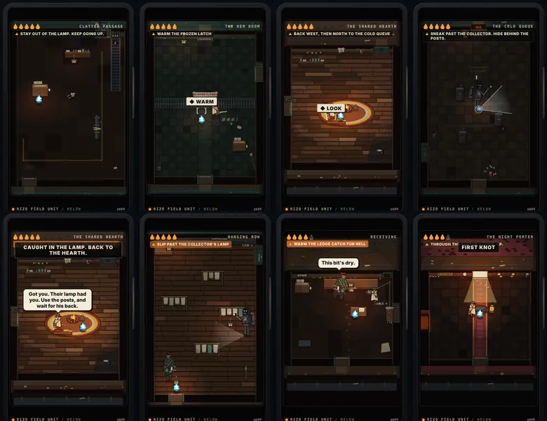
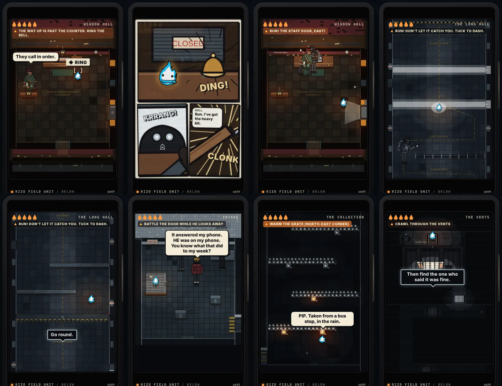

# Rizo Dungeon — story overhaul verification

**Branch:** `claude/dungeon-story-overhaul` → `develop`
**Integration commit (code):** `b4c86ea` (this document and the SHA manifest follow it)
**Canon:** [Story Spine v0.4](../dungeon/story/Rizo-Dungeon-Story-Spine-v0.4.md) · [Contracts v0.4](../dungeon/story/Rizo-Dungeon-Contracts-v0.4.md)
**Build marker:** `v96-dungeon-story` · **Save:** `threshold-v4` (the one revision bump; v1/v2/v3 journeys carried forward untouched)

Evidence below is Chromium at 390×844 unless stated. It is not Safari or physical-phone evidence.

## What changed, in one screen

Top row: `develop`. Bottom row: this branch. Clatter Passage now has the Boss's collector and his cold lamp at the door Rizo needs. The Hem Room is unchanged in staging, but Latch's lines name who froze him in. The Cold Queue's stanchions became stone ticket posts wide enough to hide behind, with a collector walking the line. The Hanging Row's Draftling became a collector between the sheets, with Nell telling him where to hide. Every room shows what Rizo is trying to do.

## Core changes

| Area | What shipped |
|---|---|
| Story | The Boss collects every Rizo (why stays secret). Reveal ladder: caller → hands, cufflinks, tie → silhouette behind glass. His mark (a bell jar with a light shut inside) is his caller ID, his calling card and his collectors' badge. Each cave person has one identity and one reason (spine §cave folk). |
| Dialogue | The van's fear joke says what he wants ("All of 'em. He wants every one there is." / "Stop counting. He can hear you counting."), and "What's he even want it for?" still gets no answer. The Boss speaks on the dropped phone if Rizo answers it. Latch, Nell, Orr and the Porter were rewritten around the collectors. Every accepted v0.3 opening line is word for word. |
| Objectives | One short goal line under the HUD at every chapter and area, kept in the pause card, updated as each step completes (35 goals). |
| Challenges | Collectors (patrol, cold lamp cone, posts and shadow hide, a Flare carries, seen for a second = caught → back to the hearth). Clatter's first collector is soft (it teaches). Then the Cold Queue (pure stealth) and the Hanging Row. A frozen load blocks Receiving until it is thawed. The Rows' frozen catches are the collectors' cold. |
| Retry | Caught = the flame-out respawn at the last hearth. Banner: CAUGHT IN THE LAMP, and Latch: "Got you. Their lamp had you. Use the posts, and wait for his back." Nothing durable is lost. |
| Wayfinding | One function (`objectiveKey` / `rowsNext`) answers "what now" for every room. In the Rows, standing still points the way (`ROWS_WAY`) after 4.5 s. |
| Comics | `dungeon-comic.js/.css`: grab, sack, van-leap, taillights, fall, boss-hands, boss-glass. Paper and ink, slammed and flipped panels, halftone, speed lines, SFX lettering, the player's own Rizo in the panels, one game sound per panel, tap or Primary to skip. Driven by the scene clock, so a pause freezes it. Committed once (`comic:<id>`). Reduced motion: the same panels, fading in. |
| Art | The Boss's mark, calling card, collector (four states), the capped hood's face, scared hoods, the Boss's caller-ID portrait. All in the Character Lab. |
| Late-game kit | `modes/dungeon/kit/` with stealth, watchers, chase, cage, vents and grate views, and a greybox factory slice at `tools/dungeon-kit/?dev=1`. Never loaded by the game, never precached, left out of the production package by `build-site.py`. |

## The opening (the quality bar)

Nothing was taken out of the car → sack → van → roadside → drain sequence. Every v0.3 beat, line, hold and timing is still checked by `browser-dungeon.py`.

Added:
- a comic at four action hits (the grab, bursting the sack, the leap through the door, the van stopping) and at the slip into the drain;
- the van's "every one" exchange between the number and the missed check-in;
- The Boss's three lines on the dropped phone, if the player answers it (the call is now about 8.6 s, up from 5);
- a calling card under someone else's LOST poster at the bus stop;
- quiet goal lines once YOU has gone in.

The opening's own beats still commit in order, each once, with the comic beats between them.

## Playtest

**How:** I played the route myself in Chromium at 390×844 through `tests/`-style Playwright: real keys for every move, Flare, Tuck, WARM, LOOK, choice and tap. The QA clock was used only to skip pure waiting (the 55 s wait for YOU, long overheard talk) and to settle the Night Porter's and the Press House's fights once the help beats had played. Every line, bark, goal and comic the player is shown was logged with its scene time.

One honest limit: the original brief asked for three independent skeptic players. The owner later asked for no subagents, so these are one player's scores, with the transcript as evidence.

### Below

### The two-minute test (cave time from the moment he can move after the awakening)

| Cave time | What the player is shown |
|---:|---|
| +0 s | Goal: FIND A WAY UP |
| +4 s | "Someone scratched it with a key: HOME, and an arrow. Up." Goal: HOME IS UP. KEEP CLIMBING. |
| +5 s | Comic *boss-hands*. The Tall Hood: "Boss. Funny story. It went down a drain." The Boss: "Then it's in the Below." "Send the collectors down. I want every one of them." |
| +6 s | A cold lamp at the door he needs. Goal: STAY OUT OF THE LAMP. KEEP GOING UP. |
| +19 s | On the collector's radio: "Anything?" Then: "Then try the Queue. It wants to go up." |
| +39 s | Latch: "NO OPEN FLAMES." … "Collectors froze this gate on their way through. With me in it." |
| +45 s | Latch, freed: "They take every light down here. You're the first one that gave some back." "Going up? Hearth first. I owe you a route." |
| +53 s | At the hearth: "Cold since they took our fire. You lit it just walking in." |
| +60 s | "Way up is past the Cold Queue. A collector walks it now." "Stay in the dark. Posts block his lamp. If it finds you, run back here." "Then the Night Porter." |

By the end of the first minute every answer has been shown:
- **Who took him:** the hoods (the opening), for The Boss (the van, the phone, the comic).
- **Why:** The Boss wants every one. The deeper reason stays a secret.
- **Where:** the Below, off their route.
- **Who helps, and why:** Latch. They take every light; Rizo gave some back.
- **What next:** home is up, through the Queue and past the Porter.

A first-time player who lingers reaches Latch later, but the comic and the first lamp land in the first ten seconds of the cave.

### The Rows, in the same run

Receiving's frozen load opened in one WARM. Nell says the dry way up is through her rows. The goal line changed at every step: the low catch, into the Rows, slip past the lamp, the split, the low route to Eyelet Landing, the grille for Orr, back to the table, the press house, the stair.

Orr's line landed in the meal: "Second portion's Eda's. Collectors took her." The high window shows "a cold white lamp" going from window to window in Window Hall. The `boss-glass` comic closes the built content at the counter.

### Fixes the play found (all in this branch)

- The hearth's goal said "north" while the north door is locked until the lever. It now says "back west, then north to the Cold Queue", and "north door: the short way" once the lever is pulled.
- The Cold Queue had a Draftling, a Needle and a collector at once. It is now pure stealth, with stone posts wide enough to read as cover.
- Clatter's first lamp ran as a long scene that stopped the room's own noticing and pointing. It is now a room event; only the comic holds the room.
- A bark could cover the goal line. Bubbles now avoid it like they avoid Rizo and the dialogue box.
- The pause card's goal line pushed RESTART off a short landscape screen. It now hides below 520 px of height.

### Scores (1–5, my own, with the evidence above)

| DONE MEANS | Score | Why not 5 |
|---|:-:|---|
| 1. The two-minute test | 4 | Everything is shown by cave +60 s. A slow first-timer could still miss the radio lines, so the comic carries most of it. |
| 2. Every room asks for a story action | 4 | Thaw, rescue, sneak, survive, stop the press, fit Orr's tray through the grille. Tray Passage, the Return Stair and the Upper Landing are still walk-through or look-only connectors. |
| 3. The Boss is the villain, felt everywhere | 5 | Voice, hands, silhouette, his mark on cards, phone and collectors; every cave person has lost something to him. |
| 4. Action comics, unlike gameplay | 4 | Paper, ink, slams, halftone, SFX, the player's own Rizo. The art is clean vector work, not full illustration. |
| 5. Every line does a job | 4 | Rewritten around the collectors. A few older Rows asides (the rough corner) are only small character beats. |
| 6. The opening is no worse | 4 | Every v0.3 beat, line and timing is kept and tested. The comics add a cut at each hit; skippable. |
| 7. All Dungeon tests green | 5 | See below. No test was skipped, deleted or loosened. |

## Test results

All runs were on this branch in this container, with Chromium 141 from `/opt/pw-browsers`. No test was skipped, deleted or loosened. Where a dialogue line or timing changed on purpose, the assertion was updated to the new canonical line, beat or duration. New assertions were added for the comics, The Boss's words, collectors, threshold-v4 and the kit.

**The Dungeon (the brief's required set). Final run on `b4c86ea`.**

| Suite | Result |
|---|---|
| `node tests/dungeon-core.test.js` | 76/76 (8 new: collectors, catch, hiding, soft lamp, threshold-v4 carry-forward, cast and portraits, story lines) |
| `node tests/dungeon-input.test.js` | 26/26 |
| `node tests/dungeon-kit.test.js` (new) | 6/6 |
| `tests/browser-dungeon.py` | 390/390 |
| `tests/browser-dungeon-controls.py` | 185/185 |
| `tests/browser-dungeon-cohesion.py` | 67/67 |
| `tests/browser-dungeon-depth.py` | 45/45 |
| `tests/browser-dungeon-gamefeel.py` | 63/63 |
| `tests/browser-dungeon-character-lab.py` | 96/96 |

**The rest of the release-candidate workflow, on the glue commit.** These suites' code paths were not touched after the glue.

| Suite | Result |
|---|---|
| `browser-home-world` | 115/115 (rerun after updating its pinned save revision to threshold-v4) |
| `browser-home-alive` | 57/57 |
| `browser-visual-uphaul` | 72/72 |
| `save-safety` | 37/37 |
| `browser-defense-integration` | 78/78 |
| `mode-contract` | 25/25 |
| `training-contract` | 22/22 |
| `browser-launch-recovery` | 5/5 |
| `browser-v88-training-fixes` | 13/13 |
| `browser-v88-authored` | 25/25 |
| `browser-v87-arcade-freeze` | 66/66 |
| `browser-public-product` (on the built `dist`) | 150/150 |
| `browser-world-first` (on the built `dist`) | 77/77 |
| every other `node tests/*.test.js` | green (14 files) |

What the tests now say on purpose:
- The Cold Queue's Needle check moved to the Low Run's Needle: same lane timing, same cover rule.
- The phone call is about 8.6 s, and The Boss's last line is asserted.
- The fall includes the comic's 3.4 s.
- The opening's beat list includes the five `comic:*` beats in order.
- The production package is 166 files: the two comic files, and no kit.

## Director's expansion: Chapter 3, The Collection (build `v97-dungeon-collection`)

What changed, why, and every autonomous fix are in [RIZO-DUNGEON-EXPANSION-LOG.md](RIZO-DUNGEON-EXPANSION-LOG.md); the story is in the spine's §Chapter 3. Summary:

| Room | What the player does | Fails how, back to where |
|---|---|---|
| Window Hall | rings the bell; the window opens on a collector (comic) | — |
| The Long Hall | runs; times the window lamps; gets under the night gate | caught: hall door, or the gate once passed |
| Intake | rattles the crate while the small hood looks away; freezes when he looks | seen moving: put back (keeps two notches) |
| The Collection | wakes jars; three lights open the frozen grate | the grate explains it is too cold for one |
| The Vents | stops on grates to look; freezes when light comes up | heard: the start of that duct |
| The Factory Floor | rides belts; hides behind crates from walkway lamps | caught: the vent landing |

**Cloudflare:** Pages deployed the branch. The red "Workers Builds" check is a separate Worker integration that fails in 0 s on every PR, including PRs without this code. The repo has no Worker config. Details and the remedy are in the log, §1.

## Reserved for the factory chapters

- *(v97: built. See the section above.)* The window opens on collectors; the chase, the cage, the vents and the factory are live rules in `dungeon-core.js`.
- **Kit (dev only, unchanged):** the greybox sandbox at `tools/dungeon-kit/?dev=1` and `tests/dungeon-kit.test.js` stay as the place to prove the next systems first.
- Open questions are listed in the spine's "Open" section. They are not answered anywhere in the game.
