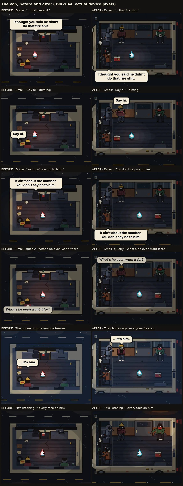
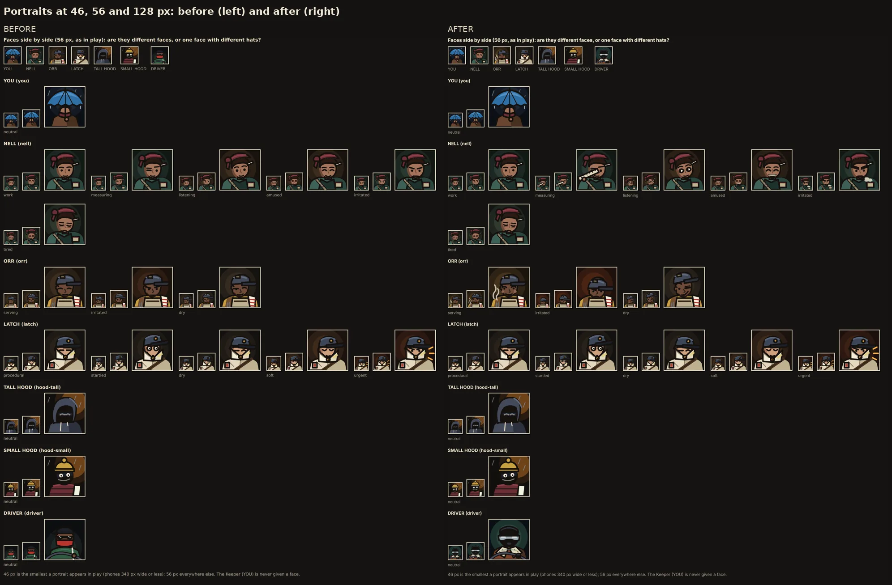
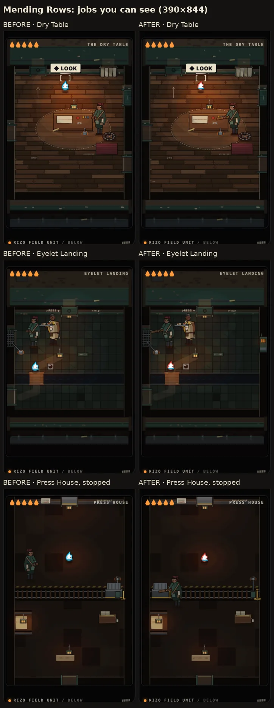

# Rizo Dungeon: visual logic, the kidnappers' van and the cast

Starting commit: `f3b8b40b1cca441e359543838412bc8716e4d0a5` (`develop`, the
Character Lab merge).
Branch: `feat/dungeon-visual-logic-overhaul`, targeting `develop`.

This pass makes the art tell the truth about what is physically happening.
The kidnappers' van comes first, then the weakest characters (found with the
Character Lab), then a room-by-room check through the Mending Rows.

**No line, line order, timing, story fact, save field, progression rule or
collision box changes.** Everything here is presentation. The only logic
change keeps the Press House carriage from stopping in a place its own art
says it cannot (see below).

Every image is in [`docs/dungeon/visual-logic/`](../dungeon/visual-logic/).
They are real game captures (the van and the rooms) or Character Lab captures
(the cast) at 2 device pixels per CSS pixel, which is what a phone draws. The
"before" lab sheets are the ones the Character Lab committed in
`docs/dungeon/character-lab/`.

## 1. The van

### What was wrong

Looking at the van as a physical place:

- **It drove two ways at once.** The dashboard and windscreen were at the top,
  so the van pointed up. The lane dashes and the streetlight pools scrolled
  sideways, so it drove sideways, and the light pass ran right-to-left, the
  opposite way. The interior never moved the way it faced.
- **It wasn't van-shaped.** With the cab on the long edge, the cargo floor
  was 212 units wide and 96 deep: a bus, or a room.
- **Nothing outside the box said "vehicle".** It was a beige tray on a road,
  with no nose, wheels, mirrors or lights.
- **The wrong door.** The beat sheet (7.8) says the *back* door rattles loose.
  The art drew a side door as the gap, plus rear doors that did nothing.
- **The people were blobs.** Each was a head over a box, about 22 units, which
  read as headrests. The two riding in the back sat with their backs to the
  camera and faced away from Rizo, though the script has them unable to stop
  looking at him.
- **Speakers were hard to find.** Talking was a ±1 unit nod. "It's listening."
  was four pairs of 1-unit dots. The capped hood never pointed, though the beat
  sheet says he does. A bubble pushed aside to stay on screen kept its tail in
  the middle, so the driver's line pointed at the small hood.
- **The cooler vanished** when its slide ended. The phone's cold light came
  from a fixed spot, not from the phone.

### How it was rebuilt

**Orientation.** The nose points left and the van drives left. Under it,
lane dashes and tar seams stream right. Streetlights stand on the far verge and
wash through cab-to-back every couple of seconds, and now and then an oncoming
car lights the near side. The cargo bay (Rizo's floor, unchanged) now has a
van's proportions: long, with the cab at the end. The canon back door is the
right-hand door. It rattles on its hinge with rain spitting through, then
swings open on the black road and the red of the van's own taillights. This
also matches the roadside, where he lands behind it and watches the
taillights go.

**A physical shell**, seen from above with the roof cut away, like the
Keeper's car:

- the hood and headlights, and a wet windscreen with wipers;
- the rear-view mirror with the tree swinging under it;
- two seats with headrests, and a console with the cup, receipt and charger
  cable;
- the far wall standing up in 3/4, like every room below: ribbed metal, ply
  lining, the swapped primer sliding door with its own window and taped
  handle, and the rear wheel arch;
- the near wall cut down to a stub over the van's side, wheels (one hubcap
  missing, as outside), rust and the mustard sticker;
- the back doors, bumper and taillights.

Rain stays outside the body. The camera keeps the cab and the back doors in
frame (`cameraCenterX`).

**People where people sit**
(`Art.seated`, `dungeon-art.js`):

| Who | Where | Pose | The shape that names them |
| --- | --- | --- | --- |
| Driver | at the wheel, near side | hands on the wheel, faces the road | rust chore coat, cream fleece collar, gloves, black ski mask, **sunglasses at night** |
| Tall hood | passenger seat | twisted round, arm over the seatback, slides and socks up on the dash | hood with a drooping peak |
| Small hood | milk crate against the far wall | facing the floor, phone in hand | puffer, **mustard beanie and pom** |
| Capped hood | rear wheel arch | elbows on knees, the empty pillowcase in his hands | track jacket and stripe, **flat backwards cap**, red bandana |

Who is nearest Rizo follows from the seats: the two in the back are closest,
the tall one is twisted round to see him, and the driver only has the mirror.

**Speaker readability** (`crewOptions`, `dungeon-view.js`):

- Whoever talks turns to whoever spoke before them and moves a hand. The
  others turn to the talker. When nobody is talking they watch Rizo, and the
  driver watches the road.
- When the driver talks, his eyes show in the rear-view mirror.
- The quiet line ("What's he even want it for?") drops the small one's head
  and eyes, and its bubble stays the quiet bubble.
- The phone freezes everyone, looking at the phone, lit by its cold light,
  which now comes from the small one's hands.
- "It's listening." turns every face to Rizo with lit eyes, and the capped one
  points straight at him (beat sheet 7.7).
- A bubble's tail now always points at its speaker, even when the bubble has
  to move to stay on screen. This fixes every room, not just the van.
- The driver sits directly below the tall one, so his bubble hangs below his
  seat (`barkBelow`), and its tail can only mean him.

**The ride** (`Art.vanRide`). One shared motion sways the crew, Rizo and a
loose can together. A pothole jolts every head. The cooler now comes to rest
where a slide ends. For the second jolt it is dragged back to the front before
it goes again, instead of vanishing and reappearing. Reduced motion stills all
of it.

**The mood arc**, carried by the road:

1. **Funny:** lit streets.
2. **Uneasy:** when the joke dies (the wipers-only hush) the town runs out.
   From that stretch of road on, only one streetlight in three, so the cabin
   is lit by the dash and his flame.
3. **Afraid of someone absent:** the phone floods the van cold.
4. **"It's listening.":** every face turns, in the dark.

### Evidence

- Six key beats, before and after (390×844):
  [van-before-after-390](../dungeon/visual-logic/van-before-after-390.webp)
- Every beat after the rebuild:
  [390×844](../dungeon/visual-logic/van-beats-390.webp) and
  [320×568, the smallest phone](../dungeon/visual-logic/van-beats-320.webp)
- "It's listening." at actual pixels on 320×568:
  [van-stare-320](../dungeon/visual-logic/van-stare-320.webp)
- The ride in real time, 0.4 s apart:
  [van-motion](../dungeon/visual-logic/van-motion.webp)

## 2. The cast

All of these were measured in the Character Lab at actual size on 320 and 390,
in values and in silhouette.

- **Van crew.** See section 1. The lab now paints them as the game does, with
  fixed facings and seven states: idle, talking (small), talking (driver),
  quiet, filming, freeze and stare.
  [crew-before-after](../dungeon/visual-logic/crew-before-after.webp)
- **Driver portrait.** It was the capped hood's jacket, cap and bandana; at 46
  px the two were one face. It is now the man in the van: rust coat, fleece
  collar, black mask, sunglasses, a gloved hand on the wheel. It is lit against
  the dash's green so the mask's outline reads.
- **YOU in the car.** "turn" and "look" were drawn identically, though they
  answer different things.
  - "turn" (to him: "Off the dash, please." / "Okay, show-off.") now swings the
    shoulders toward the passenger seat with one finger up.
  - "look" ("It's just rain.") keeps the body still, lifts the head to the glass
    and opens a palm at the rain.
  - The lab no longer needs to declare them twins.
  [you-seated-before-after](../dungeon/visual-logic/you-seated-before-after.webp)
- **Orr.** In play he always carries or holds the tray, so his outline is not
  Nell's. His three portraits were one picture at 46 px. Each now moves a big
  shape, as Latch's do:
  - serving: an open smile and steam off the food;
  - irritated: the cap yanked low, the head dropped, a heavy brow bar, a reddened
    ground;
  - dry: the head tipped, the cap pushed back, one brow up, a lopsided mouth.

  [orr-before-after](../dungeon/visual-logic/orr-before-after.webp)
- **Nell, portraits.** Work, measuring and listening were alike at 46 px.
  - measuring holds a ruler to one squinting eye;
  - listening is the only face with open eye-whites, glancing aside, head
    tipped;
  - amused laughs with an open mouth;
  - irritated has a brow bar and a huff of breath.
- **Nell, states.** These used to change only her forearms. Each now changes
  her outline:
  - support holds a visible board out at her hands;
  - fix bends her over the work with a scraper;
  - listen puts both hands on her hips, elbows out;
  - tired rubs the back of her neck.

  [nell-before-after](../dungeon/visual-logic/nell-before-after.webp)
- **Night Porter.** "Lamp sweep" was a 10° tilt of a 10 px lantern. During a
  sweep it now hoists the lantern high on a stretched collar and swings it
  toward the side the light will travel. This is the "change in the body's
  shape" the art rules ask a telegraph for.
  [porter-before-after](../dungeon/visual-logic/porter-before-after.webp)
- All faces side by side at 46, 56 and 128 px:
  [portraits-before-after](../dungeon/visual-logic/portraits-before-after.webp).
  The cast at 320×568:
  [lineup-320-before-after](../dungeon/visual-logic/lineup-320-before-after.webp)

## 3. Scene logic, room by room

The walk went from the car through the Mending Rows in real story states (the
cohesion suite's own route, with evidence). For each place: what is happening
physically, and does the art show it?

| Place | Problem | Fix |
| --- | --- | --- |
| Van | All of section 1. | Rebuilt. |
| Van | The cooler vanished at the end of its slide. | It rests where it stops, and is dragged back for the second jolt. |
| Every room | A bubble pushed aside pointed at the wrong person. | The tail follows the speaker. |
| Dry Table, Eyelet, Hanging Row, Receiving, Upper Landing, Press shutter | Nell "supports" a load while he warms the catch, but her board was drawn behind her coat: she held nothing. | The board is out at her hands where it meets the thing: the table's support over the catch, the grille, the low hatch, the stair door (she now stands at its middle, clear of the doorway, and leaves through it), the shutter's edge. |
| Press House | The stopped "empty job" came to rest at whichever end it reached. Its stop bar is drawn on the carriage's west side, so at the east end the bar was inside the wall. Nell stood at the west end holding nothing, and a reload put the carriage back at her end. | Stopping now completes only at the west stop, the same place a reload finds it. Nell stands on the near side with her board across its frame and the stop bar while he releases the brake at the drive end. She lets go when the test ride starts. |
| Eyelet Landing | Orr walked in with the food through a solid east wall. | A one-way staff door, in the art only: no handle on this side, a kick plate, the kitchen's warm light in its wired window. It swings open while he passes. The narrative's "visible staff corridors" for Window Hall; no exit, collision or text added. |

Before and after, from the cohesion suite's own walk:
[rows-staging-before-after](../dungeon/visual-logic/rows-staging-before-after.webp).

Kept as they were, because they already work: the car in the rain, the roadside
and its loneliness, the drain, the Slip awakening, the Shared Hearth, the
Porter's hall and the Rows' architecture.

## Tests

Changed:

- `tests/browser-dungeon-depth.py` checks that he looks at whoever is talking.
  It used to ask that he face *down* at the capped one ("behind him"). That was
  the old seat. It now asks that he face the capped one where he sits.
- The Character Lab's van crew has fixed facings (the game never mirrors a
  seat), so its mirror check no longer applies to that group. YOU-in-car's
  declared twin pair is gone, because the states now differ.

Results on the final code (local Chromium, the release workflow's suites):

| Suite | Result |
| --- | --- |
| Source syntax (`node --check` on every runtime file), `git diff --check` | clean |
| All 13 Node suites (`tests/*.test.js`, including `dungeon-core` 68/68) | all pass |
| `browser-dungeon` | 371/371 |
| `browser-dungeon-controls` | 185/185 |
| `browser-dungeon-cohesion` | 67/67 |
| `browser-dungeon-depth` | 44/44 |
| `browser-dungeon-gamefeel` | 63/63 |
| `browser-dungeon-character-lab` | 87/87 |
| `save-safety` | 37/37 |
| `mode-contract` | 25/25 |
| `browser-home-world` | 110/110 |
| `browser-home-alive` | 57/57 |
| `browser-defense-integration` | 78/78 |
| `training-contract` | 22/22 |
| `browser-launch-recovery` | 5/5 |
| `browser-v88-training-fixes` | 13/13 |
| `browser-v88-authored` | 25/25 |
| `browser-v87-arcade-freeze` | 66/66 |
| `tools/build-site.py` | 164 files, build `v95-dungeon-depth` |
| `browser-public-product` (built site) | 150/150 |
| `browser-world-first` (built site) | 77/77 |

The build marker is unchanged: every Dungeon file is network-first in the
service worker, so players get the new art without a cache bump.

## What still remains weakest

- The kidnappers still share one face construction, a black ski mask with pale
  eyes. That is in character, and hats, coats and seats now separate them. A
  portrait for the capped one does not exist, because he has no blocking line.
- Mustard is still shared (the small hood's beanie, Orr's shirt, Latch's sock,
  the Porter's brass, a can in the van). They never share a room.
- The van's sideways road and the roadside's upward road are two cameras: the
  cut between them is through black.
- Rizo is still the smallest figure on screen and reads by light and colour,
  not shape. That is by design; this pass does not touch him.
- The van's 3/4 far wall and plan-view floor are a convention shared with
  every room below. The car stays pure plan, as before.
