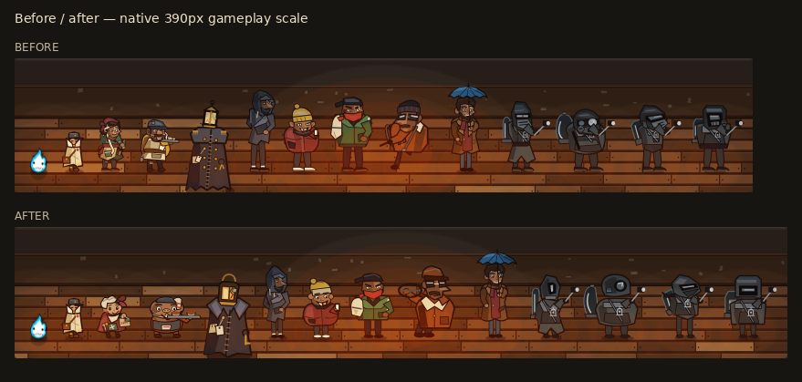
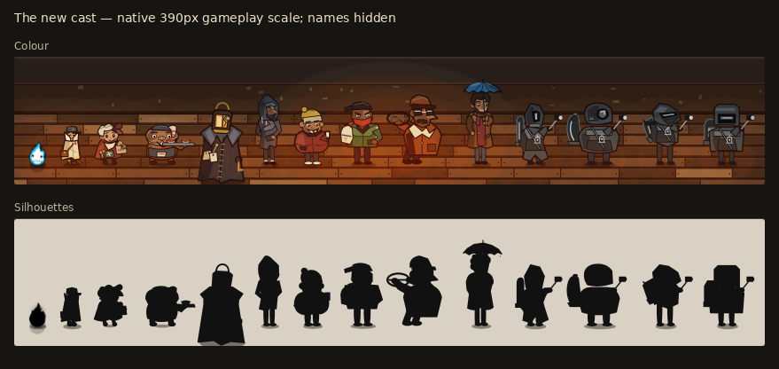

# Dungeon cast rebirth — visual and integration review

Base: `develop` at `1a10ac66fbd33991f9ddcd013cb3b77e717787ce`.
Branch: `feat/dungeon-complete-cast-rebirth`. No merge or deployment.

[Complete inventory and Latch study](INVENTORY.md) · [Concept alternatives](concepts.png)

## Artwork





The lineup uses the game's actual drawing functions and feet-anchored scale,
at the common BELOW camera size on a 390px phone. Full gameplay captures use
each scene's own shell and camera.
It shows colour and silhouettes without names. Left to right: Rizo, Latch,
Nell, Orr, Night Porter, Tall, Small, Cap, Driver, YOU, marshal, gatherer,
runner, sentry. The width accommodates the cast; individual figures have
not been enlarged. The game screenshots below retain their full phone viewports.

| Discarded construction | Selected identity and reason |
| --- | --- |
| Nell's adult limbs, narrow face, apron/clothing stack | Wool fringe and one asymmetric yarn knot over a small bell coat; green mitts, repair pocket and brass scissors. Her hands do useful work, and six expressions keep warmth, irritation and fatigue in the same face. |
| Orr's humanoid neck, joint stack and layered apron | A broad hearth dweller with planted paws, low cap, striped towel and heavy cheeks. A horizontal mass and practical tray distinguish him immediately from Nell. |
| Porter's epaulettes, frayed fingers and separate lamp construction | One severe empty greatcoat, high collar, sewn seam, big key and blank tag; the split, repaired lantern is identical when mounted and fallen. |
| Kidnappers' assembled torso/limb geometry | Tall is a slouching taper; Small a beanie and puffer mass; Cap a square track jacket and backwards brim; Driver a long nose, glasses and shearling. All remain human and keep their narrative roles. |
| Collectors' layered armour and extra reaching sleeves | Narrow marshal, barrel gatherer, forward wedge runner, shutter-shaped sentry. Their vessels, helmets and two connected arms communicate four roles within one cold faction. |
| YOU's duplicated clothing/face details | Shared curls, beard, camel coat, maroon scarf and blue umbrella across car, pavement, store and portrait. The indoor wave replaces the resting sleeve. |

Rizo and Latch are protected. Their drawing functions are unchanged (see
[hash comparison](tests/protected-art.json)). Jar souls, Draftling, Needle,
white coats and the unseen Boss retain their purposeful existing identities.

## Real mobile evidence

[All paired phone frames and pose sheets](MOBILE.md)

| Native comparison sheet | Evidence |
| --- | --- |
| [Nell and Orr, 320×568](friendly-320.webp) | Dialogue portraits, world bodies and Nell beside Latch |
| [Human ensemble, 390×844](crew-390.webp) | Van seating and Intake standing poses |
| [Collectors, 430×932](collectors-430.webp) | All four role silhouettes in their actual encounters |
| [Work and combat, 320×568](actions-320.webp) | Lift, wrap fit, open seam and fallen lantern |
| [Collector comics, 390×844](comics-390.webp) | Shared marshal and runner head/body paths |
| [YOU, 390×844](you-390.webp) | Pavement walk and indoor store appearance |

Every substantially changed character is present in the paired gameplay
captures, at **320×568, 390×844 and 430×932**, using the same scene fixtures,
player anchors and native display scale. The extra action frames reach
Nell's fix/lift/brace/fit/sit/walk, Orr's carry, each crew speaker, and the
Porter's open/sweep/settled states through the actual game. Capture JSON
records actors, enemies, dialogue, scene clocks and screen bounds.

Before art comes from the base commit in a detached checkout. Both lab
versions apply their respective production `WORLD_SCALE`; the old lab's
missing transform is not used to exaggerate the difference. The Press
House action pair intentionally differs in camera framing: the new north
headroom exposes Nell's raised hands rather than hiding them under the HUD.

Visual review prompted these revisions before submission: lift hands moved
outside Nell's head; board aligned with both wrists; north shutter framing;
correct seated head bounds and gaze anchors; one sleeve per indoor wave;
one shared mounted/fallen Porter lantern. No extra limbs or disconnected
props were observed in the final reviewed frames. This is finite screenshot
and browser evidence, not a claim of perfection.

## Verification

[Exact commands, accepted results and complete logs](tests/README.md)

| Check | Result |
| --- | --- |
| All current Node suites | 16 suites; 368 checks passed |
| All eight Dungeon browser suites | 1,025 checks passed |
| Full browser release checklist | All 21 suites have passing accepted results |
| Paired mobile artwork | 117 before/after pairs across the three phone viewports |
| Source syntax | 36 JavaScript and eight Python files passed |
| Final production package | 166 files; same fingerprint as the final tested art build |

The [pixel manifest](evidence-manifest.json) records native dimensions and
decoded RGB hashes. WebP conversion was verified to preserve every captured
pixel; figures and screenshots were never resized. The comparison sheets
paste those images at native size.

PR #43's failed Dungeon quality run (`38037326476`, job `114170855220`)
failed **only** the Boss-line hold assertion: 5050ms sampled versus a 5125ms
minimum. The existing 1.4 weight was reduced by the van's 0.91 speech pace
and frame/step sampling. Increasing that line's weight to 1.5 gives it the
intended reading time; no assertion was weakened or removed. Dialogue text
and all other scene timing remain intact.

The [original CI excerpt](tests/pr43-failure.log) and initial local failures
are retained alongside the passing results. Release verification also found
a Defense fixture comparing absolute clocks from separately scheduled page
startups. It now compares deltas over the exact controlled interval in one
evaluation; its strict clock/cadence assertions are unchanged (**78/78**).
The unchanged arcade pause suite passed its serial retry (**66/66**), after
an initial rhythm resume sample exceeded its wall-clock bound. That check
remains sensitive to browser scheduling; no arcade code or threshold changed.

The first local depth run passed the Boss assertion but failed its two Rows
checks. Its saved frame shows the existing “device fell behind” pause panel,
so the fixture never walked out of the Porter room. The fixture set `porterDown` without settling the actual Core enemy.
That live boss could wake and activate the lag protection during a post-fight
exit. The fixture now also sets its boss to settled/0hp, matching a real
victory. Lag protection and all 45 depth assertions remain unchanged.
The corrected fixture passes **45/45** on the final production build. Compare
the [initial pause frame](tests/initial-rows-pause.webp) with the
[successful Rows arrival](tests/final-rows-arrival.webp), and see the
[final depth log](tests/final-depth.log).

Chromium 134 / Playwright 1.51.0 on Linux. Physical iPhone, Safari/WebKit,
Android hardware and a hosted deployment were not tested. No hosted preview
was deployed; the PR's standard release workflow can attach a downloadable
static build when successful. Existing progression, saves, controls and collision/AI are covered by
the existing release suites.

## Reproduce

```sh
python tools/build-site.py --out /tmp/rizo-cast-site
python tests/capture-dungeon-character-art.py --directory /tmp/rizo-cast-site --evidence /tmp/rizo-cast-shots
python tests/capture-dungeon-opening-direction.py --directory /tmp/rizo-cast-site --evidence /tmp/rizo-opening-shots
python tests/capture-dungeon-collector-comics.py --directory /tmp/rizo-cast-site --evidence /tmp/rizo-comic-shots
python tools/dungeon-lab/capture.py --out /tmp/rizo-lab-shots --format png
python tools/dungeon-lab/serve.py
# Open /tools/dungeon-lab/rebirth-concepts.html for the original silhouette alternatives.
```

The review tools and evidence are excluded from the shipped site. Production
art lives in `dungeon-art.js`; shared heads and garments feed portraits and
collector comic busts. Obsolete supporting bodies and unused limb helpers
were removed rather than retained as alternate render paths.
