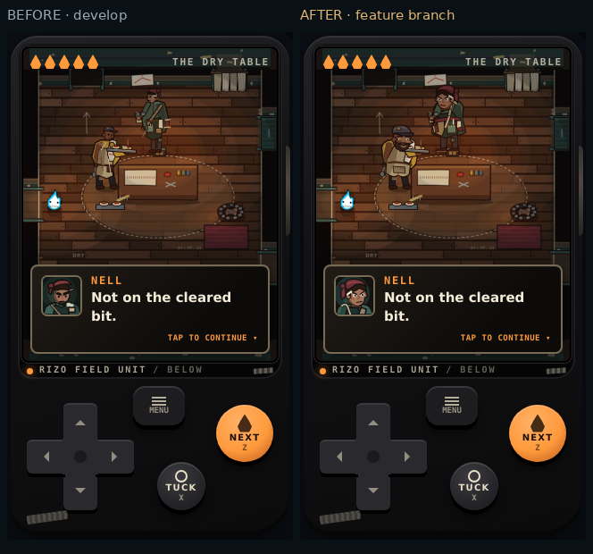

# Character art redesign

Base: latest remote `develop`, `3363f1be427b9480b64e8d21a989d2f12998f322`. Branch: `feat/latch-bar-character-art`.

Latch is the reference. His folded coat, high collar, postal cap, one heavy satchel and expressive eye strip make a clear, asymmetrical courier silhouette at normal gameplay size. This pass applies that level of intent to the supporting cast with their own proportions, faces and clothing. Latch's world art and portraits are unchanged. Rizo retains the hub's canonical art.

## Substantial redesigns

| Character | Deliberate identity and integration |
| --- | --- |
| YOU | Rounded shoulders and fitted camel raincoat, split hem, scarf, cropped coils, short beard and a warm, readable face. The umbrella clears his face. Matching seated, standing, store and dialogue appearances. |
| Tall | Long tapered hoodie, drooping angular hood, narrow mask eyes, asymmetric cords, socks and slides. Keeps his lanky posture and established phone-stop/reach poses. |
| Small | Short, broad puffer, raised collar, rolled mustard pom beanie, crooked eyes and white trainers. Keeps the phone and milk-crate identity across the opening, van, roadside and Intake. |
| Cap | Broad track-jacket shoulders, compact waist, backward cap/brim, nicked brow and tied red bandana. Keeps the pillowcase, card and pointing poses. |
| Driver | Heavy rust work coat, fleece collar, seat belt, knitted black mask and silver wraparound glasses. A separate cab silhouette with the existing wheel and turning poses. |
| Nell | Rounded cheek, swept maroon wrap and tied tail, asymmetric wrap skirt, fitted apron, maroon waist tie and practical tools. Six authored facial expressions, shared between world and portraits. All thirteen work states remain available. |
| Orr | Barrel chest, strong forearms, broad jaw/nose, blunt beard, patched slate cap, short apron and striped kitchen towel. Distinct serving, irritated and dry expressions; tray and carry states preserved. |
| Queue marshal | Long angular service-coat skirt and high wedge cowl. |
| Rows gatherer | Broader shoulders/back and a larger capture vessel on its harness. |
| Hall runner | Short jacket and swept cowl; existing run, grab and shutter-hit poses preserved. |
| Factory sentries | Rigid service vest and compact cowls. The four collector profiles share gasket goggles, respirators, harness construction, palette and faction mark. Encounter IDs select their identity consistently. |

The Night Porter, Boss, White Coats and Latch were inspected in their affected scenes. Their established lantern-head/faceless designs already have deliberate identity and were preserved. No character, dialogue, role, story beat, level, progression rule or combat rule was removed or added.

## Phone comparisons

Every screenshot below is the actual built game. Each pair uses the same phone viewport and gameplay scale. Images are lossless WebP conversions of the full screenshot; the comparison sheets paste each phone image at one image pixel per CSS pixel. Headers and spacing are the only additions. No enlarged character preview substitutes for these scenes.

| Review sheet | 320×568 | 390×844 |
| --- | --- | --- |
| YOU and all four seated crew | [Before/after](comparison-1-320.webp) | [Before/after](comparison-1-390.webp) |
| Nell/Orr with dialogue; Intake crew with dialogue | [Before/after](comparison-2-320.webp) | [Before/after](comparison-2-390.webp) |
| Queue marshal and Rows gatherer | [Before/after](comparison-3-320.webp) | [Before/after](comparison-3-390.webp) |
| Hall runner and factory sentries | [Before/after](comparison-4-320.webp) | [Before/after](comparison-4-390.webp) |



The new heads use one vector geometry source for canvas actors, seated crew, SVG portraits and collector comic close-ups. [All portrait expressions](after/portrait-sheet.webp), [window comic](after/window-comic.webp), [chute comic](after/chute-comic.webp).

## Rendering integration

The screen now follows changes to its actual slot size. The previous launch/shell handoff could retain a short canvas or spill beyond its new slot until a viewport resize. A ResizeObserver updates the existing layout function and disconnects on teardown.

Intake's north-wall tableau receives headroom at the same camera scale while Rizo is near the cage. Speech placement protects visible character heads and offers another below-body position, keeping the crew readable during barks. Existing camera easing, scene clocks, walking, bobbing, van sway, poses, arm endpoints, dialogue and input behavior are retained.

## Capture method

`tests/capture-dungeon-character-art.py` builds and serves the production site, then uses the existing QA room/scene clock hooks to select authored beats. Fresh touch/mobile Chromium contexts use 320×568 and 390×844 viewports, DPR 2 with CSS-size screenshots, and reduced motion for comparable stills. Both builds receive a native viewport resize back to the requested width after shell layout settles, so the baseline's stale launch sizing does not change the comparison scale. The final viewport width is asserted. Baseline source is an isolated worktree at the develop SHA above.

`tests/capture-dungeon-opening-direction.py` captures the authored opening with normal motion: walking to the store, door, store window, reaching hands, grab comic and physical grip. It also checks checkout stability, page errors and page overflow. This adds twelve phone pairs to the thirty cast/room pairs. The cast captures include backgrounds, room lighting, normal camera distance, dialogue, cage bars and factory catwalk occlusion.

Reproduce:

```bash
python3 tests/capture-dungeon-character-art.py --evidence /tmp/rizo-character-art
python3 tests/capture-dungeon-opening-direction.py --evidence /tmp/rizo-opening-art
python3 tests/browser-dungeon-character-lab.py
```

## Raw gameplay evidence

| Scene | 320px before / after | 390px before / after |
| --- | --- | --- |
| you-car | [Before](before/you-car-320.webp) / [After](after/you-car-320.webp) | [Before](before/you-car-390.webp) / [After](after/you-car-390.webp) |
| van-crew | [Before](before/van-crew-320.webp) / [After](after/van-crew-320.webp) | [Before](before/van-crew-390.webp) / [After](after/van-crew-390.webp) |
| van-quiet | [Before](before/van-quiet-320.webp) / [After](after/van-quiet-320.webp) | [Before](before/van-quiet-390.webp) / [After](after/van-quiet-390.webp) |
| latch | [Before](before/latch-320.webp) / [After](after/latch-320.webp) | [Before](before/latch-390.webp) / [After](after/latch-390.webp) |
| nell | [Before](before/nell-320.webp) / [After](after/nell-320.webp) | [Before](before/nell-390.webp) / [After](after/nell-390.webp) |
| nell-dialogue | [Before](before/nell-dialogue-320.webp) / [After](after/nell-dialogue-320.webp) | [Before](before/nell-dialogue-390.webp) / [After](after/nell-dialogue-390.webp) |
| orr-hatch | [Before](before/orr-hatch-320.webp) / [After](after/orr-hatch-320.webp) | [Before](before/orr-hatch-390.webp) / [After](after/orr-hatch-390.webp) |
| meal | [Before](before/meal-320.webp) / [After](after/meal-320.webp) | [Before](before/meal-390.webp) / [After](after/meal-390.webp) |
| meal-dialogue | [Before](before/meal-dialogue-320.webp) / [After](after/meal-dialogue-320.webp) | [Before](before/meal-dialogue-390.webp) / [After](after/meal-dialogue-390.webp) |
| intake-crew | [Before](before/intake-crew-320.webp) / [After](after/intake-crew-320.webp) | [Before](before/intake-crew-390.webp) / [After](after/intake-crew-390.webp) |
| queue-collector | [Before](before/queue-collector-320.webp) / [After](after/queue-collector-320.webp) | [Before](before/queue-collector-390.webp) / [After](after/queue-collector-390.webp) |
| row-collector | [Before](before/row-collector-320.webp) / [After](after/row-collector-320.webp) | [Before](before/row-collector-390.webp) / [After](after/row-collector-390.webp) |
| hall-runner | [Before](before/hall-runner-320.webp) / [After](after/hall-runner-320.webp) | [Before](before/hall-runner-390.webp) / [After](after/hall-runner-390.webp) |
| factory-sentry | [Before](before/factory-sentry-320.webp) / [After](after/factory-sentry-320.webp) | [Before](before/factory-sentry-390.webp) / [After](after/factory-sentry-390.webp) |
| porter | [Before](before/porter-320.webp) / [After](after/porter-320.webp) | [Before](before/porter-390.webp) / [After](after/porter-390.webp) |
| opening-walk | [Before](before/opening-walk-320.webp) / [After](after/opening-walk-320.webp) | [Before](before/opening-walk-390.webp) / [After](after/opening-walk-390.webp) |
| opening-door | [Before](before/opening-door-320.webp) / [After](after/opening-door-320.webp) | [Before](before/opening-door-390.webp) / [After](after/opening-door-390.webp) |
| opening-window | [Before](before/opening-window-320.webp) / [After](after/opening-window-320.webp) | [Before](before/opening-window-390.webp) / [After](after/opening-window-390.webp) |
| opening-reach | [Before](before/opening-reach-320.webp) / [After](after/opening-reach-320.webp) | [Before](before/opening-reach-390.webp) / [After](after/opening-reach-390.webp) |
| opening-comic | [Before](before/opening-comic-320.webp) / [After](after/opening-comic-320.webp) | [Before](before/opening-comic-390.webp) / [After](after/opening-comic-390.webp) |
| opening-grip | [Before](before/opening-grip-320.webp) / [After](after/opening-grip-320.webp) | [Before](before/opening-grip-390.webp) / [After](after/opening-grip-390.webp) |

[Baseline capture state](before/capture.json) · [Final capture state](after/capture.json) · [Test results](validation.md)

## Assessment and limits

All required characters now have authored silhouettes and consistent visual identities. No required target is still a placeholder in the reviewed phone scenes. Nell and Orr carry the warm scenes; Tall, Small, Cap and Driver remain individually recognizable without losing their crew continuity. The collectors share a believable uniform while their encounter roles have different masses.

This is Chromium viewport evidence, not Safari or physical-device testing. Factory catwalks and scene dialogue still occlude parts of bodies as authored; the review includes those cases. This pass deliberately retains the existing motion language for the later animation pass.

## Files changed

- `modes/dungeon/dungeon-art.js`: shared vector heads; redesigned world, seated and portrait art; collector profiles.
- `modes/dungeon/dungeon-scenery.js`: matching YOU store appearance and collector gate identity.
- `modes/dungeon/dungeon-comic.js`: collector close-ups from the shared head designs, matching Nell sleeve palette.
- `modes/dungeon/dungeon-view.js`: stable collector IDs, slot sizing, Intake headroom and speech attachment protection.
- `tools/dungeon-lab/lab.js`: all four collector profiles and current YOU description.
- `tests/capture-dungeon-character-art.py`: reproducible phone evidence and capture checks.
- `tests/capture-dungeon-opening-direction.py`: mobile context and settled viewport measurements for comparisons.
- `docs/verification/character-art-redesign/`: this report, test results and lossless evidence.
