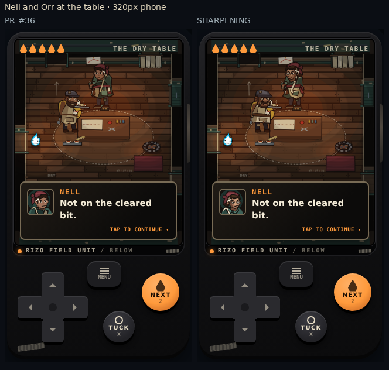

# Character art — sharpening pass

PR #36 was fetched and verified at `3142ce144ee0ca0122fd1c5faaa427b06ba3cb17`, the current head of `feat/latch-bar-character-art`. This pass lives on `feat/dungeon-character-art-sharpening` and targets that feature branch, not develop. No merge or deployment action.

## What Latch establishes

Latch's cap and high folded collar frame one narrow face strip. The diagonal satchel pulls down one shoulder, so the silhouette, costume, posture and face tell the same story: a small courier carrying a load. The large paper planes give him a readable value pattern. His expressions change the eye opening and the surrounding collar, rather than relying on facial decoration. At a phone's normal camera distance, there are very few competing shapes.

The PR #36 comparison sheets and portrait sheet showed a different problem in the other figures. The kidnappers still shared a circular eye pair inside a dark mask; clothes and hat colour did much of the identification. Nell and Orr had different jobs, but their faces and garment cuts were relatively safe. The collectors shared most of their head, shoulder, harness and vessel geometry.

This revision retains roles, palettes and useful props, then changes the construction underneath. It does not add a new animation system, gradients, glow trim, random accessories or raster replacements.

## Designs changed

| Design | Construction and continuity |
| --- | --- |
| Nell | A narrow chin and defined cheek/nose plane against a heavy swept hair mass; a folded maroon wrap, grey temple and working chalk. Fitted green jacket over a weighted, diagonal work apron, with one readable measuring tape and a scissor holster. Work, measuring, listening, amused, irritated and tired use different eye shapes, cheeks and mouths. The same head paths serve the world and portraits. All 13 work states retain their original arm endpoints and timing. |
| Orr | A low, broad face, large nose, substantial ears and a hanging horseshoe moustache under a sloping repaired cap. Low shoulders and a pear-shaped smock contrast with Nell's fitted waist; a squared kitchen apron and long striped towel retain his food-service identity. Original tray/carry/free-hand states are preserved. |
| Tall | A long, off-centre exposed face under an overhanging hood, narrow lowered eyes and a folded mask beneath the nose. A diagonal storm flap, dropped shoulder and split low hem break the old hoodie rectangle. Long shins, socks, slides and existing reaching/phone-stop poses remain. |
| Small | Exposed cheeks and ears, a crooked toothy grin, sideways folded beanie and a mask gathered at the chin. A compact rounded puffer replaces the straighter jacket. Standing and seated bodies share its collar and padded construction; the phone and milk crate remain. |
| Cap | A broad squared skull, heavy brow, visible upper face and severe bandana plane below a low backward cap. Wide stepped shoulders, a dark neck insert and strong track-jacket yoke give him more physical weight. The pillowcase and pointing/reaching endpoints remain. |
| Driver | Long weathered face, hooked nose, low moustache, close wool cap and cold driving glasses. Dropped work-coat shoulders, a large fleece collar and diagonal seat belt distinguish his cab silhouette from Cap's jacket. Existing steering, turn, talk and stare behavior remains. |
| YOU | Sculpted cropped coils, tapered temples, broad cheek planes, shaped eyes and close beard. An open tailored camel coat with deliberate lapels and an offset hem/pocket pattern frames the maroon scarf and inner layer. `youCoat()` now draws both street and store clothing; seated hair and the portrait retain the same identity. Blue umbrella, jeans, walking, store actions and scene timing are preserved. |
| Queue marshal | Tall folded cowl, narrow horizontal glass slit and a projecting louvred respirator; long formal service coat and slender capture tube. Its comic close-up uses the same head and folded lapels. |
| Rows gatherer | Low rounded hood, unequal circular lenses and side filter; broad work smock, heavy apron and a rounded full capture retort. Equipment weight changes the outline rather than adding trim. |
| Long Hall runner | Swept head, sloped glass visor and forward respirator; cropped diagonal jacket and a flat capture flask. Running, grabbing and gate-hit poses remain. The RETURNS comic shares its head and jacket construction. |
| Factory sentries | Flat square factory hood, vertical shutter face and side filter; squared work yoke, short apron/vest structure and rectangular reservoir. Different from both the marshal's long wedge and the gatherer's rounded mass. |

Rizo, Latch, the Night Porter, Boss and White Coats retain their established art. Gameplay, save schema, content, dialogue, input, progression, camera, lighting and scene controllers are unchanged. Actor scales and speech attachment heights are unchanged.

## Full phone comparisons

The screenshots below are complete production-game frames at **320×568** and **390×844**, including lighting, backgrounds, dialogue, rails and occlusion. Comparison sheets paste the original images at one image pixel per CSS pixel. No enlarged preview stands in for gameplay.

| Comparison | 320px | 390px |
| --- | --- | --- |
| Nell and Orr | [Before / after](nell-orr-320.webp) | [Before / after](nell-orr-390.webp) |
| Four kidnappers seated; three standing in Intake | [Before / after](kidnappers-320.webp) | [Before / after](kidnappers-390.webp) |
| YOU seated, walking and in the store | [Before / after](you-320.webp) | [Before / after](you-390.webp) |
| All four collector profiles | [Before / after](collectors-320.webp) | [Before / after](collectors-390.webp) |
| Collector comics | [Before / after](comics-320.webp) | [Before / after](comics-390.webp) |



[All expressions at actual 46px / 56px](portraits-mobile-comparison.webp) · [World colour and silhouette study at the 320px gameplay scale](silhouette-study-comparison.webp) · [Larger portrait construction study](after/portrait-study.webp)

The supplemental portrait sheet uses the real dialogue SVGs at the game's outer sizes, including the 2px portrait frame. Larger 128px faces are explicitly labelled as construction studies. The unlit silhouette sheet is supplementary; the full phone scenes above are the readability evidence.

## How the comparisons are held constant

Baseline is a production build from the fetched PR #36 head. Candidate is the production build of this pass. Both use the same mobile Chromium context, DPR 2 with CSS-size screenshots, reduced-motion setting, viewport settling and scene/room QA hooks. The opening captures use the existing normal-motion opening script.

For cast stills, a capture-only requestAnimationFrame wrapper stops queued frames immediately before the screenshot. A final real frame is drawn at dt=0. Moving collectors are placed at their authored patrol anchors; the runner uses the existing capture's normal run pose at (100,420). This holds poses without introducing a production pause feature or substituting a renderer. All factory collectors retain a valid patrol state, and the real view selects its normal downward-watching pose.

The paired capture records prove **30/30 identical screen bounds, visible NPC positions/states/facings, player positions, and recorded enemy positions/states**. The text-reveal count in the unchanged Latch control can differ; dialogue content and the target character conditions remain the same. Both complete capture runs pass without page errors or horizontal overflow.

[Baseline capture records](before/capture.json) · [Candidate capture records](after/capture.json) · [Comic baseline](before/comics.json) · [Comic candidate](after/comics.json)

Reproduce from the repository:

```bash
python tests/capture-dungeon-character-art.py --directory /path/to/build --evidence /tmp/cast
python tests/capture-dungeon-opening-direction.py --directory /path/to/build --evidence /tmp/opening
python tests/capture-dungeon-collector-comics.py --directory /path/to/build --evidence /tmp/comics
python tests/capture-dungeon-art-studies.py --evidence /tmp/art-studies
```

Use `--source /path/to/baseline/build` for baseline art studies. PNG captures are converted to lossless WebP without resizing.

## Critical assessment

The strongest changes are Nell's face/expression construction, Orr's nose/moustache and apron mass, and the crew's separation into four people. The collectors now have different equipment and head outlines while sharing their faction's materials, glass and harness. YOU has a clearer face and clothing continuity, but his warm raincoat/umbrella identity is deliberately retained.

Orr's serving and dry expressions are still relatively close at 46px. Driver's emotional range behind the glasses remains restrained. At phone scale some scissor, seam and moustache detail disappears; those details are not relied on for identification. Factory rails still obscure bodies, and room darkness suppresses some value differences. Motion has been preserved for its separate pass, so this report does not claim a final motion-quality improvement or perfection across the cast.

Evidence is Chromium viewport testing. Safari and physical phones remain unverified.

## Files and validation

- `modes/dungeon/dungeon-art.js`: shared head constructions, world/seated/portrait clothing and collector profiles; shared YOU coat.
- `modes/dungeon/dungeon-scenery.js`: consistent store coat and back-of-head construction.
- `modes/dungeon/dungeon-comic.js`: collector garment and shared-head continuity.
- `tests/capture-dungeon-character-art.py`: fixed moving-enemy stills and recorded pose/position evidence.
- `tests/capture-dungeon-art-studies.py`: reproducible portraits and silhouette review.
- `tests/capture-dungeon-collector-comics.py`: both collector comics at both phone sizes.
- This folder: report, validation and lossless baseline/candidate evidence.

[Tests and preservation checks](validation.md)
